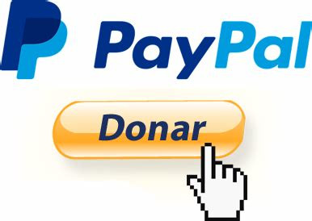

# Tutoriales de Programo Ergo Sum

> Repositorio público donde se almacenan todos los tutoriales para aprender informática, programación, electrónica y robótica del proyecto educativo de código abierto [Programo Ergo Sum][PES-COM].

 

  

 

## Mensaje del fundador

Cuando fundé Programo Ergo Sum, pude haberla establecido como una compañía con fines de lucro, pero decidí hacer algo diferente. Mi objetivo desde el primer momento ha sido que cualquier persona pueda aprender informática, programación, electrónica o robótica gratis y sin moverse de su casa.

Desde el 2015 y hasta la actualidad estoy trabajando muy duro para cumplir con los [objetivos de la asociación][PES-ASO]. He invertido muchísimo tiempo y algo de dinero de mi bolsillo para llegar hata aquí, pero desgraciadamente, en la tecnología, hay que seguir invirtiendo dinero y tiempo para continuar.

Este proyecto, además de gratis, es libre y de código abierto, lo que significa que tienes acceso 100% tanto al código fuente de la web como los contenidos y documentos.

Si todo el que leyera este mensaje realizara una donación, solo se tendría que recaudar fondos un día al año. Pero no todos pueden o quieren donar. Y no pasa nada.

Un saludo, Miguel Ángel Abellán

### ¿A qué se destinan las donaciones?

**Tecnología**: servidores, ancho de banda, mantenimiento, desarrollo. Los proyectos educativos de la asociación reciben más de cinco mil (5.000) visitas diarias con picos de hasta 60 personas conectadas al mismo tiempo, y se emplea una mínima parte de los recursos que otros sitios emplean.

**Personal**: otros sitios web más visitados tienen personas contratadas. En ProgramoErgoSum n ohay ningún empleado, todos los tutoriales se han realizado durante el tiempo libre, por lo que tu donación representa una gran inversión en esta iniciativa.

 

## Licencia

Esta obra está bajo una licencia de [Creative Commons Reconocimiento-CompartirIgual 4.0 Internacional][CC-BY-SA].

Usted es libre de:

* **Compartir**: Compartir y redistribuir el material en cualquier medio o formato.
* **Adaptar**: Remezclar, transformar y crear a partir del material para cualquier finalidad, incluso comercial.

Bajo las siguientes condiciones:

* **Reconocimiento**: Debe reconocer adecuadamente la autoría, proporcionar un enlace a la licencia e indicar si se han realizado cambios. Puede hacerlo de cualquier manera razonable, pero no de una manera que sugiera que tiene el apoyo del licenciador o lo recibe por el uso que hace.
* **CompartirIgual**: Si remezcla, transforma o crea a partir del material, deberá difundir sus contribuciones bajo la misma licencia que el original.

[CC-BY-SA]: https://creativecommons.org/licenses/by-sa/4.0/deed.es_ES
[PES-COM]: https://www.programoergosum.com
[PES-ASO]: https://www.programoergosum.es/asociacion
