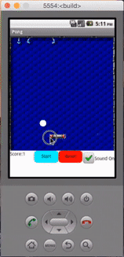
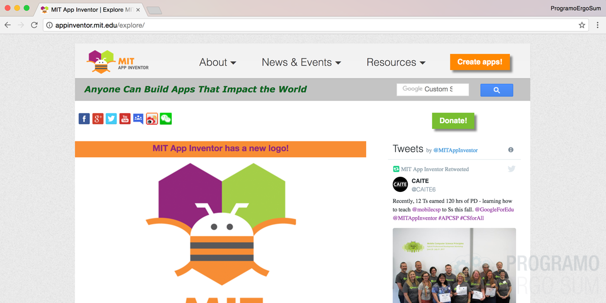
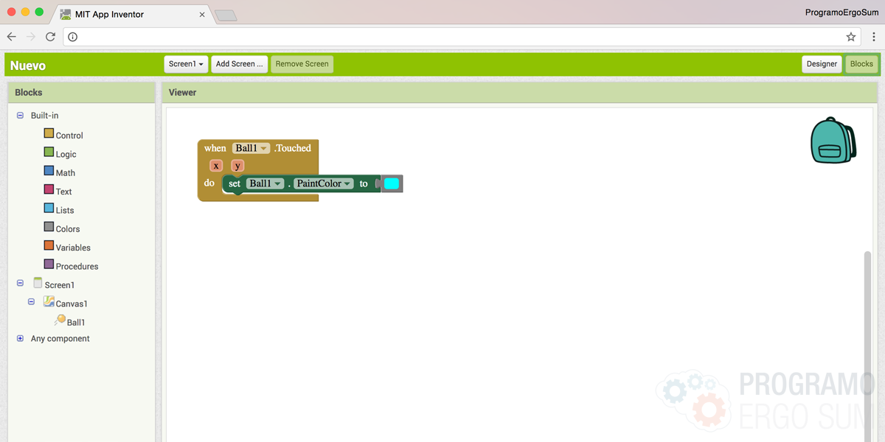
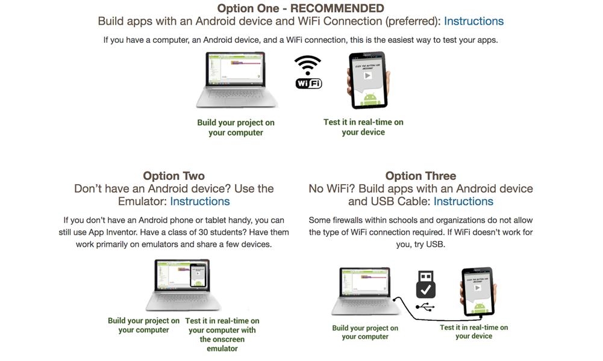

## Introducción

En este curso online de iniciación a la programación de dispositivos móviles aprenderás a utilizar la herramienta de AppInventor para programar diferentes tipos de aplicaciones mediante el lenguaje de programación por bloques de Blockly. Si ya conoces la herramienta te recomendamos que accedas al siguiente tutorial de esta misma plataforma. 

 

## ¿Qué es AppInventor?

AppInventor es un entorno de desarrollo de software creado por Google para la elaboración de aplicaciones destinadas al sistema operativo de Android. El lenguaje es gratuito y se puede acceder fácilmente de la web. Las aplicaciones creadas con AppInventor están limitadas por su simplicidad, aunque permiten cubrir un gran número de necesidades básicas en un dispositivo móvil.

Con AppInventor, se espera un incremento importante en el número de aplicaciones para Android debido a dos grandes factores: la simplicidad de uso, que facilitará la aparición de un gran número de nuevas aplicaciones; y Google Play, el centro de distribución de aplicaciones para Android donde cualquier usuario puede distribuir sus creaciones libremente.

### Ventajas e inconvenientes de AppInventor

Como ventajas a la hora de programar con AppInventor, encontramos las siguientes:.

- Se pueden crear aplicaciones por medio de bloques de manera intuitiva y grafica, sin necesidad de saber código de programación.
- Se puede acceder en cualquier momento y cualquier lugar siempre que estemos conectados a internet.
- Nos ofrece varias formas de conectivad: directa, o wi fi o por medio del emulador.
- Nos permite descargar la aplicación mediante el .apk a nuestro pc.

Sin embargo, son varios los inconvenientes que encuentra un usuario de nivel medio o avanzado:

- No genera código Java para desarrollos más profundos.
- Solo se puede desarrollar para Android.

 

## Accede a AppInventor

  <iframe src="//www.youtube.com/embed/WaXdkwvdvXI" allowfullscreen></iframe>

En este video te enseñamos el funcionamiento de la plataforma de appinventor y cómo está dividida. Al ser un programa gratuito de Google podrás acceder con tu cuenta de gmail. Para ello deberás acceder a la web del proyecto de AppInventor y loguearte introduciendo tu correo electrónico.

Para construir aplicaciones se trabaja con:

- El Diseñador de App Inventor (App Inventor Designer), donde podrás seleccionar los componentes para tu aplicación.
- El Editor de Bloques de App Inventor (App Inventor Blocks Editor) , donde se ensamblan los bloques del programa para especificar cómo deben comportarse sus componentes. Los programas se desarrollan visualmente, ensamblando piezas que se juntan encajando como las de un rompecabezas.

### Mi primera aplicación

A modo de ejemplo, como puedes ver en el video, vamos a añadir una pelota a nuestra pantalla, pero antes tenemos que añadirle el canvas ya que dicha pelota solamente obtiene las propiedades o coordenadas dentro del canvas..

A continuación animamos la pelota mediante programación. Para ello, nos desplazamos a la pestaña de bloques y le vamos a indicar que cuando se haga click sobre la pelota cambie el fondo de color.

 

## Configura tu ordenador

  <iframe src="//www.youtube.com/embed/Bsw2AzxlsDg" allowfullscreen></iframe>

En esta lección te explicamos cómo configurar tu móvil, ordenador y aplicación para que puedas testear las aplicaciones.

Aunque no se disponga de un teléfono con Android, siempre se pueden construir aplicaciones utilizando el emulador de Android, el software que se ejecuta en el ordenador y se comporta igual que el teléfono respecto a la misma.

En video te explicamos las 3 formas que tienes para probar tus aplicaciones antes de instalarlas en tu dispositivo móvil.

> El entorno de desarrollo de App Inventor es compatible con Mac OS X, GNU/Linux, con Windows y con la mayoría de teléfonos Android.

 

## Instalar aplicaciones

  <iframe src="//www.youtube.com/embed/j_EaVXnKuwo" allowfullscreen></iframe>

En esta última sesión aprenderás a instalar la aplicación creada en tu móvil. Para ello, compilaremos el proyecto una vez lo tengamos terminado y lo enviaremos por correo electrónico a nuestro móvil. De esta forma estaremos instalando la aplicación de forma gratuita.

Otra opción para instalar la aplicación en nuestro terminal consiste en pasar el archivo compilado a través de nuestro cable USB, o mediante enlace de dropbox, etc.

En tutoriales más avanzados explicaremos como crear subir nuestras aplicaciones a Google Play Store.

 

## Materiales

ToDo
