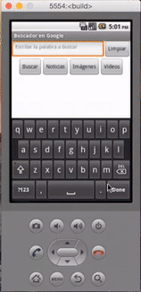

## Introducción

En este curso de programación de dispositivos móviles con AppInventor aprenderás a utilizar los procedimientos y funciones al mismo tiempo que programas una pequeña aplicación para buscar en google según los criterios utilizados de video, imágenes, etc.

 

## Diseño de la aplicación

  <iframe src="//www.youtube.com/embed/44lWL-3d4dY" allowfullscreen></iframe>

En este primer videotutorial te enseñamos a maquetar la primera parte de la aplicación que corresponde a la parte visual denominada Designer..

En el video aparece el enlace que hay que añadir en la URL para buscar en google imágenes, noticias, etc.

 

## Programación de la aplicación

  <iframe src="//www.youtube.com/embed/Wp2b99jgnfU" allowfullscreen></iframe>

En este video programamos los eventos del buscador.

Por último, te explicamos como optimizar el código mediante funciones para simplificar el código.

 

## Materiales

ToDo
