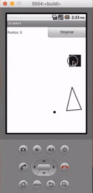

## Introducción

En este curso de programación de dispositivos móviles con AppInventor aprenderás a programar el juego de persigue. Para ello vamos a contar con 3 objetos los cuales programaremos. Una vez programado recuerda que podrás modificar las imágenes para crear otro juego totalmente diferente.

 

## Diseño de la aplicación

En este video te enseñamos el diseño de la aplicación antes de la programación.

  <iframe src="//www.youtube.com/embed/I6SIT252IfM" allowfullscreen></iframe>

 

## Programación principal

En este video programamos el movimiento del personaje principal del juego.

  <iframe src="//www.youtube.com/embed/P4Q52hhwKwY" allowfullscreen></iframe>

 

## Optimización de la programación

En este video te enseñamos el diseño de la aplicación antes de la programación.

  <iframe src="//www.youtube.com/embed/gfQh6w8z6l0" allowfullscreen></iframe>

 

## Optimización de la programación

Como buenas prácticas de programación, se optimizan las funciones del juego.

  <iframe src="//www.youtube.com/embed/1-UkWObQT7k" allowfullscreen></iframe>

 

## Mejoras de la aplicación

Por último, añadimos las mejoras y funcionalidad principal del juego.

  <iframe src="//www.youtube.com/embed/F269WsPhtJE" allowfullscreen></iframe>

 

## Materiales

ToDo
