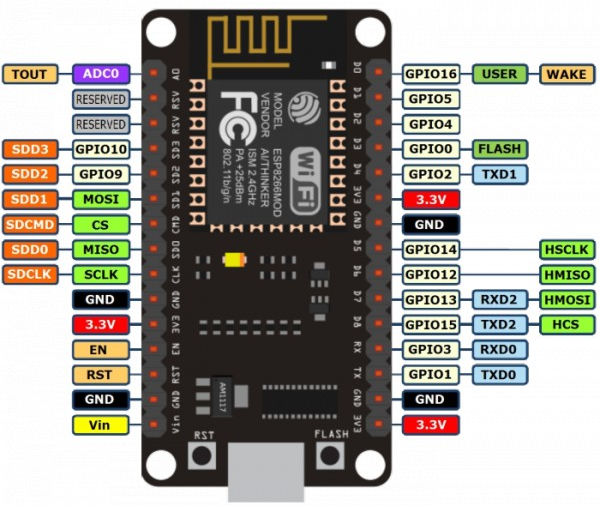

#Introducción a la placa de desarrollo NodeMCU ESP8266

En este tutorial vamos a explicar las **principales características de la placa de desarrollo NodeMCU** para posteriormente utilizarla en proyectos educativos a través de dispositivos conectados.

### Antes de empezar

Vas a necesitar los siguientes componentes:

- NodeMCU ESP8266

 

## Placa NodeMCU

NodeMCU es una placa de desarrollo de hardware y software abierto utilizada principalmente en el internet de las cosas (IoT - Internet of Things). Al igual que ocurre con otras placas similares, todo está dispuesto para que pueda ser programado de una forma sencilla.

La NodeMCU está basada en el módulo ESP12E, el cual contiene un chip SoC ESP8266, y dentro de este, un microcontrolador MCU.

- SoC (System on a Chip) ESP8266. Es un módulo WiFi de 2,4GHz compatible con la mayoría de routers del mercado.
- Microcontrolador MCU Tensilica de 32-bit. Encargado de ejecutar las sentencias del programa y gestionar las entradas y salidas de los pines GPIO.

Al ser hardware abierto podemos encontrar diferentes modelos de fabricantes, aunque todos ellos incluyen el mismo módulo y SoC.

### NodeMCU Lolin / Wemos Versión 3

Son varias las versiones existentes y en este tutorial vamos a hablar de la última versión v3 sin entrar en detalles sobre las anteriores. 

Veamos la placa de desarrollo `NodeMCU Lolin / Wemos v3`.

### Pinout de NodeMCU

Una vez vista la placa NodeMCU vamos a ver una visión general de la distribución de los pines. Recuerda que hay una variedad de fabricantes así que puede haber pequeñas diferencias en la placa de desarrollo que tengas, sobre todo en la serigrafía, sin embargo, todas se basan en el mismo módulo ESP8266.

- El pin A0 es el destinado a entrada analógica. Rango de tensión de 0V-3.3V (valor 0-1023).
- Los pines GPIO (General Purpose Input/Output) son los destinados a entradas y salidas digitales.

 

## Ejercicios propuestos

1.- Piensa varios proyectos que se podría realizar con esta placa.
