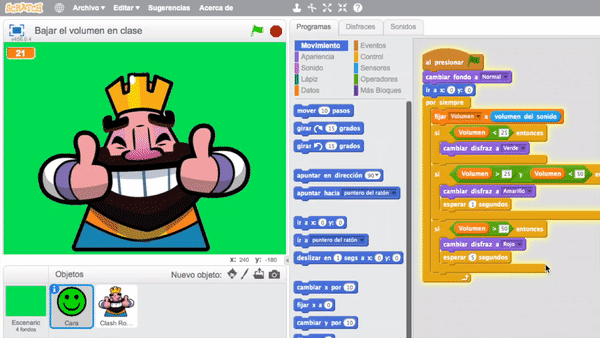
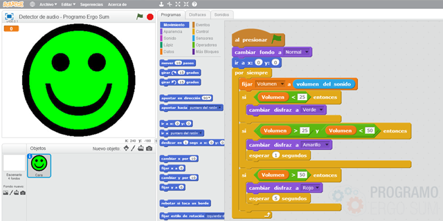
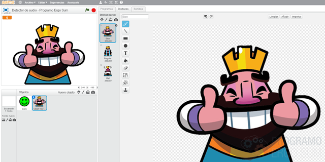
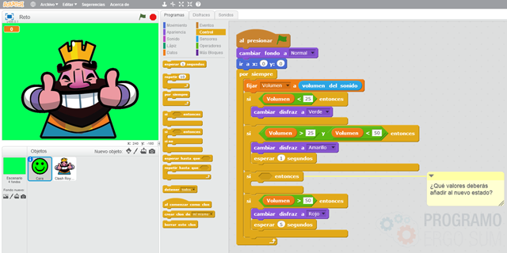

# Control de volumen con Scratch 2.0

En este curso aprenderás a utilizar la Realidad Aumentada con Scratch para crear aplicaciones y usarlas en el aula con tus alumnos. La aplicación consiste en medir el volumen de tus alumnos con ayuda de un micrófono y mostrar diferentes imágenes por la pantalla. Si el volumen es adecuado se mostrará un fondo de color verde con una cara sonriente, si aumenta cambiará a amarillo y en caso de estar gritando pasará al color rojo.

### Reinventa, programa y comparte

Antes de continuar con las lecciones de este curso de programación con Scratch te recomendamos seguir los siguientes pasos para reinventar y obtener todas las imágenes utilizadas en el videojuego gratis.

- Regístrate o accede a la web de <a target="_blank" href="https://scratch.mit.edu">Scratch</a>.
- Reinventa el proyecto <a target="_blank" href="https://scratch.mit.edu/projects/159779241/editor">Control de volumen (base)</a> para obtener todas las imágenes.
- Programa el videojuego siguiendo los videotutoriales de las lecciones de este curso.
- Comparte el proyecto y si está entre los mejores aparecerá en la sección Mejores proyectos.

 

## Programación

  <iframe src="//www.youtube.com/embed/OWlknXdxZHo" allowfullscreen></iframe>

### Programación de la aplicación

En esta lección se va a programar un detector de audio para que muestre diferentes caras según el volumen. Para ello lo primero que tenemos que hacer es crear un objeto con 3 disfraces (verde, amarillo, rojo) que se cambiará según el volumen.

El siguiente paso consiste en programar los cambios de disfraces. Para ello vamos a necesitar crear una variable que almacena el volumen que recibimos desde el micrófono, y según el volumen crearemos varias condiciones, tantas como disfraces hayamos creado.

> El sensor del sonido devuelve un valor comprendido entre 0 100, siendo 0 el mínimo valor que percibe el micrófono y 100 el valor máximo.

Por último añadimos los puntos de cortes para cambiar a los 3 disfraces. Por ejemplo, los puntos de corte seleccionados en el ejemplo corresponden a los valores 25 y 50. Fíjate que en la tercera condición se establece que el punto de corte debe estar entre 25 y 50. Además se ha añadido un tiempo de espera para que el alumno se de cuenta que ha subido el tono de la voz y debe bajarlo.

 

## Cambiar imágenes

  <iframe src="//www.youtube.com/embed/UtP-yvxfEO0" allowfullscreen></iframe>

### Cambiando las imágenes de la aplicación

En esta lección se explica cómo modificar de una forma muy sencilla las imágenes y fondos de la aplicación para adecuarlas según la ocasión.

> Según la moda o gustos de los niños se pueden elegir unas imágenes u otras.

Para ello lo único que tenemos que hacer es acceder al apartado de disfraces del propio objeto y reemplazarlas por los deseados. Recuerda que es muy importante que los 3 disfraces tengan el mismo tamaño y estén centrados en el mismo sitio, ya que por el contrario veríamos un desplazamiento de las imágenes.

 

## Retos propuestos

Si ya has completado todas las lecciones del tutorial te proponemos resolver los siguientes retos de programación con Scratch.

### Reto 1: Añade nuevos puntos de corte

En este reto te proponemos que añadas un nuevo punto de corte para que se muestren 4 estados. Para ello deberás modificar la programación creando nuevos cortes que cambien al nuevo estado. Recuerda utilizar los bloques lógicos para que funcione correctamente.

