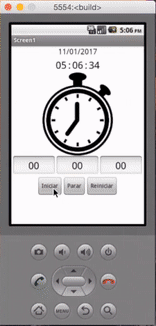
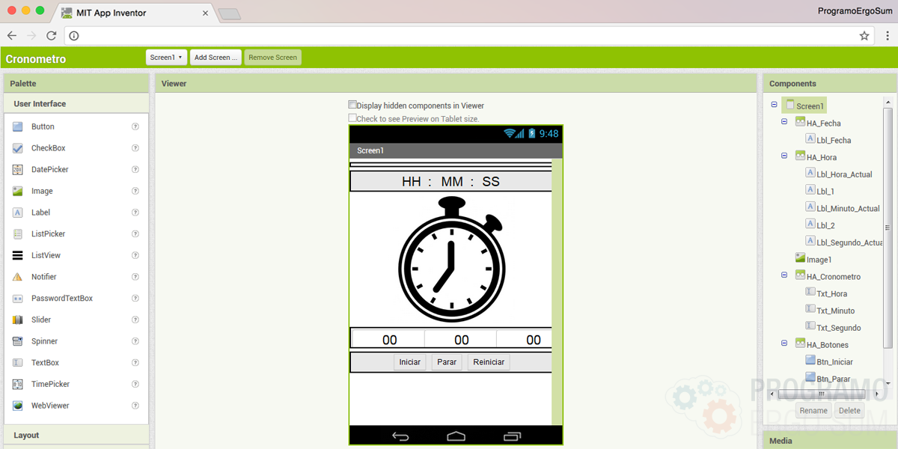
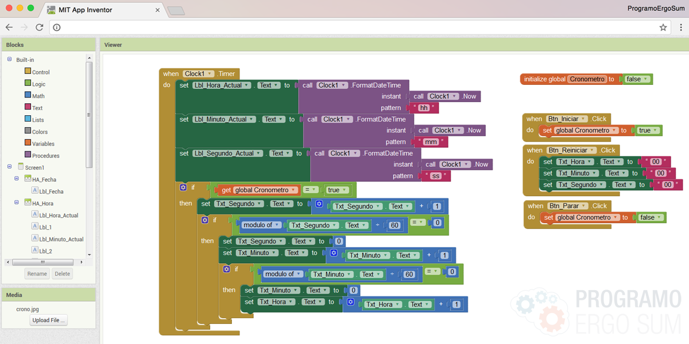

# Programación de un cronómetro en AppInventor

En este curso online de programación de aplicaciones con AppInventor aprenderás a utilizar el componente timer para crear un cronómetro. Este cronómetro tendrá las opciones de iniciar, parar y reiniciar similar a los existentes en nuestros dispositivos.

 

## Diseño de la aplicación

  <iframe src="//www.youtube.com/embed/rBK8vY75V00" allowfullscreen></iframe>

Lo primero que tenemos que hacer antes de empezar a programar la aplicación es crear el diseño con los distintos elmentos y componentes. Para ello vamos a añadir varias cuadrículas para organizar de una forma más sencilla nuestros elmentos.

Además hemos incluído una imagen adaptada al tamaño del dispositivo utilizando el componente de imágenes.

 

## Programación de la aplicación

  <iframe src="//www.youtube.com/embed/4Zo5RMPGo-A" allowfullscreen></iframe>

Una vez añadidos todos los elementos en el diseño de la aplicación procedemos a la programación.

En este vídeo se explica el funcionamiento del componente que se va a utilizar y que es utilizado en muchas aplicaciones cuando queremos calcular instantes de tiempo, en este caso, la hora del sistema o dispositivo.

En esta lección solamente se va a programar el contador del reloj y en la siguiente lección se crearán los eventos de los botones para iniciar, borrar o reiniciar el contador.

 

## Programación cronómetro

  <iframe src="//www.youtube.com/embed/XQTTaFU4B9Q" allowfullscreen></iframe>

En esta última lección programamos los botones del cronómetro utilizando buenas prácticas de programación, es decir, reutilizaremos el código programado en la lección anterior para programar las nuevas funcionalidades. Estas funcionalidades corresponden a los botones de iniciar, parar y reiniciar.

