# Introducción al diseño 3D con TinkerCAD

En este tutorial aprenderás a utilizar la herramienta gratuita online TinkerCAD para crear diseños en 3D imprimibles con una impresora 3D. A lo largo del tutorial aprenderás a diseñar diferentes tipos de objetos además de importar y exportarlos.

 

## ¿Qué es TinkerCAD?

TinkerCAD es un programa o software gratuito y online creado para el desarrollo y modelado de objetos en 3D de una manera sencilla, al disponer de una interfaz de trabajo simple y atractiva. TinkerCAD ha sido creado por la empresa AutoDesk.

Como ventajas se podría destacar que es sencillo de usar, tiene un aspecto atractivo y con unas pocas horas de uso podemos adquirir mucha destreza. Por otro lado, como desventaja podríamos señalar que es necesario tener una cuenta de correo para darse de alta como usuario y que sólo posee una versión online. En el siguiente vídeo puedes ver un reccorrido rápido de las funciones básicas de TinkerCAD, antes de empezar a construir el llavero.

### Registro en TinkerCAD

  <iframe src="//www.youtube.com/embed/pfBvGZYU1JI" allowfullscreen></iframe>

Lo primero que debes hacer es acceder a la web de TinkerCad. Es necesario registrarse. Apenas se tardan unos segundos en completar el registro y es gratuito. Una vez registrado deberás confirmar el correo electrónico para poder continuar con la cuenta.

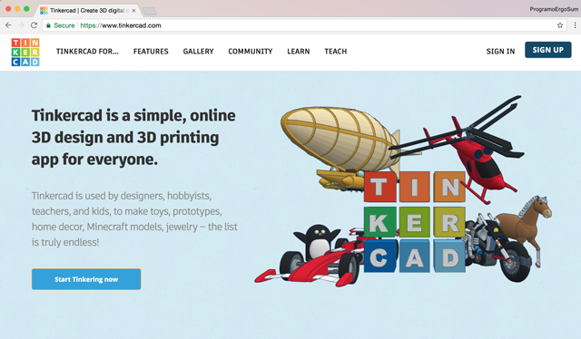

Al acceder por primera vez verás tu cuenta de usuario sin proyectos. También puedes añadir tus datos en la cuenta así como tu foto de perfil, etc. Una vez comiences a crear diseños podrás verlos en tu cuenta de usuario de TinkerCAD. También podrás marcarlos como privados o públicos para compartirlos con tus amigos.

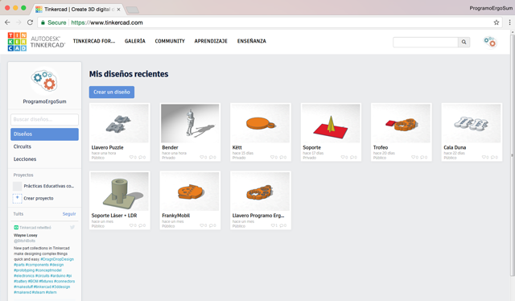

Si es tu primera vez en TinkerCAD te recomiendo que accedas a las lecciones guiadas que ofrece la herramienta. Haz clic en el menú superior Aprendizaje, para accceder a las lecciones. A continuación realiza todas las lecciones que se proponen para aprender a utilizar la herramienta.

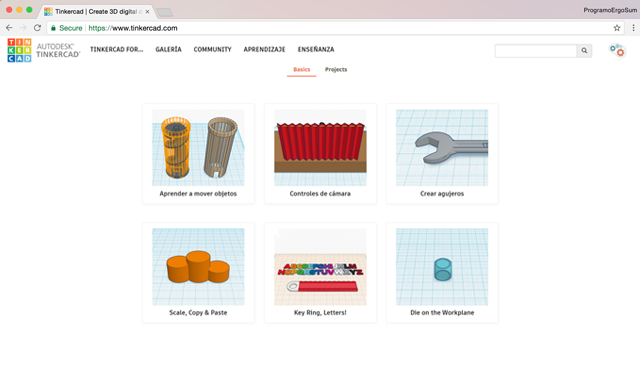

 

## Primeros pasos

  <iframe src="//www.youtube.com/embed/-b5UNU6v0FI" allowfullscreen></iframe>

En primer lugar vamos a realizar una vista rápida sobre las zonas y controles de TinkerCAD ya que es importante conocer la herramienta antes de comenzar a diseñar nuestro primer objeto en 3D.

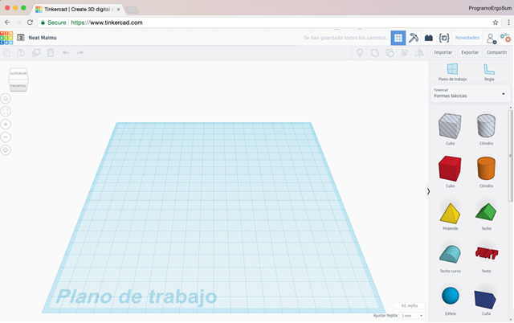

En la zona superior tenemos los iconos de deshacer, rehacer y una serie de accesos directos a herramientas de trabajo y de diseño que se explicarán más adelante, como agrupar y desagrupar, etc.

En la zona izquierda tenemos opciones para controlar el punto de vista de nuestro diseño y el zoom sobre el mismo, aunque ambas opciones se pueden realizar con los botones del ratón.

En la zona derecha tenemos una serie de menús desplegables con opciones de diseño directas (formas geométricas, letras, símbolos…).

En la zona inferior contamos con las medidas de la cuadricula. Por último, en el centro nos encontramos el plano de trabajo.

### ¡Hola Mundo!

El primer objeto que vamos a crear es un cubo. Para ello arrastraremos el objeto cubo como se observa en la siguiente imagen. Una vez situado el cubo sobre el plano de trabajo, podemos modificarle las medidas, ángulos, etc. Lo único que tenemos que hacer es hacer clic sobre el objeto, y desplazar los controles que aparecen en las esquinas.

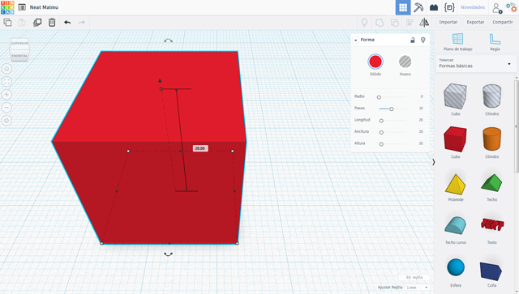

Como se observa en la anterior imagen, nuestro caso hemos creado un cubo con unas medidas de 20x20x20 milímetros, ya que la cuadrícula la tenemos en 1mm como puedes observar en la zona inferior.

 

## Mi primera figura

  <iframe src="//www.youtube.com/embed/1ZvsTkDAjOA" allowfullscreen></iframe>

En esta lección se va a construir una sencilla casa para practicar con el manejo de la herramienta así como los diferentes objetos predeterminados que trae TinkerCAD por defecto.

En primer lugar vamos a crear un cubo sólido de 50mm de largo, ancho y alto. Una vez creado, crearemos otro cubo pero hueco en este caso de 40mm de largo y ancho y 45mm alto. Una vez creado ambos cubos colocaremos el cubo hueco en el interior del cubo sólido con lo que tendremos unas paredes de 5mm.

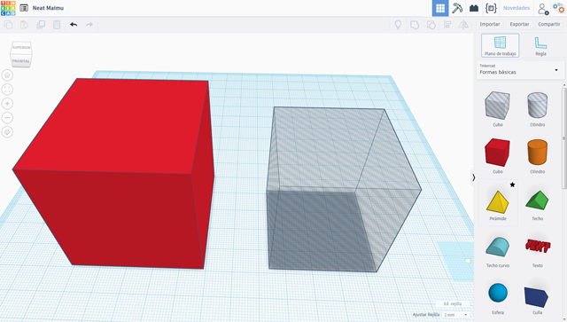

Para ver el resultado perfecto, podemos agrupar los bloques con la herramienta de agrupar situada en la parte superior de la ventana.

El siguiente paso será crear las puertas y las ventanas de la casa. Para ello crearemos cubos huecos. Los desplazaremos y los colocaremos en el lugar deseado. Una vez colocados volveremos a seleccionar todos los objetos para agrupar la casa y poder visualizarla.

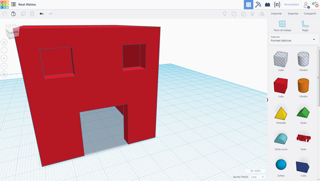

Por último, arrastraremos el objeto con forma de pirámide para situarla en la parte superior de la casa a modo de tejado. Recuerda que las medidas tienen que ser como mínimo igual que las del cubo exterior de 50mm.

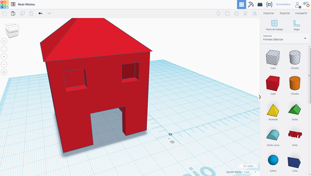

### Otros objetos

Como puedes observar es muy sencillo crear un objeto en 3D utilizando la herramienta de TinkerCAD.

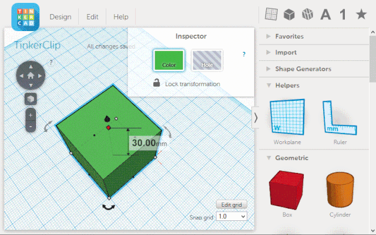

 

## Importar diseños en SVG

  <iframe src="//www.youtube.com/embed/8WQZNA5se_0" allowfullscreen></iframe>

En ocasiones disponemos de diseños en vector en formato SVG. Los archivos SVG (Scalable Vector Graphics), Gráficos Vectoriales Redimensionables, son un formato de gráficos vectoriales bidimensionales, tanto estáticos como animados, en formato XML.

Por ejemplo, en nuestro caso, el logo de la Asociación Programo Ergo Sum está creado en formato SVG para que pueda ser modificado sin pérdida.

Como puedes imaginar, crear un diseño en 3D de forma similar a como se creó la casa sería una trabajo tedioso y tardaríamos bastante tiempo, ya que realizar las tuercas para que queden exactamente igual que el diseño sería complicado.

Sin embargo, al disponer del logo original en formato SVG, podemos importarlo en la herramienta de TinkerCAD en formado 2D, para agrandarlo y crear el objeto en 3D de una manera muy sencilla.

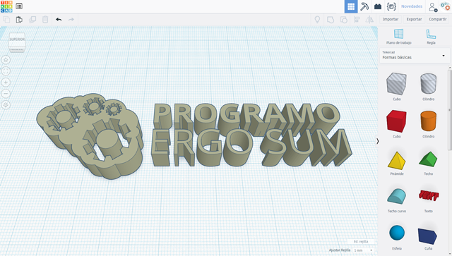

 

## Exportar diseños

Del mismo modo que podemos importar diseños también podemos exportarlos. En la lección anterior vimos cómo importar un diseño en 2D y en este caso podemos exportarlo también en 2D. Este archivo será el archivo en formato SVG como ya vimos en la anterior lección.

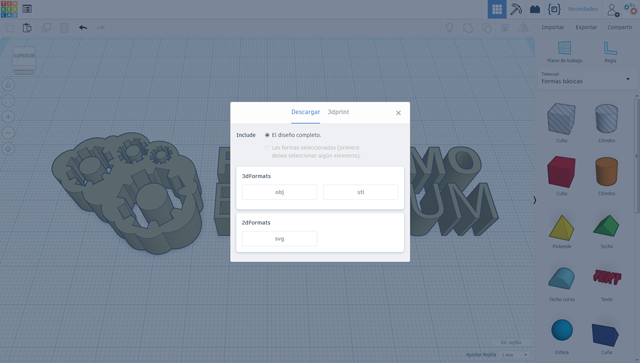

En general, utilizaremos los archivos en formato OBJ o STL para poder modificarlos utilizando otras herramientas de diseño 3D así como para imprimirlos utilizando una impresora 3D.

 

## Retos propuestos

Si ya has completado todas las lecciones del tutorial te proponemos resolver los siguientes retos.

### Reto 1: Crea un colgante

En este reto te propongo que diseñes un colgante utilizando lo aprendido en las lecciones de este curso. Recuerda que puedes modificar los colores para que cada parte del colgante tenga unos colores u otros.

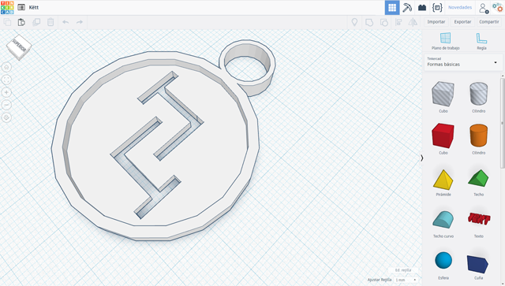

### Reto 2: Importa un logo en SVG

En este reto te propongo que busques por internet el logotipo en formato SVG y lo importes con la herramienta TinkerCAD. A continuación modifícalo para personalizarlo a tu gusto y crear el objeto en 3D.

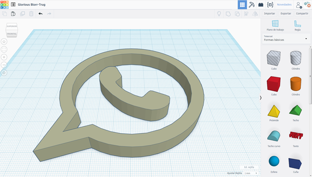
