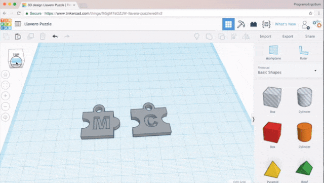
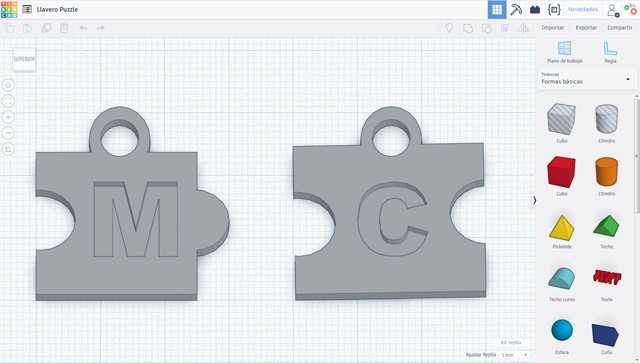
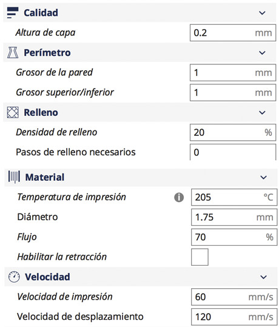
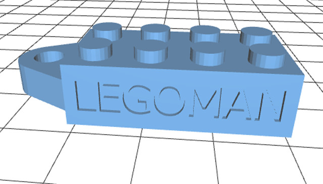

## Introducción

En este curso aprenderás a construir un llavero en 3D personalizado utilizando la herramienta gratuita online TinkerCAD. Una vez construido aprenderás cómo exportarlo para imprimirlo con una impresora 3D.

 

## Diseño del llavero

  <iframe src="//www.youtube.com/embed/qAKjM8ccubY" allowfullscreen></iframe>

Para diseñar el llavero, vamos a empezar por algo sencillo. Crearemos un llavero con forma de puzle y le añadiremos en el interior la inicial de nuestro nombre, a modo de personalización. En este caso, hemos añadido las iniciales "M" y "C".

> Este llavero tiene unas medidas aproximadas de 30mm de ancho, 30mm de largo y 5mm de grosor.

En primer lugar se creará la base del llavero tomando como medidas 30x30x5 mm. Según el puzle deseado, se le añadirá un círculo en modo sólido o hueco en el centro del lateral. Una vez añadido se agrupará para tener el objeto que se pueda mover.

A continuación se añade la letra separándola de la base 2 milímetros, de tal forma que tendremos un relieve de 3 milímetros en el llavero. Podemos crear el relieve de la letra o utilizando el modo hueco tendremos el relieve del llavero. Como más te guste.

Por último, se crea la anilla del llavero utilizando 2 círculos, uno dentro del otro, sólido y hueco respectivamente.

Para finalizar agrupamos todos los objetos del llavero para poder redimensionarlo o moverlo con facilidad.

 

## Impresión 3D

  <iframe src="//www.youtube.com/embed/7VlY6xDFdeA" allowfullscreen></iframe>

Antes de imprimir el llavero con el software de impresión Ultimaker Cura, deberemos exportarlo en formato ".stl" para abrirlo con el software de impresión. Aunque en el vídeo se explica el software de impresión Ultimaker Cura, puedes utilizar cualquier otro software siendo los parámetros de configuración parecidos.

Con los anteriores parámetros, la pieza se ha impreso en 12 minutos aproximadamente utilizando una impresora 3D Prusa BQ Hephestos.

 

## Mejores proyectos

