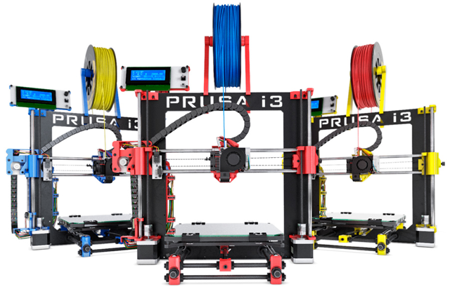
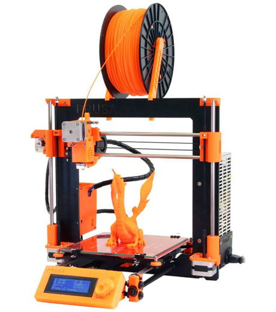
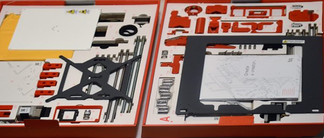
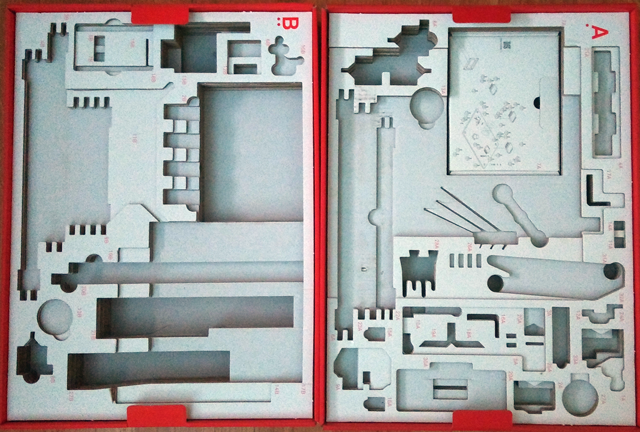

# Impresora 3D Prusa i3 BQ Hephestos

En este tutorial aprenderás los primeros pasos que tienes que seguir antes de imprimir una pieza con una impresora 3D. Para ello utilizaremos una Prusa i3 BQ Hephestos. Además, podrás observar el vídeo de BQ donde graba todo el proceso de montaje para que no tengas dudas a la hora de adquirir una impresora 3D desmontada.

### Antes de empezar

Asegúrate que dispones de todos los componentes que se van a necesitar.

- Impresora 3D Prusa i3 BQ Hephestos
- Filamento PLA 1.75mm
- Software Ultimaker Cura

 

## ¿Qué es una impresora 3D?

Una impresora 3D es una herramienta que **construye objetos físicos a partir de objetos digitalizados**. Esto permite diseñar un objeto mediante un programa como <a target="_blank" href="https://www.freecadweb.org/">FreeCAD</a> o incluso escanear la realidad mediante un escáner 3D para imprimirlo posteriormente. Una vez que se cuenta con la información que describe el archivo se puede manipular y enviar a la impresora 3D para que lo construya.

Las impresoras 3D lo que hacen es crear un objeto con sus 3 dimensiones y esto lo consigue construyendo capas sucesivamente hasta conseguir el objeto deseado. Además, existen incluso escaner 3D que nos pueden escanear un objeto y verlo en nuestro ordenador para luego imprimirlo sin necesidad de tener que diseñarlo en el ordenador.

> El futuro que nos espera con las impresoras 3D es abrumador ya que nos encontramos ante una revolución tecnológica.

Como características principales de una impresora 3D tenemos:

- Trabajan con un extrusor de polímeros (tecnología de adición de polímeros).
- Tienen un coste relativamente bajo incluido el material que utilizan.
- Están diseñadas de un modo abierto inspirándose en la cultura libre.

### Materiales en impresión de polímeros

La mayoría de las impresoras que podemos encontrar en el mercado son impresoras que utilizan la tecnología por adición de polímeros. A continuación vamos a ver los diferentes materiales que podemos utilizar con estas impresoras:

- ABS (acrilonitrato butadieno estireno): es un plástico duro y rígido, no biodegradable. Aguanta altas temperaturas. La impresión con este material necesita de una cama caliente o base de impresión caliente donde se deposita la pieza.
- PLA(poliácido láctico): es un material que se obtiene a partir de materiales naturales como el almidón del maíz o la caña de azúcar. Es biodegradable y no emite gases tóxicos durante la impresión. No necesita base caliente. No resiste temperaturas tan altas como el ABS.
- Laybrick: es una mezcla de varios materiales plásticos y yeso. A partir de él se obtienen piezas con aspecto de piedra arenisca. Se puede pintar y lijar fácilmente.
- Laywoo-D3: formado por un polímero y un 40% de polvo de madera. Se obtienen piezas con cierto parecido a la madera. Las piezas obtenidas se pueden lijar, serrar y pintar.
- Filaflex: es un filamento elástico con una base de poliuretano y otros aditivos  que le confieren una gran elasticidad. La impresión con este material es lenta. Se utiliza para imprimir zapatillas, prótesis, carcasas para teléfonos móviles, etc.

 

## ¿Qué es Prusa?

Una de las ventajas de poseer una impresora 3D de código abierto, como la Prusa i3, es que todas sus piezas de plástico son perfectamente imprimibles desde otra impresora 3D, por lo que podemos llegar a clonar el propio equipo desde casa sin tener ningún problema legal. Es por ello esta impresora 3D es vendida por muchas marcas que la ofrecen lista para ser armada por nosotros mismos, con sus respectivas partes de plástico. El problema de esto es que generalmente necesitaremos tener ciertas habilidades para lograr montar todas sus partes de forma que su desempeño sea el óptimo.

La Prusa i3 es el diseño de impresora 3D más nuevo y actual hecho por el desarrollador principal de RepRap Prusajr. Esta versión i3 incorpora lecciones aprendidas de los dos diseños anteriores de Prusa, así como de otros diseños populares modernos. Las piezas de plástico de la propia impresora 3D han sido construidas mediante impresión 3D. Además, la descripción de estos objetos libres se encuentra en repositorios para que estén disponibles para todo el mundo. Pudiendo descargarlos, modificarlos y/o publicar una nueva versión del objeto en cualquier momento.

El diseño de la Prusa i3 es completamente de código abierto por lo que las opciones de personalización son bastante amplias. Ya montada tiene unas dimensiones de 48x30x18cm y un peso de 9.4kg.

> El desarrollo de la Prusa Mendel está alojado en GitHub. Los archivos STL para construir la impresora se pueden encontrar en <a target="_blank" href="https://github.com/josefprusa/Prusa3">CloneWars</a>.

 

## Unboxing BQ Hephestos

En esta lección se explica cuál ha sido nuestra experiencia montando la impresora 3D Prusa i3 BQ Hephestos, impresora inspirada en un modelo de la comunidad RepRap que incluye la electrónica y diseño fabricado por la empresa BQ.

La impresora viene embalada en una caja compacta con un peso aproximado de 20Kg. Al abrir la caja aparece casi un centenar de piezas organizadas y ordenadas en 2 pisos. Cada pieza viene con un número para que sea fácil identificar en las instrucciones de montaje, similar al montaje de un mueble de Ikea.

En las piezas tenemos tanto las impresas en plástico por otra impresora como las piezas de hierro y circuitería electrónica, motores, etc. En cajas más pequeñas podemos ver los tornillos y tuercas de diferentes medidas separados por bolsas. También viene una hoja con la silueta de los tornillos a escala real para que sea más fácil identificarlos.

En nuestro caso, montamos la impresora siguiendo el manual impreso paso a paso y no tuvimos ningún problema. Es muy importante seguir las indicaciones del fabricante para el correcto funcionamiento de la impresora 3D. El manual está muy bien explicado, además el fabricante dispone en su web de una colección de videos que detallan todo el proceso, como el que aparece en la siguiente sección.

La cama tiene una dimensión de 220x220x3mm, consiguiendo objetos impresos de hasta 22 centímetros de altura. En cuanto al el extrusor soporta material con 1,75 milímetros de grosor, material que se puede comprar en la propia tienda online de internet. BQ Hephestos soporta la impresión de madera, PLA, bronce, cobre y FilaFlex. Pero siendo una impresora 3D basada en hardware libre, podrás alterar el extrusor y colocar otro tipo de materiales.

 

## Guía de montaje

La duración del montaje puede durar unas cuantas horas para personas que no estén familiarizadas con este procedimiento, sin embargo es una experiencia obligatoria para todos aquellos que son verdaderos entusiastas de estas máquinas. Los fabricantes incluyen generalmente una o varias guías bastante amplias para facilitar el trabajo de montaje.

En el siguiente vídeo se observa cómo montar la impresora Prusa i3 Hephestos de BQ. Además, al adquirirla viene un manual impreso explicado pasoa paso con instrucciones muy sencillas.

  <iframe src="//www.youtube.com/embed/nvTeJvRi8Bo" allowfullscreen></iframe>

 

## Nivelado y calibración

Una vez montada la impresora siguiendo el manual del fabricante, queda lo más complicado, la calibración. Una de las partes más importantes a calibrar en una impresora 3D es la base o cama, ya que, en caso de no estar bien nivelada, no se obtendrán buenos resultados de impresión.

### Ajuste del eje Z

Es necesario ajustar este eje para que al desplazarse el extrusor no se produzcan variaciones de altura entre la punta de este y la base. Para empezar, se debe comprobar que la altura en ambos lados sea la misma, midiendo desde un punto de la guía del eje z a un punto fijo de la impresora 3D. Para igualarla, se gira manualmente el motor del lado que se necesita ajustar, sujetando del otro lado para que no gire.

  <iframe src="//www.youtube.com/embed/gDcAXN6jsOc" allowfullscreen></iframe>

### Nivelado de la cama o base

La base de impresión se nivela en cuatro puntos mediante cuatro tornillos, es recomendable nivelarla un par de veces seguidas antes de empezar a imprimir. Para una buena calibración de la boquilla sobre la cama, tiene que pasar un folio sin problemas, y que la punta esté pegada al folio, pero sin que haya demasiada resistencia, sólo la justa.

> Te aconsejamos nivelar la cama 1 vez por semana o cuando notes quenecesita calibrarse (algunas piezas se despegan, no sale filamento en la primera capa, las piezas se despegan por un lado, etc.)

  <iframe src="//www.youtube.com/embed/UyZDEy34tNY" allowfullscreen></iframe>

 

## Mantenimiento

Este tipo de impresoras necesitan sesiones de mantenimiento para poder seguir imprimiendo sin problemas y para no estropear los componentes que la forman. Lo recomendado es realizar una sesión de mantenimiento cada mes aproximadamente. Si haces un uso intensivo de la impresora es posible que tengas que realizar sesiones de mantenimiento con más frecuencia.

1. Revisión de tuercas y tornillos

Las vibraciones que provocan el hecho de imprimir pueden aflojar las tuercas y los tornillos de la impresora. Por ello es conveniente hacer una comprobación de que toda la tornillería esté bien apretada para que la impresora siga imprimiendo perfectamente.

### 2. Limpieza de ventiladores y electrónica

Las aspas de los ventiladores y la electrónica acumulan polvo. Esta acumulación puede provocar una mala refrigeración o fallos en la electrónica. Comienza desatornillando el ventilador de la electrónica y limpia las aspas por ambos lados con la brocha. Realiza lo mismo con la electrónica.

El extrusor tiene dos ventiladores, comienza limpiando el lateral. Separa el disipador del ventilador y límpialos por separado. Limpia el ventilador de la misma forma que hiciste con el de la electrónica y el disipador límpialo pasando la brocha por su superficie.

### 3. Comprueba las correas

Las correas se pueden destensar con el uso y con el tiempo, por lo que periódicamente debe comprobarse su tensión. Comprueba la tensión de las corres y en caso de que no estén lo suficientemente tensas, ayúdate de la pieza del tensor para ajustarlas.

### 4. Limpieza de las varillas

Tanto las varillas lisas como las roscadas han de estar bien limpias y engrasadas para que deslice correctamente y no se produzcan ruidos ni vibraciones molestas. Limpia las varillas y una vez limpias, echa unas gotas de lubricante en otro trozo de papel.

### 5. Limpieza del cristal

Si imprimes pulverizando laca sobre la superficie de cristal, notarás que se forma una capa sobre ésta, que aumenta su grosor cuantas más veces se utilice laca. Esta capa también puede estar formada por restos de plástico de impresiones anteriores. El aumento de grosor de dicha capa puede provocar malas impresiones de las primeras capas de la pieza, por lo que es conveniente limpiar el cristal cada cierto tiempo. Para limpiar el cristal simplemente lávalo con agua caliente para que se despege con facilidad el plástico y la laca.

### 6. Limpieza del Hotend

El hotend es la pieza que se calienta y por la que sale el filamento de plástico caliente y en ocasiones se pueden dar atascos en el interior de esta pieza que provocan que el plástico no fluya y que la impresora no funcione correctamente.

Para limpiar el hotend lo primero que hay que hacer es quitar la pieza protectora que rodea la punta del hotend y quitar el filamento. Una vez extraído el filamento, introduce la punta de la aguja de acupuntura por la boquilla del hotend (por la parte inferior) teniendo cuidado de no acercar los dedos al hotend. Sube y baja la aguja por el interior de éste durante unos segundos. Este movimiento desplazará el plástico que pueda haber dentro del hotend, desatascándolo en caso de que se hubiese producido un atasco. Una vez realizado este paso, lo siguiente será limpiar externamente la punta del hotend. Teniendo mucho cuidado de no dañar los cables del cartucho cerámico y del termistor pasaremos el cepillo de púas por la parte exterior de la punta del hotend.

### 7. Nivelación de la base

Repite este proceso tal y como se explica en la lección anterior.
