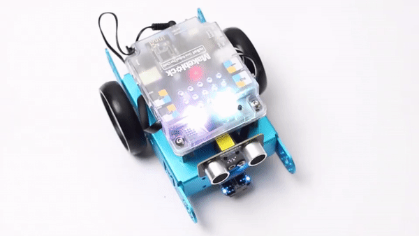
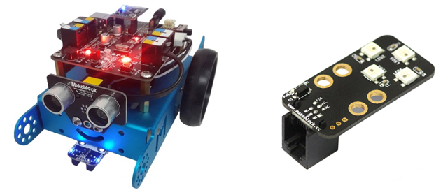
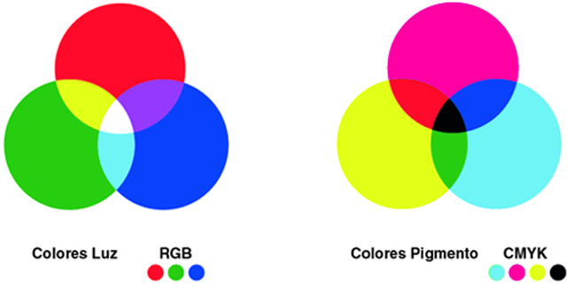
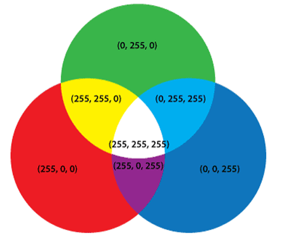
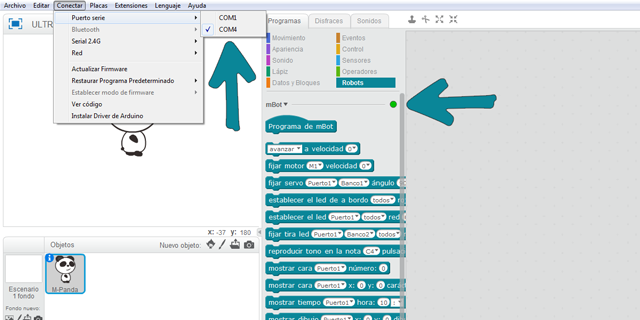
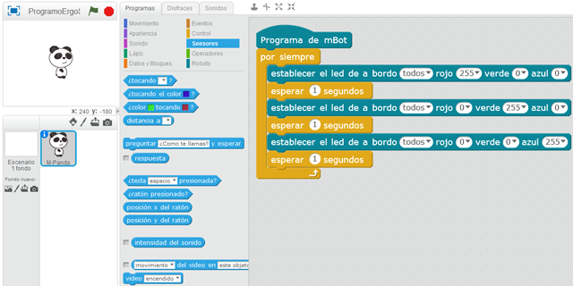

# Led RGB del robot mBot con mBlock

En este curso aprenderás a programar el robot mBot de MakeBlock y utilizar los Led RGB que trae por defecto el robot. Para ello se programará sobre el lenguaje de programación por bloques de mBlock el código que se le pasará al robot mBot.

### ¿Qué es un Led RGB?

El led RGB (Red, Green, Blue) es un led que combina estos tres colores para formar más de 16 millones de tonos de luz. De esta forma, dependiendo de la tonalidad pasada como parámetro, podemos emitir un colo de luz u otro. En mBot tenemos por defecto 2 led RGB en la parte superior del robot, no obstante, se puede adquirir por separado un módulo encargado para tal fin.

Antes de nada veamos las diferencias entre RGB y CMYK. El codigo RGB es un modelo de colores que tiene su base en los tres colores primarios rojo (Red), verde (Green), y azul (Blue). El acrónimo CMYK indica el modelo de colores cian (Cyan), magenta (Magenta), amarillo (Yellow) y negro (black).

Los colores del Led RGB vienen representados con números comprendidos entre el valor 0 y el valor 255. De esta forma, para componer el color rojo pondríamos el valor máximo del rojo y el valor mínimo de los otros colores, es decir, el rojo equivale a "R=255; G=0; B=0". Y así sucesivamente con el resto de colores.

 

## LED RGB del robot mBot

En esta lección se va a programar el Led RGB utilizando el lenguaje de programación por bloques de mBlock. Para ello lo primero que deberemos hacer será conectar nuestro robot mBot a Scratch y conectar el puerto serie al que estemos conectado. Además, si queremos ejecutar el programa sin desconectarlo de mBlock, deberemos cargar el firmware en el menú Conectar > Actualizar Firmware.

El siguiente paso será añadir el programa encargado de modificar los valores de los Led RGB de forma que cambie de color cada segundo, pasando por los colores rojo, verde y azul. Fíjate en los valores que se le da al bloque comprendido entre 0 y 255.

 

## Retos propuestos

Si ya has completado todas las lecciones del tutorial te proponemos resolver los siguientes retos.

### Reto 1: Luces aleatorias

En este reto de programación con mBot deberás programar un código encargado de mostrar un color aleatorio utilizando los LEDs RGB del robot, además, cada uno de los dos LEDs deberá mostrar un color diferente.

### Reto 2: Detecta el sonido

En este reto de programación con mBot deberás detectar el sonido del micrófono de tu ordenador (utilizando realidad aumentada), para cambiar los LEDs RGB del robot mBot. Esta programación solamente podrá funcionar conectado a mBlock.

### Reto 3: Tonalidades RGB

En este reto de programación con mBot deberás mostrar las distintas tonalidades de los LED RGB pasando por los colores rojo, verde y azul de los LEDs RGB del robot mBot.

