# Curso de primeros pasos con Arduino

En este curso online de Arduino se explica cómo configurar la placa de arduino en nuestro ordenador y cómo instalar los diferentes programas de código abierto que se utilizarán en las prácticas. Para ello aprenderás a instalar y configurar los siguientes programas:

- Arduino IDE
- Scratch 4 Arduino (basado en Scratch 1.4)
- Snap 4 Arduino (basado en Snap)
- mBlock (basado en Scratch 2.0)

### ¿Qué materiales voy a necesitar?

Antes de continuar con las lecciones del curso asegúrate que dispones de todos los componentes que se van a necesitar. Los componentes utilizados en este tutorial son:

- Permiso de administrador para instalar programas en tu ordenador
- Arduino UNO
- Cable USB


<br />


## ¿Qué es Arduino?

Arduino es una plataforma para prototipado de electrónica basada en hardware y software libre y fácil de utilizar. Podemos construir circuitos electrónicos y programarlos para iniciarnos en el mundo de la electrónica y robótica, construir componentes electrónicos a nuestro antojo e incluso crear un modelo de negocio.

> Arduino se apoya en 2 pilares fundamentales; Hardware (placa de Arduino) y Software (entorno de programación).

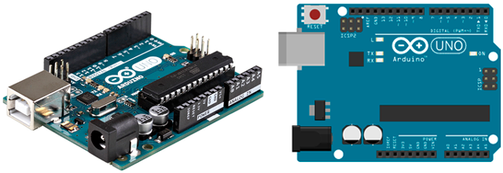

### Hardware de Arduino

El microcontrolador de Arduino es un circuito integrado programable capaz de realizar operaciones matemáticas complejas a gran velocidad. Normalmente el modo de alimentación de una placa de Arduino es mediante el puerto USB mientras se está programando, pero hay ocasiones en la que necesitamos que el código de nuestra placa se siga ejecutándose sin estar conectado al equipo. Probablemente la forma más habitual de alimentar Arduino (sin utilizar tu equipo) es mediante una fuente de alimentación o pila de 9V.

Arduino dispone de un regulador de voltaje interno que actúa para que la tensión de alimentación no supere los 12V, ya que en caso contrario podemos dañar el regulador y con ello la placa de Arduino. Por otro lado, para tensiones inferiores a 7V en la alimentación, es probable que la placa no llegue a encenderse. La mayoría de los componentes electrónicos de Arduino utilizan una tensión operativa de 5V (ya regulada por el regulador de voltaje de la propia placa de Arduino)

Tanto las entradas como las salidas dotan al sistema de información y realizan diferentes actuaciones. Arduino contiene la siguiente distribución de pines:

- 14 pines digitales que pueden ser configurados como entradas o salidas.
- 6 pines PWN (serigrafiados con ~) entre los pines digitales.
- 6 pines analógicos serigrafiadas desde A0 hasta A5 para las entradas analógicas.
- 3 pines GND para conectar a tierra nuestros circuitos.
- 2 pines de alimentación de 5V y 3.3V respectivamente.

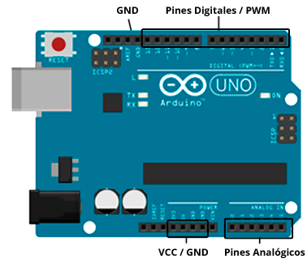

### Software de Arduino

Para programar una tarjeta de Arduino, podemos utilizar diferentes lenguajes y entornos de programación. En este caso vamos a introducir la programación y electrónica con Arduino utilizando los lenguajes de programación por bloques y lenguajes de programación en modo texto.

- Lenguajes de programación por bloques:
  - Ardublock
  - Scratch 4 Arduino
  - Snap 4 Arduino
  - mBlock
  - Blocklyduino
  - Visualino
- Lenguajes de programación textual
  - Arduino IDE


<br />


## Software de Arduino IDE

<div class="iframe">
  <iframe src="//www.youtube.com/embed/7F9hH7SGfyk" allowfullscreen></iframe>
</div>

### ¿Qué es Arduino IDE?

Arduino IDE es un editor de texto y compilador para programar y transferir el contenido de las instrucciones a la placa de Arduino en su lenguaje máquina. El lenguaje de programación utilizado es Processing.

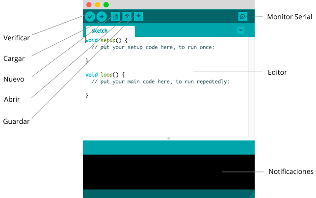

El Software Arduino IDE se compone de 3 partes principalmente:

- Botonera o barra de navegación:
  - Verificar: Se encarga de verificar la sintaxis de nuestro programa.
  - Cargar: Si la verificación ha sido correcta, podemos cargar el código en nuestra placa de Arduino.
  - Nuevo: Simplemente abrimos un documento vacio (salvo funciones principales) para comenzar un nuevo programa.
  - Abrir: Para abrir proyectos en otros directorios o rutas.
  - Guardar: Simplemente guarda el programa en el directorio que especifiquemos (si es la primera vez que lo guardamos).
  - Monitor serial: Supongamos que necesitamos saber en algún momento qué ocurre dentro de nuestra placa de Arduino, pues bien, mediante el monitor serial podemos enviar datos que se mostrarán en nuestro monitor.
- Editor de programación: Es la parte principal de Arduino IDE, básicamente donde se programan las líneas y líneas de código en lenguaje processing.
- Notificaciones: Conocido normalmente por consola, es la parte de depuración donde notifica al programador sobre errores de sintaxis, comunicación, etc.

### Descargar e instalar Arduino IDE

Descargamos el software de Arduino desde la sección de descargas de la página web Arduino.cc y procedemos a ejecutar el programa descargado aceptando la licencia de uso y siguiendo los pasos que aparecen en el instalador.

> En siguientes tutoriales aprenderás a programar utilizando este lenguaje de programación textual.


<br />


## Software S4A

> Scratch 4 Arduino (S4A) está basado en la versión 1.4 de Scratch, con lo cual recomendamos utilizar otros lenguajes de programación por bloques, como mBlock, basado en la versión actual de Scratch.

<div class="iframe">
  <iframe src="//www.youtube.com/embed/WUy_FLhvN8U" allowfullscreen></iframe>
</div>

### ¿Qué es Scratch 4 Arduino (S4A)?

Scratch 4 Arduino (S4A) es una modificación del software libre de Scratch que nos permite crear programas para Arduino, pero tenemos que tener en cuenta que los proyectos siempre serán dependientes de la conexión con S4A, es decir, debemos tener S4A ejecutándose en nuestro equipo al mismo tiempo.

Está basado en el lenguaje de programación por bloques y sus instrucciones han sido diseñadas con un lenguaje natural, eliminando términos técnicos y empleando una terminología más natural. Así se facilita el acceso a la programación en niveles educativos básicos.

> Scratch 4 Arduino (S4A) funciona correctamente con Arduino Diecimila, Duemilanove y Uno.

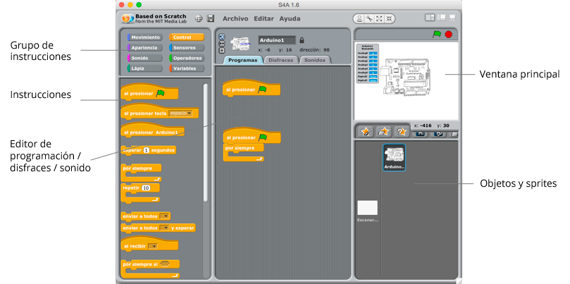

### Descargar e instalar Arduino IDE

Independientemente del sistema operativo que utilicemos, desde la web del proyecto está disponible para Windows, Linux y Mac, siendo la instalación similar. Para instalar S4A en nuestro equipo debemos seguir los siguientes pasos:

- Tener instalado Arduino IDE en primer lugar.
- Cargar un pequeño programa o firmware en la placa de Arduino utilizando Arduino IDE.
- Instalar S4A desde la web s4a.cat siguiendo los pasos de instalación.

### Cargar el Firmware de S4A en Arduino

<div class="iframe">
  <iframe src="//www.youtube.com/embed/cIPGyZDYIS4" allowfullscreen></iframe>
</div>

Para que S4A reconozca y se comunique con la tarjeta de Arduino, debemos cargar un firmware o controlador en la misma. De esta forma, toda la información de sensores que recibe la placa, la envía a través del cable USB mediante el firmware al programa S4A.

> El firmware hace de intermediario entre Scratch 4 Arduino y la placa de Arduino.

Para cargar el firmware en la placa de arduino debemos seguir los siguientes pasos:

- Abrir el archivo S4AFirmware16.ino con Arduino IDE.
- Subir el código a la placa de arduino y esperar a que finalice.

Una vez subido el firmware a la placa de arduino deberá aparecer que la placa ha sido detectada en Scratch 4 Arduino (S4A).

Unos errores detectados a la hora de cargar el firmware de S4A en la placa de Arduino, son los siguientes:

- En algunos equipos, los puertos USB delanteros no funcionan.
- En sistemas operativos Windows XP:
  - Al conectar la placa de Arduino por primera vez nos pedirá permiso para instalar los drivers. Para ello debemos tener permiso de administrador para instalarlo.
  - Si no detecta la placa de Arduino debemos instalar los drivers desde Panel de control > Agregar nuevo hardware.
- Al cargar el firmware de S4A en nuestra placa de Arduino, debemos seleccionar la placa y el puerto correcto desde el software de Arduino IDE.


<br />


## Software Snap for Arduino

### ¿Qué es Snap 4 Arduino?

Snap 4 Arduino es una modificación del software libre de Snap que nos permite crear programas para Arduino, pero tenemos que tener en cuenta que los proyectos siempre serán dependientes y deberán estar conectados a Snap.

Está basado en el lenguaje de programación por bloques y sus instrucciones han sido diseñadas con un lenguaje natural, eliminando términos técnicos y empleando una terminología más natural. Así se facilita el acceso a la programación en niveles educativos básicos.

> Snap 4 Arduino funciona correctamente con Arduino Diecimila, Duemilanove y Uno.

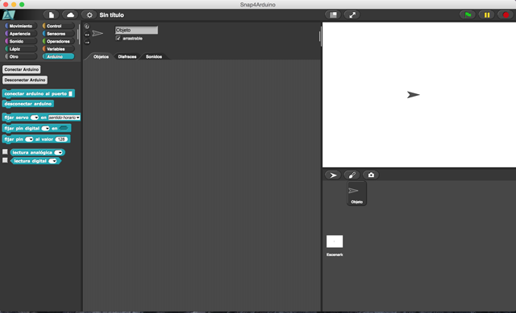

### Descargar e instalar Arduino IDE

Independientemente del sistema operativo que utilicemos, desde la web del proyecto está disponible para Windows, Linux y Mac, siendo la instalación similar. Para instalar el software en nuestro equipo debemos seguir los siguientes pasos:

- Tener instalado Arduino IDE en primer lugar.
- Cargar un pequeño programa o firmware en la placa de Arduino utilizando Arduino IDE.
- Instalar Snap 4 Arduino desde la web http://snap4arduino.rocks/ siguiendo los pasos de instalación.

### Cargar el Firmware de Snap en Arduino

Para que Snap reconozca y se comunique con la tarjeta de Arduino, debemos cargar un firmware o controlador en la misma. De esta forma, toda la información de sensores que recibe la placa, la envía a través del cable USB mediante el firmware al programa de Snap.

> El firmware hace de intermediario entre Snap 4 Arduino y la placa de Arduino.

Para cargar el firmware en la placa de arduino debemos seguir los siguientes pasos:

- Abrir el archivo StandardFirmata de Arduino IDE.
- Subir el código a la placa de arduino y esperar a que finalice.

Una vez subido el firmware a la placa de arduino deberá aparecer que la placa ha sido detectada en Snap 4 Arduino.

### Configurar Snap for Arduino

Una vez hemos instalado Snap 4 Arduino, debemos conectar nuestra placa de arduino utilizando el cable USB. A continuación, deberemos seguir los siguientes pasos de configuración.

- Cargar el firmware StandardFirmata
- Conectar Arduino con Snap

**Cargar el firmware**

Antes de conectar nuestra placa con Snap y Arduino debemos cargar un firmware que hace de intremediario entre el programa de Snap y la placa de arduino. Para ello debemos haber instalado previamente Arduino IDE y acceder a StandardFirmata como aparece en la siguiente imagen.

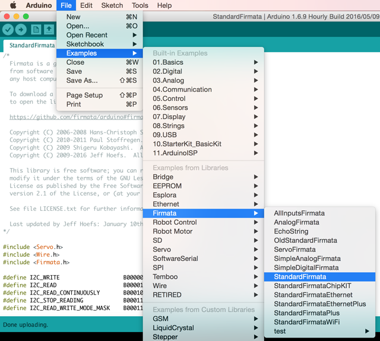

**Conectar Arduino con Snap**

Al conectar con Arduino en Snap deberá aparecer un mensje de que la placa ha sido detectada correctamente, y ya podrás empezar a programar utilizando Snap 4 Arduino.


 
> Recuerda que deberás realizar estos mismos pasos cada vez que desconectes y conectes tu arduino al ordenador.


<br />


## Software mBlock

### ¿Qué es mBlock?

mBlock es un entorno gráfico de programación basado en Scratch 2.0 y desarrollado por la empresa MakeBlock, para programar placas de prototipado basadas en Arduino, entre otros. Scratch está pensado para programar videojuegos mientras que mBlock está pensado para programar robots.

> Si todavía no conoces Scratch puedes acceder a la categoría de cursos y tutoriales de programación con Scratch.

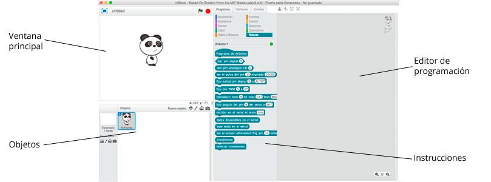

### Descargar e instalar mBlock

Independientemente del sistema operativo que utilicemos, desde la web del proyecto está disponible para Windows y Mac, siendo la instalación similar.

### Actualizar firmware

Para que Arduino se pueda comunicar con mBlock y ejecute las acciones de Scratch en tiempo real, es necesario que cargues previamente un Firmware en la placa. De esta forma, toda la información de sensores que recibe la placa, la envía a través del cable USB mediante el firmware al programa mBlock.

### Configurar mBlock

Una vez hemos instalado mBlock, debemos conectar nuestra placa de arduino utilizando el cable USB. A continuación, deberemos seguir los siguientes pasos de configuración.

- Conectar el puerto USB
- Elegir placa
- Elegir extensión
- Actualizar firmware
- Programar y depurar el código
- Subir el programa a Arduino

**Conectar el puerto USB**

En primer lugar debemos elegir el puerto correcto al cual hemos conectado nuestra placa de arduino. En caso de dudas puedes acceder a las herramientas administrativas de tu equipo (Windows, Linux o MAC) y comprobar el puerto utilizado.

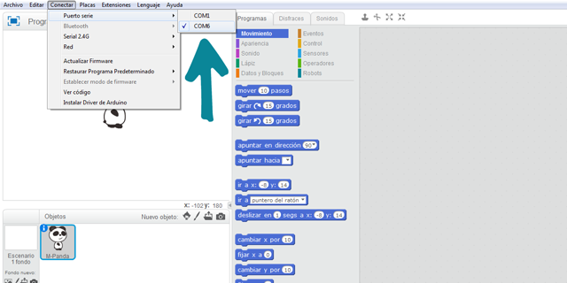
 
**Elegir la placa y extensiones**

mBlock puede ser utilizado con diferentes robots educativos o placas como Arduino. En este caso deberemos seleccionar la placa de arduino y la extensión de MakeBlock. A continuación observaremos como aparecen los bloques de programación para Arduino en el apartado de robots en la pestaña de programas.

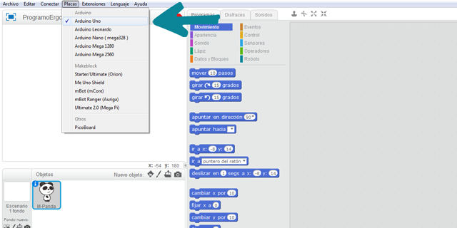

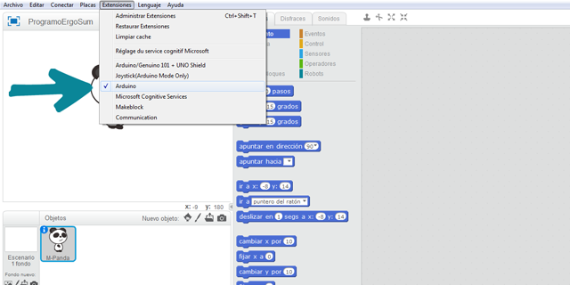

**Actualizar firmware**

Según se va programando el código a ejecutar en la placa de arduino, podemos ir probándolo sin necesidad de desconectarlo del puerto USB. En este caso, deberemos cargar el firmware en la placa para que el código y las variables utilizadas en el programa puedan ser mostradas desde la placa hacia la pantalla de mBlock.

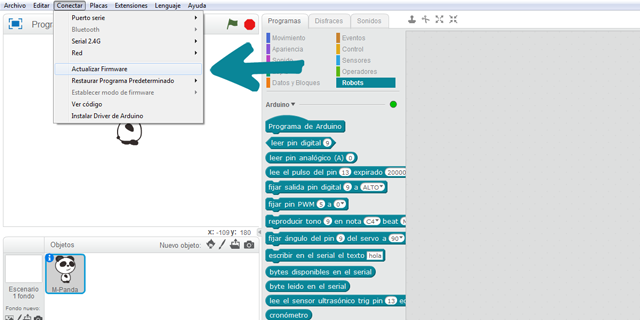

**Hola Mundo**

Puedes probar a programar el siguiente código y pulsar la bandera verde. Si todo ha salido correcto deberá parpadear el led situado junto al pin 13 de tu placa de arduino. De esta forma ya habremos configurado y conectado correctamente nuestra placa de arduino con el software mBlock.

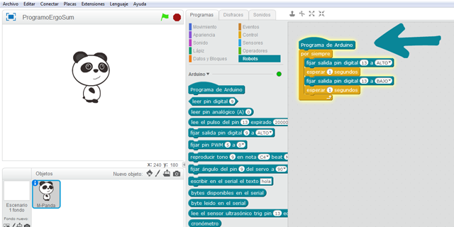

**Subir el código programado a Arduino**

Una vez hemos programado nuestra placa de arduino y queremos que funcione de forma autónoma sin necesidad de estar conectado a nuestro PC mediante el cable USB, deberemos cargar el código en la placa. Para ello deberemos acceder al apartado de Arduino y subir el código a arduino. El proceso suele tardar unos segundos.

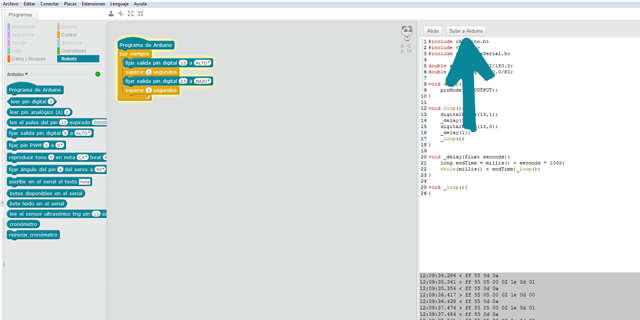


<br />


## ¡Hola Mundo!

Si ya has configurado correctamente tu placa de arduino explicada en las anterirores lecciones, estarás preparado para realizar la primera práctica.

En este lección se va a programar el código encargado de encender y apagar el led situado junto el pin número 13 de nuestra placa de Arduino. Deberá encenderse y apagarse con una frecuencia de 1 segundo. En esta práctica simplemente deberás conectar tu placa de arduino al ordenador utilizando el cable USB.

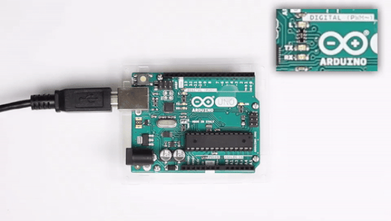

### Scratch for Arduino (S4A)

Para realizar la práctica utilizando Scratch 4 Arduino, deberás haber cargado el firmware que hace de intermediario entre la placa y el programa S4A. El siguiente paso será programar el código encargado de encender y apagar el pin digital 13 (el cual tiene contiene un led en la placa).

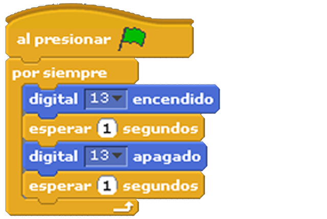

### Snap for Arduino

Para realizar la práctica utilizando Snap 4 Arduino, deberás haber cargado el firmata que hace de intermediario entre la placa y el programa de Snap. El siguiente paso será programar el código encargado de encender y apagar el pin digital 13 (el cual tiene contiene un led en la placa).

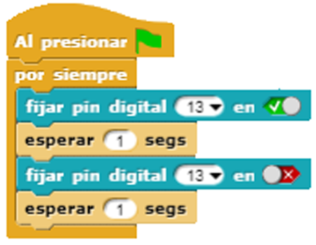

### mBlock

Para realizar la práctica utilizando mBlock, deberás haber configurado y cargado el firmware que hace de intermediario entre la placa y el programa mBlock. El siguiente paso será programar el código encargado de encender y apagar el pin digital 13 (el cual tiene contiene un led en la placa).

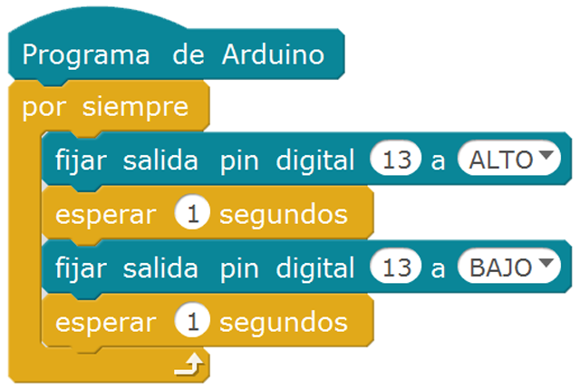

### Arduino IDE

Para programar el código utilizando el lenguaje de programación de Arduino IDE, recuerda elegir el puerto correcto. El siguiente paso será programar el código encargado de encender y apagar el pin digital 13 (el cual tiene contiene un led en la placa). Fíjate además que estamos indicando a Arduino que el pin digital 13 tiene que tratarlo como salida.

```arduino
void setup() {
  pinMode(13, OUTPUT);
}
void loop() {
  digitalWrite(13, HIGH);
  delay(1000);
  digitalWrite(13, LOW);
  delay(1000);
}
```
