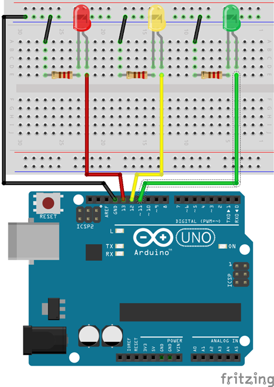
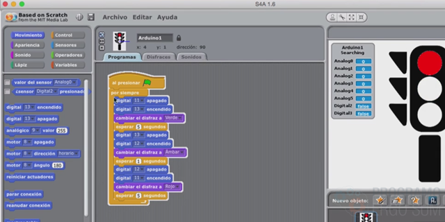
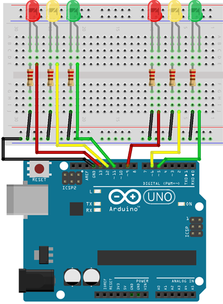
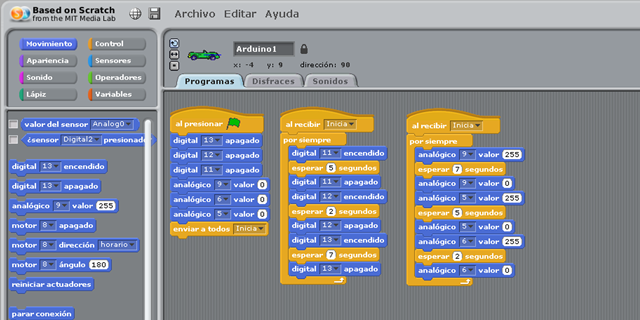

# Programación de un semáforo con Arduino

En este curso aprenderás a construir y programar un sencillo semáforo utilizando un lenguaje de programación por bloques y el lenguaje de Arduino. En las siguientes lecciones te explicamos paso a paso conceptos básicos de electrónica y programación que deberás conocer para construir la práctica del semáforo con Arduino.


### Materiales

Antes de continuar con las lecciones del curso asegúrate que dispones de todos los componentes que se van a necesitar. Los componentes utilizados en este tutorial son:

- Arduino UNO
- Cable USB
- Placa de prototipado o protoboard
- 4 cables o latiguillos
- 3 Diodos Led (Rojo, Amarillo, Verde)
- 3 Resistencias de 220Ω

### Esquema eléctrico

Los Led que estamos utilizando para la práctica admiten una tensión máxima de 2,1V y para evitar que se puedan dañar tendremos que colocarle una resistencia al circuito. Para ello, vamos a calcular el valor de la resistencia siguiendo la Ley de Ohm, es decir, la tensión en el Led tiene que ser 2,1V.

Si el pin de Arduino ofrece 5V, el tensión que debe circular por la resistencia es 5V – 2,1V = 2,9V. Por otro lado, sabemos que la intensidad que circula por el Led es de 20mA. Con lo cual siguiendo la Ley de Ohm, tenemos que:

```
R = 2,9V / 0,02A = 145Ω 
```

Redondeamos el resultado obtenido a un valor de resistencia por encima de su resistencia ideal, obteniendo una resistencia de 220Ω.




<br />


## Programación en S4A

<div class="iframe">
  <iframe src="//www.youtube.com/embed/6Q60WzYxb3c" allowfullscreen></iframe>
</div>

En esta lección te enseñamos la programación del semáforo programado en S4A y en las siguientes lecciones explicaremos como construir sobre la placa de prototipado los diferentes leds y resistencias.

Lo primero que hay que hacer es crear un objeto de tipo Arduino, y le añadimos los disfraces del semáforo. Esto lo vamos a hacer para comprobar que el cambio de disfraz y cambio de luces en la placa de Arduino funcionan correctamente.

En cuanto a la programación, utilizaremos un bucle que se repetirá siempre. Deberemos utilizar retardos para cambiar de disfraz y led, siguiendo los pasos del semáforo (verde, amarillo, rojo).

Al pulsar sobre la bandera verde observaremos que se produce el cambio de disfraz simulando el semáforo en la pantalla de Scratch. En la siguiente lección comprobaremos que también funciona en nuestra placa de Arduino.

> S4A está desarrollado sobre la versión 1.4 de Scratch. En la siguiente lección aprenderás cómo programar el semáforo utilizando mBlock, basado en Scratch 2.0 y superiores.



### Construcción del semáforo

<div class="iframe">
  <iframe src="//www.youtube.com/embed/Nr28WpNP3mQ" allowfullscreen></iframe>
</div>

Siguiendo el esquema eléctrico y explicaciones proporcionadas en la lección anterior, conectamos los led y resistencias sobre la placa de prototipado y Arduino.

Para reutilizar cables, conectamos todas las resistencias a la guía serigrafiada con el polo negativo de nuestra placa de prototipado. A continuación, conectamos los led a la resistencia. Para esta conexión se ha conectado la patilla más corta del led (cátodo o negativo) a la resistencia, y la patilla más larga (ánodo o positivo) al pin digital programado en nuestro programa S4A.

Por último, se conecta el cable de USB al equipo y pulsamos la bandera verde para ver el resultado de nuestro semáforo.

### Cruce de semáforos

<div class="iframe">
  <iframe src="//www.youtube.com/embed/PlAV36CI_No" allowfullscreen></iframe>
</div>

En esta lección te enseñamos la programación del cruce de semáforos programado en S4A y explicaremos como construir sobre la placa de prototipado los diferentes leds y resistencias.



Lo primero que hay que hacer es crear un objeto de tipo Arduino que será donde se programarán todas las instrucciones que se comunican con la placa de Arduino.

En cuanto a la programación, utilizaremos un bucle que se repetirá siempre. Deberemos utilizar retardos para cambiar de disfraz y led, siguiendo los pasos del semáforo (verde, amarillo, rojo). Para el otro semáforo procederemos al mismo método. La diferencia sobre el ejercicio del semáforo es que en este caso creamos funciones para el cambio de semáforos. A este concepto se le conoce como abstracción de código.




<br />


## Programación en Arduino IDE

<div class="iframe">
  <iframe src="//www.youtube.com/embed/_4ZOp9TZr6w" allowfullscreen></iframe>
</div>

Al igual que en el apartado anterior, programamos en Arduino IDE la práctica propuesta.

```arduino
void setup() {
  pinMode(13, OUTPUT);
  pinMode(12, OUTPUT);
  pinMode(11, OUTPUT);
  digitalWrite(13, LOW);
  digitalWrite(12, LOW);
  digitalWrite(11, LOW);
}

void loop() {
  digitalWrite(13, LOW);
  digitalWrite(11, HIGH);
  delay(5000);
  digitalWrite(11, LOW);
  digitalWrite(12, HIGH);
  delay(1000);
  digitalWrite(12, LOW);
  digitalWrite(13, HIGH);
  delay(5000);
}
```

### Construcción del semáforo

<div class="iframe">
  <iframe src="//www.youtube.com/embed/53Git9YiRvA" allowfullscreen></iframe>
</div>

Siguiendo el esquema eléctrico y explicaciones proporcionadas en la lección anterior, conectamos los led y resistencias sobre la placa de prototipado y Arduino.

Para reutilizar cables, conectamos todas las resistencias a la guía serigrafiada con el polo negativo de nuestra placa de prototipado. A continuación, conectamos los led a la resistencia. Para esta conexión se ha conectado la patilla más corta del led (cátodo o negativo) a la resistencia, y la patilla más larga (ánodo o positivo) al pin digital programado en nuestro programa. Por último, se conecta el cable de USB al equipo.
