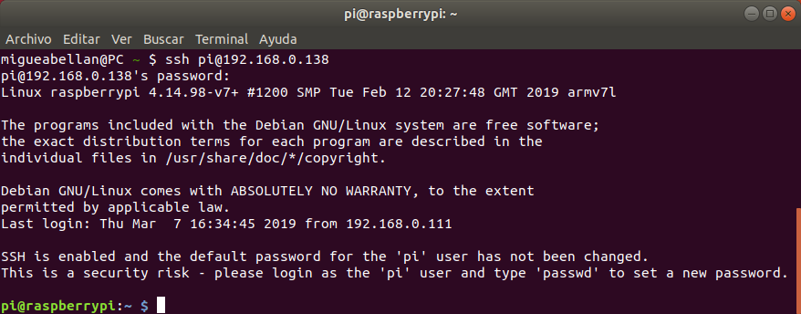
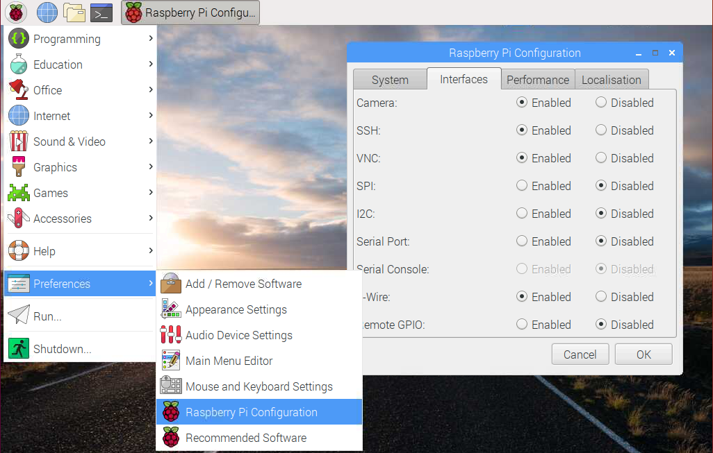
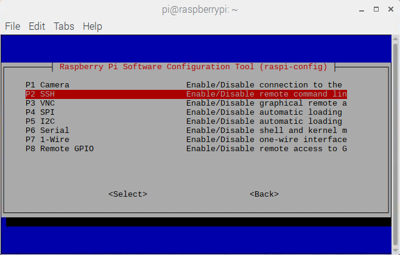

En este tutorial vamos a explicar cómo **acceder a través de SSH a nuestra Raspberry Pi** para controlarla desde un equipo remoto en la misma red local.

# Antes de empezar

Vas a necesitar los siguientes componentes:

- Raspberry Pi con Raspbian

Es recomendable acceder a los siguientes tutoriales:

- [Direcciones IP en Raspberry Pi](raspberry_pi-ip)

# Secure Shell (SSH)

Secure Shell (SSH) es un protocolo de comunicación entre dos sistemas usando una arquitectura cliente/servidor y que permite a los usuarios conectarse a un host de forma remota. La sesión de conexión está encriptada haciendo imposible que alguien pueda obtener contraseñas no encriptadas.

En la siguiente imagen podemos ver una ventana típica de conexión SSH a una Raspberry Pi con el sistema operativo Raspbian.



> Los usuarios con sistemas operativos *Linux* o *MAC* pueden utilizar la propia terminal mientras que los usuarios de *Windows* deben **instalar un cliente SSH** como [Putty](https://www.putty.org/).

## Habilitar SSH en Raspbian

La conexión por SSH en Raspbian viene deshabilitada por defecto, con lo cual, lo primero que tenemos que hacer es habilitarla desde el **entorno gráfico** o **desde la terminal**.

- **Desde el entorno gráfico**: Accedemos al menú `Inicio > Preferencias > Raspberry Pi Configuración` y una vez en la ventana de configuración, sobre la pestaña `Interfaces` habilitamos la opción `SSH`. A continuación guardamos y ya está habilitado el acceso por SSH.



- **Desde la terminal**: Accedemos a la terminal e introducimos el comando `sudo raspi-config`. Seleccionamos la opción de `Interfaces`, a continuación la opcción de `SSH` y por último la opción de `Habilitar`. Guardamos y ya está habilitado el acceso por SSH.

```sh
pi@raspberrypi:~ $ sudo raspi-config
```



## Acceder por SSH

Una vez habilitada la conexión, vamos a acceder desde otro host para comprobar que funciona. Para ello utilizaremos el comando para conectar por SSH `ssh user@host` que consta de 3 partes:

- **ssh**: Indica que se establecerá una conexión segura y cifrada por SSH
- **user**: Usuario del host remoto con el cual se establecerá la conexión
- **host**: Dirección IP o dominio de la máquina a la cual nos vamos a conectar

Por ejemplo, voy a conectarme por SSH utilizando el usuario por defecto `pi`, a la Raspberry Pi con dirección IP `192.168.0.138`. Y cuando nos solicite el password introducimos la contraseña por defecto `raspberry`

```sh
migueabellan@PC ~ $ ssh pi@192.168.0.138
pi@192.168.0.138 password: *********
```

Una vez establecida la conexión SSH nos aparecerá el **prompt** `pi@raspberrypi:~ $ ` el cual indica que estamos conectados con el usuario `pi` a la máquina `raspberrypi`

```sh
migueabellan@PC ~ $ ssh pi@192.168.0.138
pi@192.168.0.138 password: 
Linux raspberrypi 4.14.98-v7+ #1200 SMP Tue Feb 12 20:27:48 GMT 2019 armv7l

...

pi@raspberrypi:~ $ 
```

## Recomendaciones de seguridad

Al instalar el sistema operativo Raspbian, el usuario por defecto es `pi` y la contraseña `raspberry`. Con lo cual es una buena práctica cambiar la contraseña inicial para que no se conecte personal no autorizado.

# Resumen

En la práctica es una buena solución habilitar la conexión por SSH de nuestra Raspberry Pi cuando queremos controlarla desde el exterior. Cada vez que queramos conectar debemos introducir el comando de SSH mediante la IP (recuerda que es buena idea establecer la IP fija) e introducir el usuario y contraseña de la máquina a la cual nos queremos conectar.

# Ejercicios propuestos

1.- Habilita la conexión SSH de tu Raspberry Pi mediante entorno gráfico y prueba a conectarte desde otro equipo.

2.- Ahora deshabilita la conexión SSH mediante la consola y prueba a conectarte nuevamente. ¿Qué ocurre?

3.- Recuerda cambiar la contraseña para que otros no puedan acceder a tu Raspberry Pi.
