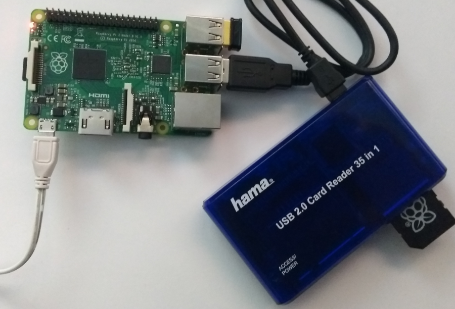
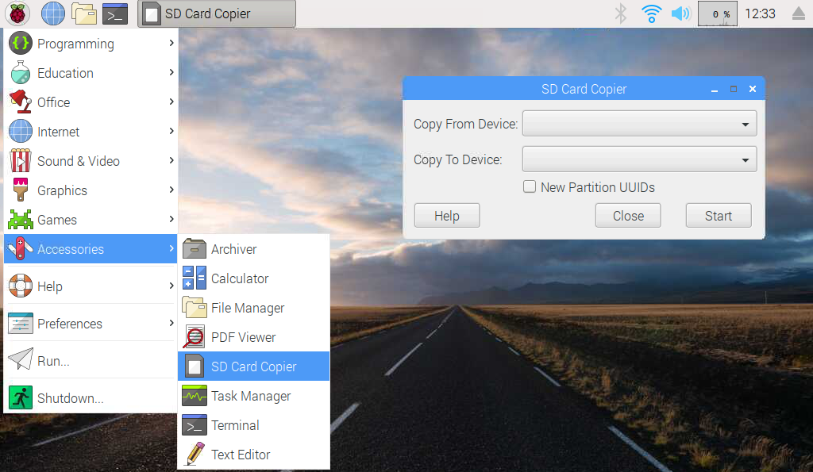
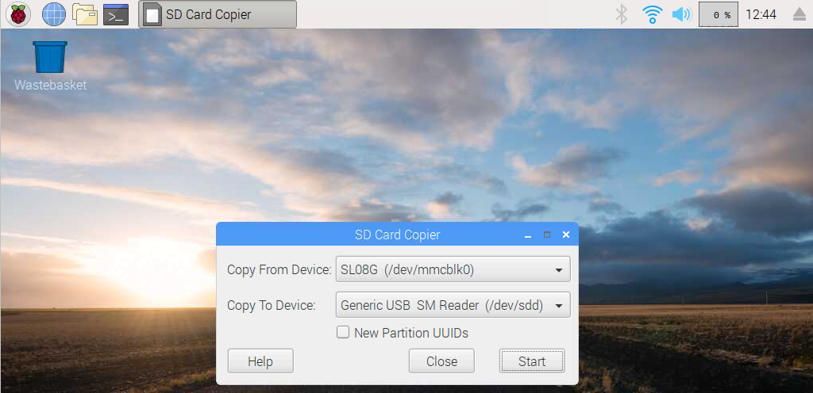

En este tutorial vamos a explicar cómo **clonar el sistema operativo Raspbian** para crear una imagen con nuestros programas e instalación preferida.

# Antes de empezar

Vas a necesitar los siguientes componentes:

- Raspberry Pi con Raspbian
- Lector de tarjetas SD
- Tarjeta SD auxiliar

# SD Card Copier (piclone)

SD Card Copier (piclone) es la herramienta que integra el sistema operativo Raspbian para el clonado de tarjetas microSD de forma gráfica, es decir, podemos copiar todo el contenido de una tarjeta microSD a otra haciendo un clon idéntico sin utilizar la línea de comandos.

Para utilizar la aplicación deberás disponer de un hub USB de tarjetas SD.



## Clonar Raspbian con SD Card Copier

Accedemos a la herramienta desde el entorno gráfico de Raspbian en `Inicio > Accesorios > SD Card Copier`. Otra forma de acceder es mediante el comando `piclone` desde una nueva terminal. De una u otra forma se abrirá el asistente SD Card Copier como se muestra en la siguiente imagen.

```sh
pi@raspberrypi:~ $ piclone
```



Si nos fijamos en la imagen, debemos seleccionar el dispositivo desde donde queremos copiar (seleccionando la actual SD */dev/mmcblk0*) y hacia donde, en nuestro caso, un Hub USB utilizando una tarjeta SM en `/dev/sdd`.



El proceso suele tardar aproximadamente **20 minutos**, tiempo similar a la instalación por defecto de Raspbian, con la diferencia de ahorrarnos instalar los programas y configuraciones realizadas sobre nuestra Raspberry Pi.

# Resumen

Piclone es una gran herramienta si queremos tener una copia o respaldo de nuestra configuración preferida de Raspbian. De esta forma no tenemos que preocuparnos por hacer un mal uso del sistema operativo cuando estamos probando programas, ya que en caso de error podemos restaurar la copia de la tarjeta SD auxiliar sin necesidad de volver a instalar todos los programas que teníamos.

# Ejercicios propuestos

1.- Actualiza el sistema operativo Raspbian a la última versión. Instala los programas necesarios y crea una copia de Raspbian en una nueva tarjeta SD.

2.- Una vez copiada la imagen, introduce la nueva tarjeta SD y comprueba que la clonación se ha realizado correctamente.
