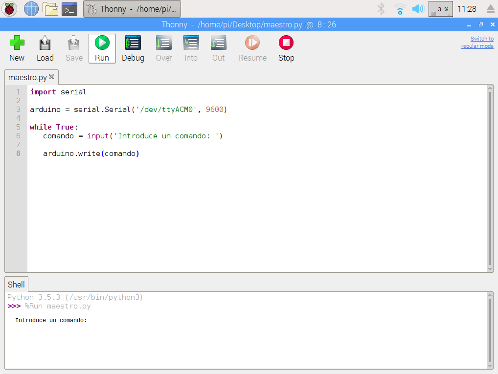
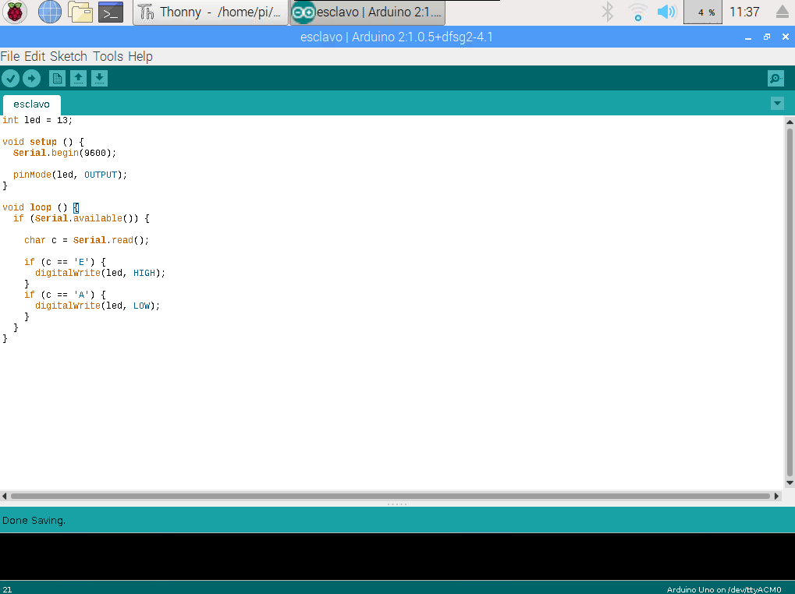
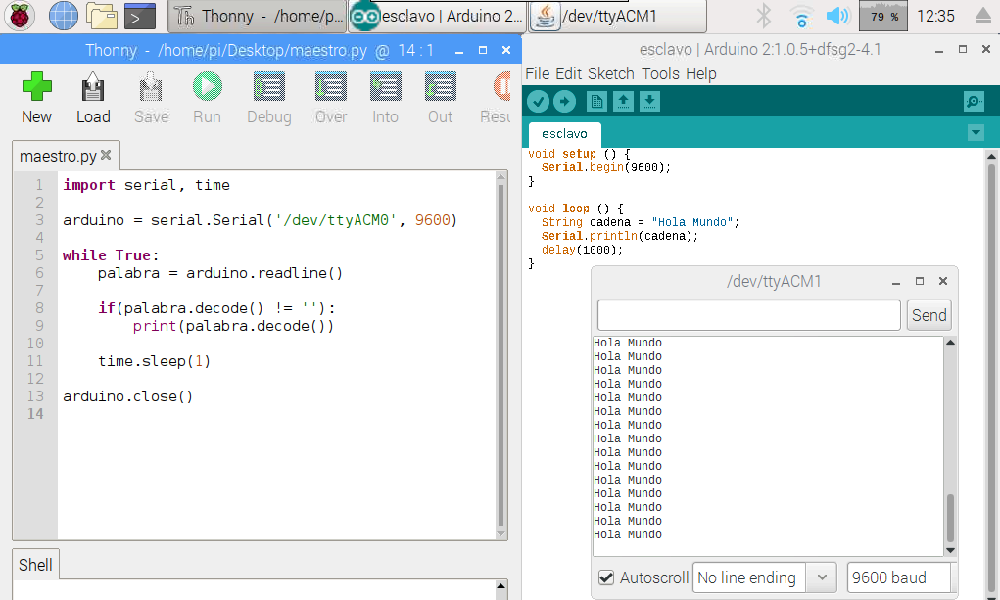

En este tutorial vamos a **conectar Raspberry Pi con Arduino** para controlar diferentes sensores y actuadores haciendo que se comuniquen entre ellos a través del puerto serie.

# Antes de empezar

Vas a necesitar los siguientes componentes:

- Raspberry Pi con Raspbian
- Arduino UNO

Es recomendable acceder a los siguientes tutoriales:

- [Instalar Arduino IDE en Raspbian](raspberry_pi-arduino_ide)

# Raspberry Pi vs Arduino

Mediante Raspberry Pi podemos controlar diferentes pines GPIO para entradas y salidas, sin embargo este número de pines es limitado. Además, nos encontramos con que los tiempos de respuestas son demasiado lentos cuando programamos con lenguajes como Python. Con Arduino no nos encontramos con estas limitaciones.

En este tutorial vamos a combinar las ventajas que ofrece Raspberry Pi en cuanto a sistema operativo como controlador maestro, y las ventajas que ofrece Arduino para controlar diferentes sensores y actuadores como esclavo, haciendo que se comuniquen entre ellos a través del puerto serie.

## Instalar Python Serial

Como hemos comentado, vamos a utilizar las ventajas de ambas plataformas para conectarlas juntas a través del puerto serie. Por ello, vamos a necesitar instalar la librería *python-serial* con el comando `apt-get install python-serial` la cual nos permitirá utilizar el puerto serie desde Python para comunicarnos con Arduino. 

```sh
pi@raspberrypi:~ $ sudo apt-get install python-serial
```

## Enviar datos desde Raspberry Pi hacia Arduino

En primer lugar vamos a programar el código encargado de enviar comandos a través del serial. Estos comandos van a encender y apagar el LED 13 de una placa de Arduino. Lo vamos a programar en Python utilizando cualquier editor, por ejemplo, Thonny Editor.

```
Con el comando 'E' se encenderá el LED 13
Con el comando 'A' se apagará el LED 13
```

**Maestro: Enviar datos hacia el serial**

En primer lugar se importa la librería previamente instalada. A continuación se crea el objeto *Serial* estableciendo el puerto y la velocidad de transmisión. En nuestro caso tenemos un Arduino UNO conectado al puerto `/dev/ttyACM0` el cual se comunica a 9600 baudios. 

A continuación, en bucle vamos a solicitar al usuario que introduzca el comando a través del teclado, se almacenará en una variable, y a continuación se enviará a través del serial. Es importante añadir la función `encode()` a la cadena enviada

```python
import serial

arduino = serial.Serial('/dev/ttyACM0', 9600)

while True:
   comando = input('Introduce un comando: ')

   arduino.write(comando.encode())
```



**Esclavo: Recibir datos desde el serial**

Desde Arduino, establecemos la velocidad de transmisión a 9600 baudios como ya hicimos en Python. En el interior del bucle `loop()` estaremos escuchando el serial hasta que encontremos nueva información, en cuyo caso solamente comprobaremos si la información añadida al serial es una 'E' para encender el pin 13 o una 'A' para apagarlo.

```arduino
int led = 13;

void setup () {
  Serial.begin(9600);
  
  pinMode(led, OUTPUT);
}

void loop () {
  if (Serial.available()) {
    
    char c = Serial.read();
    
    if (c == 'E') {
      digitalWrite(led, HIGH);
    }
    if (c == 'A') {
      digitalWrite(led, LOW);
    }
  }
}
```




## Enviar datos desde Arduino hacia Raspberry Pi

De forma similar, podemos enviar datos desde arduino. Por ejemplo, supongamos que tenemos un sensor de temperatura que queremos controlar para enviar la información a la Raspberry Pi.


**Esclavo: Enviar datos hacia el serial**

En este ejemplo, vamos enviar el mensaje "Hola Mundo" desde la placa de Arduino hacia el serial.

```arduino
void setup () {
  Serial.begin(9600);
}

void loop () {
  String cadena = "Hola Mundo";
  Serial.println(cadena);
  delay(1000);
}
```

**Maestro: Recibir datos desde el serial**

De forma similar, el maestro estará leyendo del serial y mostrará el contenido por la pantalla. Hemos añadido la librería `time` para esperar unos segundos entre lectura y lectura. Además, fíjate como si en el caso anterior, teníamos que codificar la cadena, en este caso tenemos que decodificarla utilizando la función `decode()`.

```python
import serial, time

arduino = serial.Serial('/dev/ttyACM0', 9600)

while True:
  cadena = arduino.readline()
  
  if(cadena.decode() != ''):
    print(cadena.decode())
  
  time.sleep(1)

arduino.close()
```



# Resumen

Arduino es ideal para todo tipo de proyectos de electrónica. Con sus conectores se puede conectar directamente a componentes y sensores, siendo más rápida a la hora de realizar cambios o proyectos sencillos que no requieran tareas complejas. Además, nada más enchufarla, empezará a ejecutar la tarea para la que ha sido programada.

Por otro lado, mediante Python en Raspberry Pi podemos analizar dichos datos para procesarlos según sea nuestro interés.

# Ejercicios propuestos

1.- Envía datos desde la Raspberry Pi hacia Arduino para encender o apagar un LED.

2.- Envía datos desde el Arduino hacia Raspberry Pi para mostrar un mensaje u otro por la pantalla.
