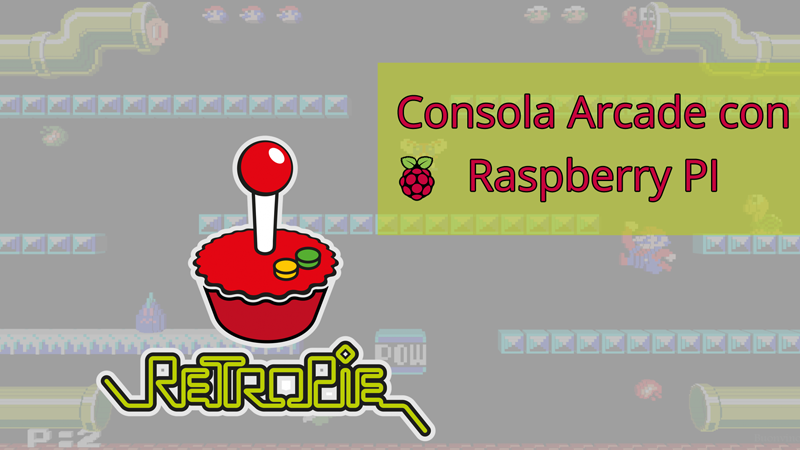
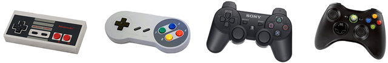
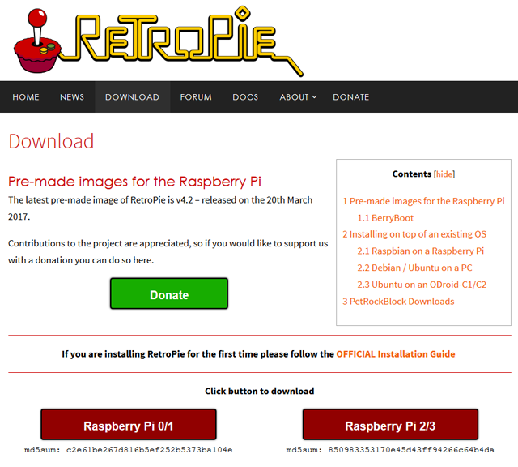
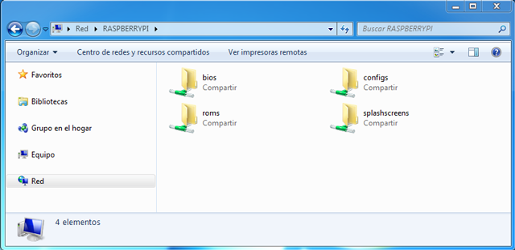
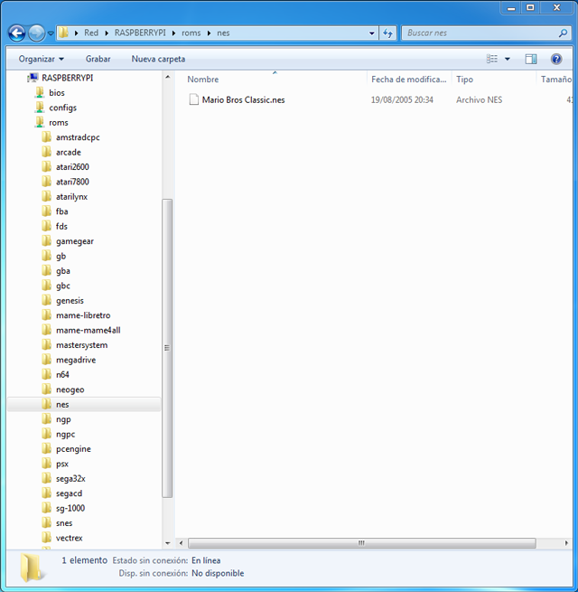
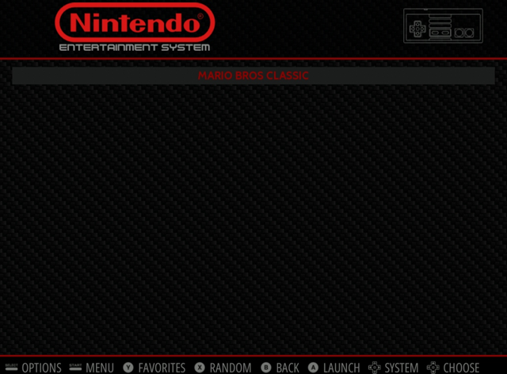

## Introducción

En este curso aprenderás a instalar y configurar el Sistema Operativo RetroPie para Raspberry Pi como videoconsola Arcade. También aprenderás cómo conectarte de forma remota para añadir nuevos videojuegos a tu Raspberry Pi.




<br />


## ¿Qué es RetroPie?

<div class="iframe">
  <iframe src="//www.youtube.com/embed/sZiUiBUVp8c" allowfullscreen></iframe>
</div>

RetroPie es un sistema operativo para Raspberry Pi basado en Raspbian que incluye por defecto una capa de personalización con una interfaz desde donde ejecutar los diferentes emuladores para poder jugar a juegos retro. Toda la interfaz de RetroPie así como los emuladores son de código abierto por lo que cualquier usuario puede colaborar en el desarrollo y reportar posibles errores detectados durante la instalación o el juego.


### Videoconsolas disponibles en RetroPie

La mayoría de los videojuegos se pueden emular desde la versión 1 de Raspberry Pi, sin embargo, algunos juegos de videoconsolas como PS1 o NS64, necesitaremos emularlos en Raspberry Pi 2 ó 3. Se dispone de 29 videoconsolas para emular videojuegos en RetroPie, entre las cuales destacamos las siguientes:

- Atari 800 – Atari 2600 – Atari ST/STE/TT/Falcon
- Amstrad CPC
- Game Boy – Game Boy Color – Game Boy Advance
- Sega Game Gear
- MAME
- PC x86
- NeoGeo
- Nintendo Entertainment System – Super Nintendo Entertainment System
- Nintendo 64
- Sega Master System – Sega Mega Drive / Genesis – Sega Mega-CD – Sega 32X
- Playstation 1
- Sinclair ZX Spectrum

### Mandos compatibles

RetroPie es compatible con un gran número de mandos, como el mando de PS3 y el mando de Xbox360 sin necesidad de instalar software adicional. En nuestro caso hemos utilizando los mando de la Play Station 3 y han funcionado perfectamente.




<br />


## ¿Cómo instalar RetroPie?

<div class="iframe">
  <iframe src="//www.youtube.com/embed/cJDyyK4xS7I" allowfullscreen></iframe>
</div>

La instalación de RetroPie se puede realizar de dos formas diferentes.

- La primera de ellas consiste en instalar el emulador mediante imagen de RetroPie con el sistema operativo Raspbian incluido. Para ello debemos descargar la imagen de RetroPie desde la web del proyecto. De esta forma debemos recordar que la instalación de la imagen borrará el contenido de nuestra microSD.
- La segunda forma consiste en aprovechar la instalación de Raspbian para instalar sobre ella el emulador de RetroPie. De esta forma no perderemos ningún archivo de nuestro disco.

### Descargar imagen de RetroPie

Para descargar la imagen de RetroPie accederemos al apartado de descargas del proyecto y seleccionamos la versión de nuestra Raspberry Pi, ya que se dispone del emulador para la versión 1, 2 y 3 de Raspberry Pi.

El tiempo de descarga vendrá delimitado por la conexión que tengamos aunque para una conexión media suele tardar 5 minutos aproximadamente.



### Instalar RetroPie mediante imagen

Antes de instalar RetroPie tenemos que pasar el contenido de la imagen de RetroPie a nuestra microSD. Para ello podemos descargar el software gratuito Etcher, como mostramos en el vídeo, o añadir la imagen del sistema operativo utilizando la línea de comandos si eres un usuario avanzado. Este proceso suele tardar 10 minutos aproximadamente.

Por último, conectaremos nuestra Raspberry Pi para probar que se ha instalado RetroPie correctamente.


### Instalar RetroPie en Raspbian previamente instalado

En caso de tener una instalación de Raspbian instalada en nuestra microSD, podemos instalar sobre ella el emulador de RetroPie. Esta instalación no borrará documentos de nuestro disco.

```sh
sudo apt update
sudo apt upgrade
sudo apt install git

git clone --depth=1 https://github.com/RetroPie/RetroPie-Setup.git
cd RetroPie-Setup
chmod +x retropie_setup.sh
sudo ./retropie_setup.sh
```

Al ejecutar esta última instrucción, nos aparecerá una ventana similar a la siguiente donde le indicaremos que realice una instalación básica. Este proceso tardará unos minutos y cuando finalice ya tendremos instalado el emulador. Para ello podemos reiniciar el sistema operativo.

> Al instalar RetroPie instalas el emulador en la Raspberry Pi sin videojuegos.


<br />


## Configuración de RetroPie

<div class="iframe">
  <iframe src="//www.youtube.com/embed/Fb-D8PDPBn4" allowfullscreen></iframe>
</div>

Una vez instalado el emulador RetroPie en nuestra Raspberry Pi, ya sea mediante nueva imagen o mediante instalación sobre Raspbian, debemos configurar ciertas herramientas, así como el mando que utilicemos para jugar a los videojuegos.

La principal herramienta que tenemos que configurar es Samba, ya que va a permitir conectarnos a la Raspberry Pi desde otro PC para poder añadir los juegos. Para configurar Samba accederemos al apartado de RetroPie Setup y lo configuraremos como se puede ver en la siguiente imagen.


Otra forma de acceder al apartado de configuración es mediante SSH como explicamos en el curso de acceso remoto a Raspberry Pi. Para ello accederemos a la consola o terminal y teclearemos el siguiente comando:

```sh
sudo ./retropie_setup.sh
```

Al ejecutar esta última instrucción, nos aparecerá una ventana similar a la siguiente donde le indicaremos que realice una instalación básica:


Este proceso tardará unos minutos y cuando finalice ya tendremos configurado el acceso a Samba desde otro PC. Para ello accederemos mediante la red conociendo la IP de nuestra Raspberry Pi o nombre. Simplemente podemos abrir una carpeta y escribir la ruta IP o el nombre en la barra de navegación de la carpeta.

```
\\RASPBERRYPI
```




<br />


## Añadir juegos

<div class="iframe">
  <iframe src="//www.youtube.com/embed/Lba-wzj6kjY" allowfullscreen></iframe>
</div>

Si hemos llegado hasta aquí es porque tenemos configurado el emulador RetroPie correctamente y tenemos acceso mediante Samba o FTP a nuestro directorio de Raspberry Pi. En este caso vamos a explicar cómo añadir juegos, ya que por defecto el emulador RetroPie no trae juegos instalados.

Lo primero que teneos que hacer es buscar el juego por internet. Existe una multitud de páginas donde descargarlos y no recomendamos ninguna ya que no nos queremos hacer responsables de los posibles virus que podáis descargar sin querer. En nuestro caso, solamente hemos utilizado un juego exportado de Mario Bros para la videoconsola NES, y es el que vamos a explicar.

> No vamos a aportar enlaces directos a webs de descarga de ROMs aunque puedes buscar por Google encontrar diferentes páginas web.

Una vez descargado el videojuego para la videoconsola que queramos, accederemos mediante Samba a la carpeta de dicha videoconsola y añadimos el juego como mostramos en la siguiente imagen. Recuerda acceder escribiendo el siguiente comando en la barra de navegación de tu carpeta.

```
\\RASPBERRYPI
```



Una vez añadido, debemos reiniciar la Raspberry Pi para que detecte nuestro videojuego y poder jugar. En nuestro caso solamente aparece la videoconsola NES y el videojuego de Marios Bros, ya que ha sido el único que hemos añadido. En vuestro caso aparecerá el que hayáis añadido.


