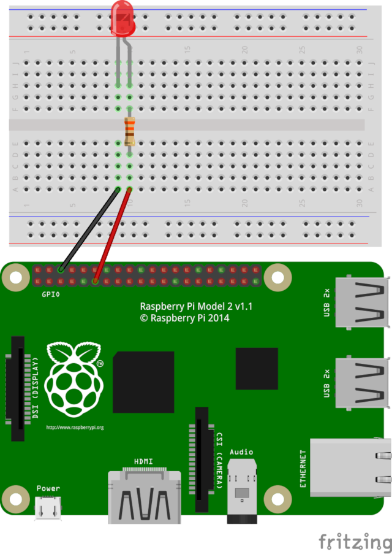
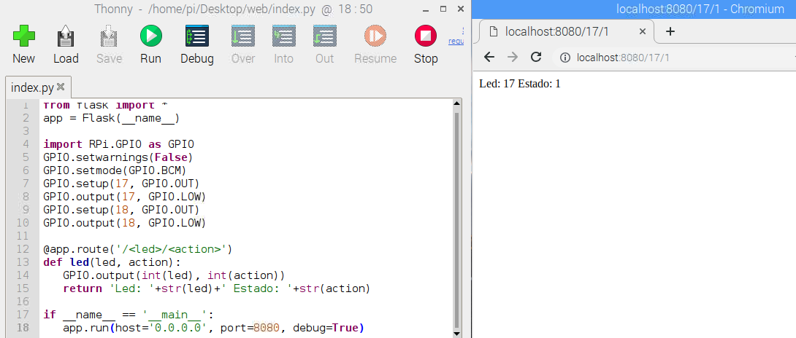
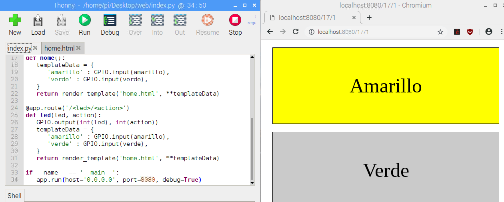

En este tutorial vamos a explicar cómo **montar un servidor web para Python con Flask** en nuestra Raspberry Pi y utilizar los pines GPIO para interactuar con ellos.

# Antes de empezar

Para este tutorial vas a necesitar los siguientes componentes:

- Raspberry Pi con Raspbian

Es recomendable acceder a los siguientes tutoriales:

- [Aprender a programar en Python](https://www.aprendeprogramando.es/cursos-online/python)
- [Servidor Web en Flask](raspberry_pi-webserver-python)

# Servidor Web con Flask

Flask es un microframework creado para facilitar el desarrollo de aplicaciones web en Python. Es utilizado normalmente para construir servicios web como APIs REST o aplicaciones de contenido estático.

En este caso vamos a utilizar los pines GPIO.

## Encendido y apagado de un LED

Vamos a realizar el encendido y apagado de un LED conectado al `Pin 11 - GPIO 17` de nuestra Raspberry Pi.



En la programación, añadimos la librería para controlar los pines GPIO así como el modo de pin. A continuación se crean dos entradas de URL o endpoints para encender y apagar dicho LED. Además mostramos un mensaje por la pantalla de la web.

```python
from flask import *
app = Flask(__name__)

import RPi.GPIO as GPIO
GPIO.setwarnings(False)
GPIO.setmode(GPIO.BCM)
GPIO.setup(17, GPIO.OUT)
GPIO.output(17, GPIO.LOW)

@app.route('/on')
def on():
   GPIO.output(17, GPIO.HIGH)
   return 'Led Encendido'

@app.route('/off')
def off():
   GPIO.output(17, GPIO.LOW)
   return 'Led Apagado'

if __name__ == '__main__':
   app.run(host='0.0.0.0', port=8080, debug=True)
```

Por último jecuta el código y accede mediante el navegador a ambas direcciones para encender y apagar el LED. Observa como el LED se enciende o apaga en cada caso.

```
URL: localhost:8080/on
URL: localhost:8080/off
```


## Controlar varios LEDs

Para controlar varios LED podemos crear varias funciones y cada una asignada a un pin GPIO de nuestra Raspberry Pi. Sin embargo, imagina que queremos controlar 5 LEDs. Podemos pensar que tenemos que crear 10 funciones (on y off para cada uno de los LED). La mejor solución pasa por pasar parámetros a la URL indicando el pin GPIO que queremos utilizar y el estado del LED que queremos asignar. Por ejemplo `/17/0`, `/18/1`, etc.

Esto lo conseguimos añadiendo parámetros a la URL `@app.route('/<led>/<action>')` y a la función `def led(led, action):`.

```python
from flask import *
app = Flask(__name__)

import RPi.GPIO as GPIO
GPIO.setwarnings(False)
GPIO.setmode(GPIO.BCM)
GPIO.setup(17, GPIO.OUT)
GPIO.output(17, GPIO.LOW)
GPIO.setup(18, GPIO.OUT)
GPIO.output(18, GPIO.LOW)

@app.route('/<led>/<action>')
def led(led, action):
   GPIO.output(int(led), int(action))
   return 'Led: '+str(led)+' Estado: '+str(action)

if __name__ == '__main__':
   app.run(host='0.0.0.0', port=8080, debug=True)
```

Ahora solamente nos queda probar que todos los enlaces funcionan correctamente accediendo a las siguientes URLs.

```
URL: localhost:8080/17/0
URL: localhost:8080/17/1
URL: localhost:8080/18/0
URL: localhost:8080/18/1
```



## Añadiendo un template

Por último, podemos crear un template personalizado con enlaces a las URLs para no tener que escribirlas en el navegador.

```python
from flask import *
app = Flask(__name__)

import RPi.GPIO as GPIO
GPIO.setwarnings(False)
GPIO.setmode(GPIO.BCM)

# leds
amarillo = 17
verde = 18
GPIO.setup(amarillo, GPIO.OUT)
GPIO.output(amarillo, GPIO.LOW)
GPIO.setup(verde, GPIO.OUT)
GPIO.output(verde, GPIO.LOW)

@app.route('/')
def home():
   templateData = {
      'amarillo' : GPIO.input(amarillo),
      'verde' : GPIO.input(verde),
   }
   return render_template('home.html', **templateData)

@app.route('/<led>/<action>')
def led(led, action):
   GPIO.output(int(led), int(action))
   templateData = {
      'amarillo' : GPIO.input(amarillo),
      'verde' : GPIO.input(verde),
   }
   return render_template('home.html', **templateData)

if __name__ == '__main__':
   app.run(host='0.0.0.0', port=8080, debug=True)
```

```html
<html>
<head>
   <style>
      .btn { 
         display:block;
         margin: 20px;
         padding: 20px 40px;
         text-align: center;
         border: 1px solid #000;
         background: #ccc;
         text-decoration: none;
         font-size: 50px;
         line-height: 3;
         color: #000;
      }
      .btn.amarillo {
         background: #ff0;
      }
      .btn.verde {
         background: #0f0;
      }
   </style>
</head>
<body>
   
      <a class="btn" href="/17/1">Amarillo</a>
   
      <a class="btn amarillo" href="/17/0">Amarillo</a>
   

   
      <a class="btn" href="/18/1">Verde</a>
   
      <a class="btn verde" href="/18/0">Verde</a>
   
</body>
</html>
```



# Resumen

Con este sencillo ejemplo hemos visto la forma de controlar los pines GPIO a través de un sencillo servidor web en Flask con Python.

# Ejercicios propuestos

1.- Enciende varios LEDs utilizando diferentes endpoints en el servidor web.
