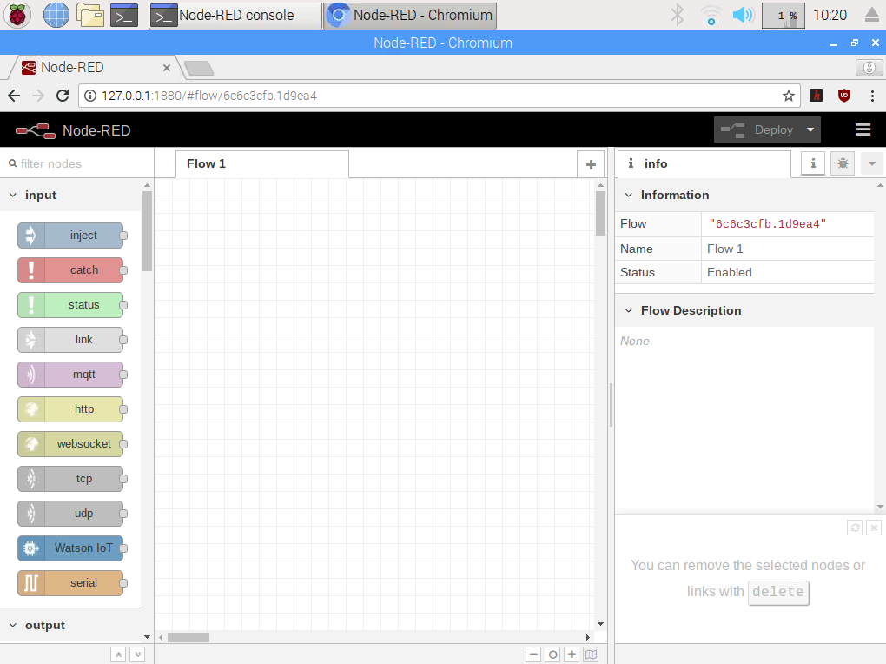
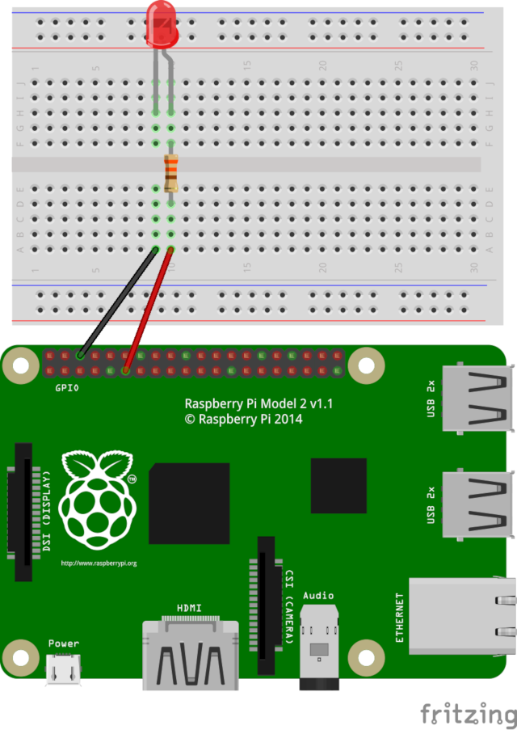
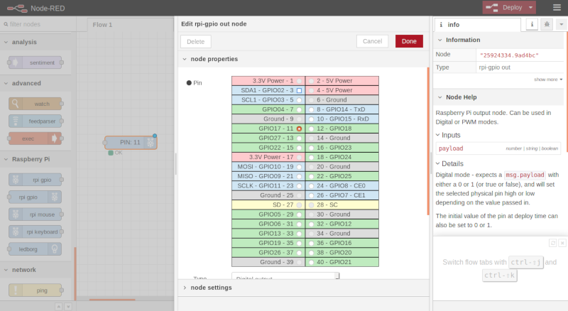
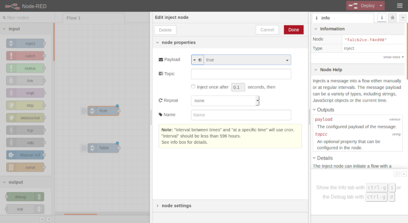
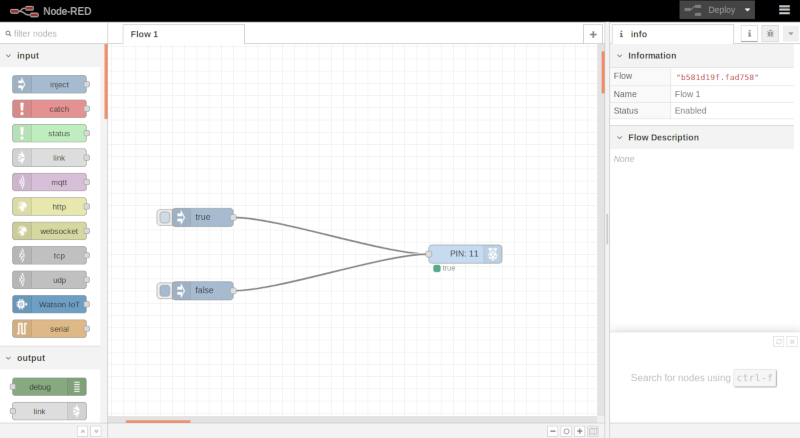

En este tutorial vamos a explicar cómo **utilizar los pines GPIO a través de Node-RED desde Raspberry Pi** de una forma muy sencilla para crear aplicaciones IoT sin saber programar en lenguaje de programación textual.

# Antes de empezar

Vas a necesitar los siguientes componentes:

- Raspberry Pi con Raspbian

Es recomendable acceder a los siguientes tutoriales:

- [GPIO en Raspberry Pi](raspberry_pi-gpio)

# Pines GPIO en Node-RED

[Node-RED](https://nodered.org/) es un motor de flujos con enfoque IoT que permite definir gráficamente flujos de servicios a través de protocolos estándares como REST, MQTT, Websocket o AMQP. Se trata de una herramienta visual muy ligera programada en NodeJS y que puede ejecutarse desde en dispositivos ligeros como la Raspberry Pi.

> Para más información sobre Node-RED accede al tutorial [Raspberry Pi - Node-RED](raspberry_pi-node_red).

## Requisitos

Para este tutorial se van a necesitar los siguientes materiales:

- 1 Raspberry Pi
- 1 Protoboard
- 1 Diodo LED
- 1 Resistencia de 330 Ohm

## Node-RED en Raspberry Pi

En primer lugar abrimos la herramienta Node-RED accediendo al menú `Programming > Node-RED` y se abrirá en segundo plano una terminal encargada de arrancar la herramienta. Una vez abierta accedemos mediante nuestro navegador predeterminado a la dirección `http://127.0.0.1:1880` o a través de la red a la IP de nuestra Raspberry Pi seguido del mismo puerto, en nuestro caso `http://192.168.0.138:1880`.

```
URL: http://127.0.0.1:1880
```



Los programas en Node-RED se llaman **Flow** (flujos). y se puede crear tantos flujos como queramos y todos pueden ejecutarse al mismo tiempo.

En el lado izquierdo tenemos todos los nodos disponibles ordenador por categorías (input, output, functions, Raspberry Pi, etc.). Los nodos se conectarán entre ellos mediante líneas creando un flujo de trabajo.

En el lado derecho aparecerán los parámetros de configuración de cada nodo seleccionado.

En el centro es donde podemos arrastrar los nodos para crear el flujo de trabajo.

## Encendido y apagado de un LED

Vamos a realizar el encendido y apagado de un LED conectado al `Pin 11 - GPIO 17` de nuestra Raspberry Pi.



Accediendo al grupo de nodos de Raspberry Pi, arrastramos al área de trabajo el nodo `rpi gpio`. Hacemos docle clic sobre el nodo y seleccionamos el pin al cual hemos conectado el LED, en este caso, el `Pin 11 - GPIO 17`.



A continuación añadimos 2 nodos `inject` de la categoría de entrada. Uno de estos nodos tendrá establecido el valor `true` y el otro el valor `false`.



Por último solamente nos queda unir los conectores y cargar el código haciendo clic en el botón `Deploy` situado en la parte superior derecha de Node-RED. A continuación, podemos hacer clic sobre el icono `true` o `false` y veremos como se enciende y apaga nuestro LED a través de los pines GPIO de nuestra Raspberry Pi.



# Resumen

ToDo

# Ejercicios propuestos

1.- Programa el encendido y apagado de múltiples diodos LEDs.

ToDo
