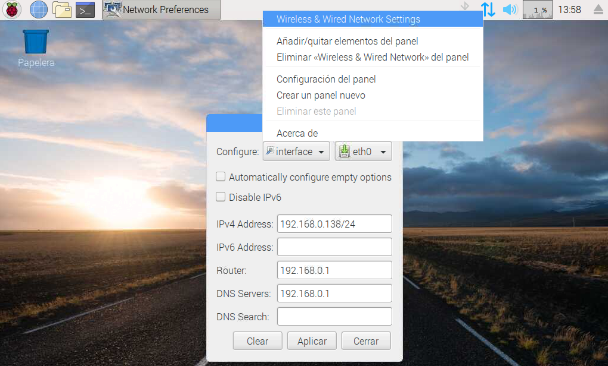

En este tutorial vamos a explicar cómo **fijar una dirección IP en Raspbian** para que siempre tenga la misma dirección.

# Antes de empezar

Vas a necesitar los siguientes componentes:

- Raspberry Pi con Raspbian
- Acceso al router

# Direcciones IP

Una dirección IP (Internet Protocol) es la dirección de red a la cual está conectado un equipo. Vendría a ser algo similar a la dirección de nuestra casa, pero utilizando números `xxx.xxx.xxx.xxx`. 

Cada vez que nos conectamos a un router, ya sea por cable o wifi, puede que nuestro router nos otorgue una *dirección IP privada o local* distinta. Normalmente, la dirección IP se asigna de forma dinámica proporcionada por el DHCP (Dynamic Host Configuration Protocol). En este caso nuestro router hace de servidor DHCP y nos asigna una dirección IP dentro de un rango de direcciones, por ejemplo la dirección `192.168.0.138`.

Lo mismo pasa con nuestro proveedor de internet ISP, cada vez que reiniciamos el router puede que tengamos una *dirección IP pública* distinta.


Sin embargo, si tenemos una instalación permanente (servidor de archivos, sistema de videovigilancia, etc.) vamos a querer que la dirección IP sea fija.

## Dirección IP local

Para saber la dirección IP que nos ha asignado nuestro router, debemos introducir el comando `ifgonfig` en la terminal y nos aparecerá todas las conexiones de red disponibles en nuestra Raspberry Pi con la IP asignada a cada una de ellas.

```sh
pi@raspberrypi:~ $ ifconfig

eth0: flags=4163<UP,BROADCAST,RUNNING,MULTICAST>  mtu 1500
      inet 192.168.0.138  netmask 255.255.255.0  broadcast 192.168.0.255
      ...

lo: flags=73<UP,LOOPBACK,RUNNING>  mtu 65536
    inet 127.0.0.1  netmask 255.0.0.0
    ...

wlan0: flags=4163<UP,BROADCAST,RUNNING,MULTICAST>  mtu 1500
       inet 10.3.141.1  netmask 255.255.255.0  broadcast 10.3.141.255
       ...
```

Si nos fijamos, al ejecutar el comando `ifconfig` aparecen 3 conexiones:

- eth0: conexión de red ethernet a través de cable
- wlan0: conexión de red a través de WiFi
- lo : conexión para referirse a la propia interfaz de red de la Raspberry Pi, por ejemplo, para probar el funcionamiento de la misma.

De toda la información que aparece, nos tenemos que fijar en la línea `inet ...`. Vemos como aparece la IP de cada una de las interfaces, en nuestro caso quedaría como sigue:

- eth0: 192.168.0.138
- lo: 127.0.0.1
- wlan0: 10.3.141.1

Como hemos comentado con anterioridad, dicha dirección IP puede cambiar cada vez que conectes o reinicies la Raspberry Pi ya que es asignada por el router normalmente.

## Hacer ping a una IP

Un comando muy sencillo para comprobar si existe una dirección IP es el comando `ping`. De esta forma podemos conocer la respuesta de si existe o no dicha IP.

Por ejemplo, vamos a hacer un ping a una de las IP del DNS de google mediante el comando `ping 8.8.8.8`
```sh
pi@raspberrypi:~ $ ping 8.8.8.8
PING 8.8.8.8 (8.8.8.8) 56(84) bytes of data.
64 bytes from 8.8.8.8: icmp_seq=1 ttl=121 time=31.5 ms
64 bytes from 8.8.8.8: icmp_seq=2 ttl=121 time=31.4 ms
64 bytes from 8.8.8.8: icmp_seq=3 ttl=121 time=31.8 ms
64 bytes from 8.8.8.8: icmp_seq=4 ttl=121 time=34.7 ms

```

Ahora vamos a inventarnos una dirección IP y volvemos a repetir el ping con el comando `ping 192.168.0.254`

```sh
pi@raspberrypi:~ $ ping 192.168.0.254
PING 192.168.0.254 (192.168.0.254) 56(84) bytes of data.
From 192.168.0.138 icmp_seq=1 Destination Host Unreachable
From 192.168.0.138 icmp_seq=2 Destination Host Unreachable
From 192.168.0.138 icmp_seq=3 Destination Host Unreachable

```


## Establecer IP Fija en Raspberry Pi

Nuestro objetivo será acceder a la propia Raspberry Pi de forma remota, pero para ello debemos establer una dirección IP fija que nunca cambie aunque reiniciemos el sistema.

> Para configurar una IP fija debemos asegurarnos que esté fuera del rango DHCP (configuración del router) y que ningún otro dispositivo tenga asignada la misma dirección IP.



La forma más sencilla de establecer una dirección IP desde Raspbian es desde el entorno gráfico. Para ello haciendo doble clic sobre el icono de `configuración de red`, seleccionamos la interfaz `eth0` si estamos conectados por cable de red o `wifi` en caso de estar mediante wifi.

Añadimos la dirección IP que tengamos libre y permitida en nuestro router. Añadimos también la máscara de red o router y también podemos añadir unas DNS de nuestro router o públicas.

- `IPv4`: Dirección IP fija que queremos (dejar el /24 al final)
- `Router`: Dirección IP del router
- `DNS Servers`: Dirección del servidor DNS (la del router)

A continuación guardamos los cambios y reiniciamos la Raspberry Pi para ver que los cambios son correctos. Al reiniciar, volvemos a acceder a la configuración de red y veremos que la IP está guardada.

# Resumen

En la práctica es una buena solución establecer direcciones IP fijas a nuestras Raspberry Pi si queremos acceder de forma remota, por ejemplo, para controlar un invernadero etc. Sin embargo, para utilizarla como equipos de trabajo, lo mejor es dejar que sean asignadas de manera aleatoria por el router al cual están conectadas para no tener conflictos de direcciones IP.

# Ejercicios propuestos

1.- Averigua tu dirección IP y prueba hacer un ping desde otro equipo a tu IP. Comprueba que la respuesta es correcta.

2.- Asigna una dirección IP fija a tu Raspberry Pi y reinicia el sistema para comprobar el correcto funcionamiento. (Recuerda establecer una IP disponible y fuera del rango DHCP de tu router).
