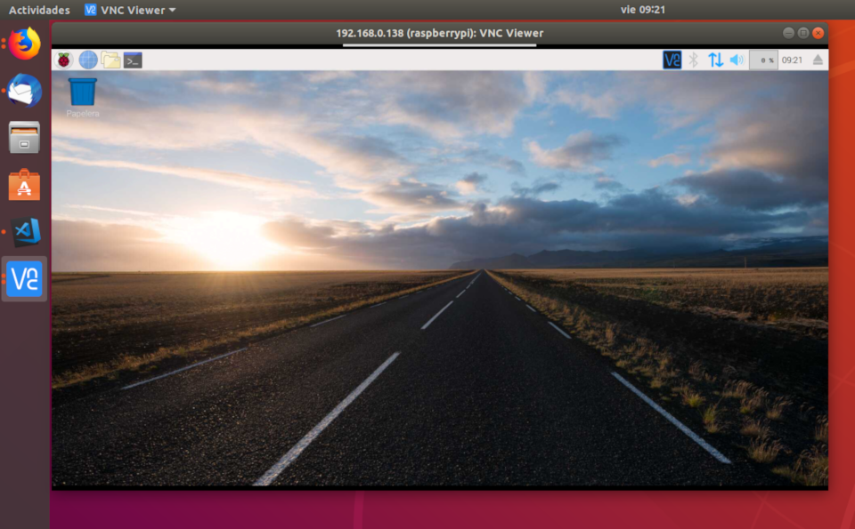
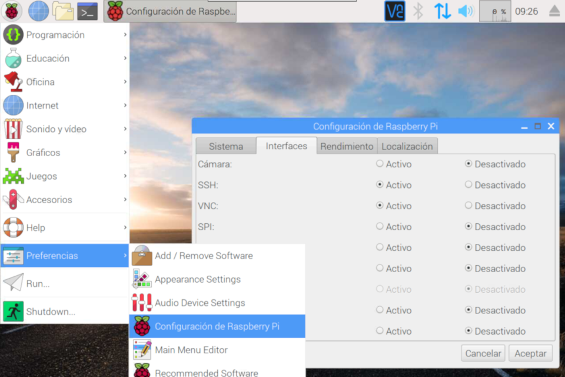
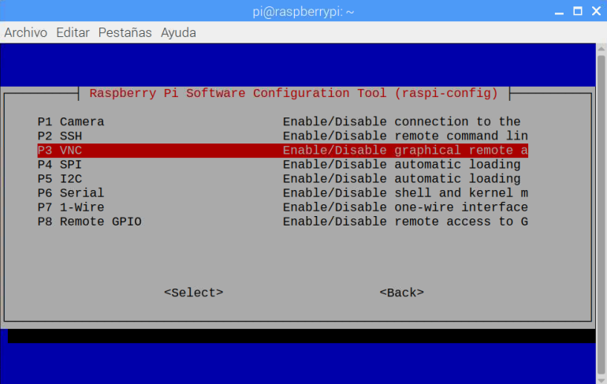
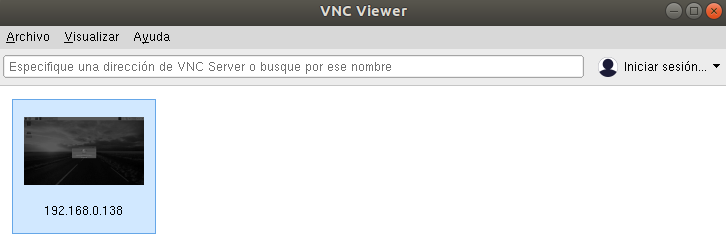

En este tutorial vamos a explicar cómo **acceder a través de escritorio remoto a nuestra Raspberry Pi** para controlarla desde un equipo en la misma red local.

# Antes de empezar

Vas a necesitar los siguientes componentes:

- Raspberry Pi con Raspbian

Es recomendable acceder a los siguientes tutoriales:

- [Direcciones IP en Raspberry Pi](raspberry_pi-ip)

# Virtual Network Computing (VNC)

Virtual Network Computing (VNC) es un programa de escritorio remoto de software libre basado en una estructura cliente-servidor que permite tomar el control del ordenador servidor remotamente a través de un ordenador cliente.



## Habilitar VNC Server

La conexión por VNC en Raspbian viene deshabilitada por defecto, con lo cual, lo primero que tenemos que hacer es habilitarla desde el **entorno gráfico** o **desde la terminal**.

- **Desde el entorno gráfico**: Accedemos al menú `Inicio > Preferencias > Raspberry Pi Configuración` y una vez en la ventana de configuración, sobre la pestaña `Interfaces` habilitamos la opción `VNC`. A continuación guardamos y ya está habilitado el acceso por VNC.



- **Desde la terminal**: Accedemos a la terminal e introducimos el comando `sudo raspi-config`. Seleccionamos la opción de `Interfaces`, a continuación la opcción de `VNC` y por último la opción de `Habilitar`. Guardamos y ya está habilitado el acceso por VNC.

```sh
pi@raspberrypi:~ $ sudo raspi-config
```



## Instalar VNC Viewer

Una vez habilitada la conexión, deberemos descargar en otro PC el cliente para VNC (**VNC Viewer**) desde la propia [web del fabricante](https://www.realvnc.com/en/connect/download/viewer/). Este programa es multiplataforma para distitntos sistemas operativos.

Una vez descargado, lo instalamos y al abrirlo observaremos una ventana donde tendremos que introducir la dirección IP de la Raspberry Pi a la cual queremos conectar.



## Recomendaciones de seguridad

Al instalar el sistema operativo Raspbian, el usuario por defecto es `pi` y la contraseña `raspberry`. Con lo cual es una buena práctica cambiar la contraseña inicial para que no se conecte personal no autorizado.

# Resumen

En la práctica es una buena solución habilitar la conexión por VNC de nuestra Raspberry Pi cuando queremos controlarla desde el exterior. 

# Ejercicios propuestos

1.- Habilita la conexión VNC de tu Raspberry Pi mediante entorno gráfico y prueba a conectarte desde otro equipo.

2.- Ahora deshabilita la conexión VNC mediante la consola y prueba a conectarte nuevamente.

3.- Recuerda cambiar la contraseña para que otros no puedan acceder a tu Raspberry Pi.
