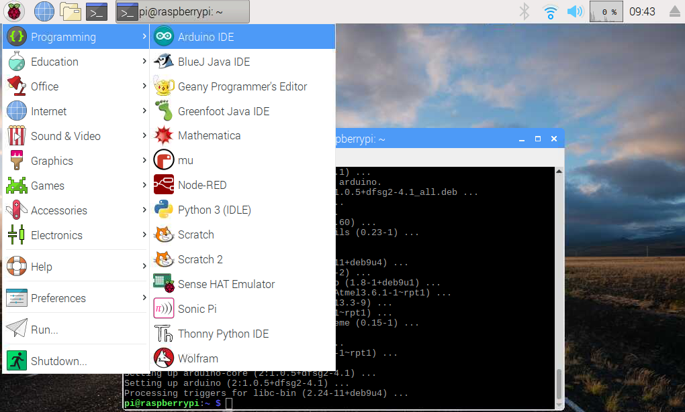
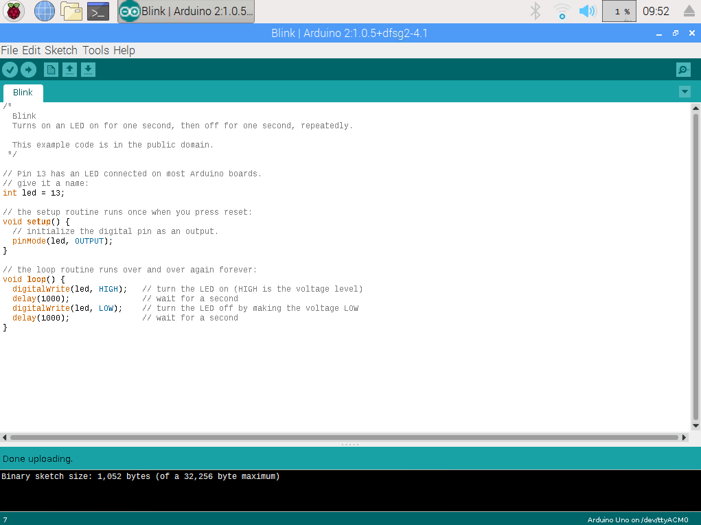

## Introducción

En este tutorial vamos a explicar cómo **instalar Arduino IDE** en Raspberry Pi con Raspbian.

### Antes de empezar

Vas a necesitar los siguientes componentes:

- Raspberry Pi con Raspbian
- Arduino UNO


<br />


## Arduino IDE

Arduino IDE es un entorno de desarrollo y en él se realiza la programación de cada una de las placas de Arduino o similares. Por defecto no viene instalada en Raspbian aunque puede instalarse de una forma muy sencilla.


<br />


## Instalar Arduino IDE

> Recuerda que antes de instalar un programa es recomendable actualizar Raspbian como se explica en el tutorial de actualizar Raspbian. 

Una vez actualizada la lista de paquetes del repositorio podemos instalar el *IDE* y el *CORE* desde la terminal mediante el comando `apt install arduino arduino-core`. El proceso suele tardar unos minutos.

```sh
pi@raspberrypi:~ $ sudo apt install arduino arduino-core
```

Una vez finalizado el proceso de instalación ya podemos acceder al IDE de Arduino desde el menú `Programming > Arduino IDE` como se muestra en la siguiente imagen.




<br />


## ¡Hola Mundo!

Una vez instalado el IDE de Arduino vamos a probar el funcionamiento cargando el programa Blink que viene en la instalación desde `File > Examples > 01. Basic > Blink`. 

Seleccionamos la tarjeta `Tools > Board > xxx` y puerto `Tools > Serial Port > xxx` al cual hemos conectado nuestra placa de Arduino, y subimos el programa haciendo clic en el icono subir `->`. Como resultado, deberá encenderse y apagarse el LED situado en el pin digital 13 de nuestra placa de arduino.

> En nuestro caso hemos seleccionado una placa de Arduino UNO en el puerto `/dev/ttyACM0`.




<br />


## Ejercicios propuestos

1.- Carga el programa Blink y comprueba que el LED situado en el pin 13 se enciende y se apaga correctamente.
