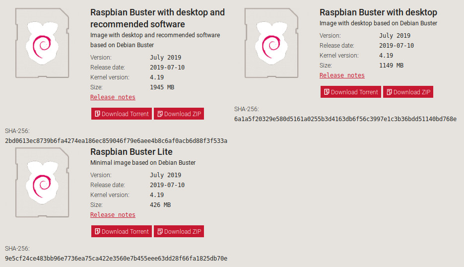
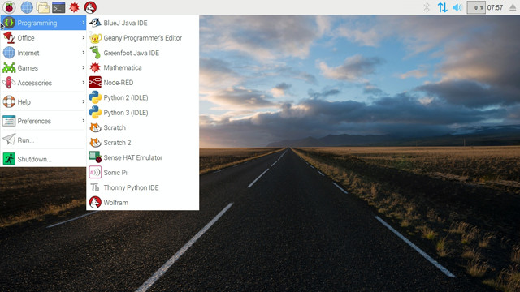

## Introducción

En este tutorial vamos a explicar cómo instalar el sistema operativo Raspbian en Raspberry Pi utilizando el clonado de una imagen con Etcher. Raspbian es el sistema operativo recomendado para Raspberry Pi (al estar optimizado para su hardware) y se basa en una distribución de GNU/Linux llamada Debian.

### Antes de empezar

Vas a necesitar los siguientes componentes:

- Raspberry Pi
- PC con conexión a Internet
- Lector de tarjetas SD


<br />


## Imagen de Raspbian

Una imagen es un archivo que contiene la estructura y los contenidos completos de un sistema operativo, es decir, una copia exacta del sistema operativo y contenido. Esto es útil cuando queremos que todos nuestros equipos dispongan de la misma configuración y con los mismos programas instalados, mismas carpetas, etc.


<br />


## Descargar imagen de Raspbian

Para descargar la imagen del sistema operativo Raspbian para Raspberry Pi accederemos al apartado de <a target="_blank" href="https://www.raspberrypi.org/downloads/raspbian/">descargas</a> y elegimos la versión a instalar. El tiempo de descarga suele ser de 10 minutos aproximadamente dependiendo de la conexión a internet.



- `Raspbian Buster with desktop and recommended software`: Versión completa con entorno gráfico y programas recomendados.
- `Raspbian Buster with desktop`: Versión completa con entorno gráfico (ventanas, carpetas, etc.).
- `Raspbian Buster Lite`: Versión reducida sin entorno gráfico (modo consola).


<br />


## Instalar Etcher

La imagen del sistema operativo se instalará sobre una tarjeta SD. Por ello, mientras se descarga la imagen de Raspbian, vamos a descargar e instalar el programa <a target="_blank" href="https://etcher.io">Etcher</a> (recomendado por Raspberry Pi) que utilizaremos para copiar la imagen de Raspbian en la tarjeta SD.


<br />


## Clonar la imagen con Etcher

Una vez descargada la imagen de Raspbian e instalado el programa Etcher, lo abrimos y seleccionamos la imagen y la tarjeta donde queremos copiar el sistema operativo. Hacemos clic en `Flash` y esperamos a que el proceso finalice. Este proceso suele tardar 20 minutos aproximadamente.

Una vez finalizado el proceso de copiado conectamos la tarjeta SD a la Raspberry Pi y al encenderla arrancará directamente el sistema operativo Raspbian.




<br />


## Primer arranque

En el primer arranque de nuestro sistema operativo Raspbian clonado a partir de una imagen, se ejecuta un proceso para asignar el espacio completo de nuestra tarjeta SD para aprovechar al máximo su capacidad.

Esto podemos comprobarlo ejecutando el comando `df -h` donde deberá aparecer el tamaño total de nuestra SD. En el ejemplo tenemos una tarjeta SD de 32GB.

```sh
pi@raspberrypi:~ $ df -h
S.ficheros     Tamaño Usados  Disp Uso% Montado en
/dev/root         30G   4,7G   24G  17% /
devtmpfs         460M      0  460M   0% /dev
tmpfs            464M      0  464M   0% /dev/shm
tmpfs            464M    12M  452M   3% /run
tmpfs            5,0M   4,0K  5,0M   1% /run/lock
tmpfs            464M      0  464M   0% /sys/fs/cgroup
/dev/mmcblk0p1    43M    22M   21M  51% /boot
tmpfs             93M      0   93M   0% /run/user/1000
```


<br />


## Ejercicios propuestos

1.- Instala el sistema operativo Raspbian a partir de una imagen.
