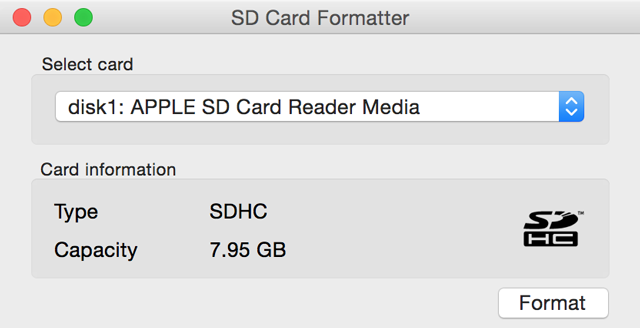
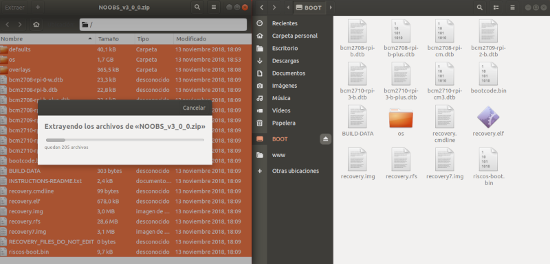
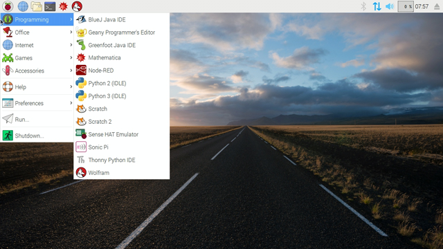

En este tutorial vamos a explicar cómo **instalar el sistema operativo Raspbian en Raspberry Pi** utilizando el asistente guiado NOOBs.

# Antes de empezar

Vas a necesitar los siguientes componentes:

- Raspberry Pi
- PC con conexión a Internet
- Lector de tarjetas SD

# Raspbian NOOBs

Raspbian es el sistema operativo recomendado para Raspberry Pi (al estar optimizado para su hardware) y se basa en una distribución de GNU/Linux llamada Debian.

NOOBS es el acrónimo de *New Out Of Box Software* y consiste en un instalador sencillo guiado paso a paso. NOOBS incluye también un método de edición rápida de configuración del nuevo sistema, un navegador web preinstalado y un modo de recuperación por línea de comandos a partir de una partición de rescate que se crea automáticamente.

## Descargar Raspbian con NOOBs

Para descargar la imagen del sistema operativo Raspbian accederemos al apartado de [descargas](https://www.raspberrypi.org/downloads/noobs/) desde la web oficial de Raspberry Pi y elegimos la versión que queremos instalar. El tiempo de descarga suele ser de 10 minutos aproximadamente dependiendo de la conexión a internet.

- `NOOBS`: Versión completa con entorno gráfico y programas recomendados.
- `NOOBS Lite`: Versión reducida sin entorno gráfico (modo consola) para *usuarios experimentados*.

El archivo descargado vendrá con extensión `.zip` con lo cual deberemos tener instalado un compresor de archivos.

## Instalar SD Card Formatter

El sistema operativo se instalará sobre una tarjeta SD que tenemos que formatear para eliminar el posible contenido así como para dejarla preparada con el sistema de archivos que utiliza Raspbian. Por ello, mientras se descarga la imagen de Raspbian, vamos a descargar el programa [SD Card Formatter](https://www.sdcard.org/downloads/index.html) (recomendado por Raspberry Pi). 

Una vez descargado e instalado, insertamos la tarjeta SD en la ranura de nuestro lector de tarjetas, la seleccionamos y la formateamos. Este proceso tarda apenas unos segundos.

## Instalar Raspbian con NOOBs

Una vez descargada la imagen de Raspbian, la descomprimimos con un compresor de archivos `.zip` y copiamos todos los archivos de la carpeta descomprimida en el interior de la tarjeta SD formateada en el paso anterior.

Una vez copiados todos los archivos, conectaremos nuestra Raspberry Pi e iremos seleccionando las opciones que nos ofrezca el asistente de instalación. Este proceso **suele tardar unos 20 minutos** aproximadamente.

Una vez finalizada la instalación arrancará el sistema operativo Raspbian como se muestra en la siguiente imagen.

# Resumen

Una forma sencilla de instalar Raspbian es copiando todos los archivos de la imagen descargada desde la página oficial de Raspberry Pi y seguir el asistente guiado de instalación.

# Ejercicios propuestos

1.- Instala el sistema operativo Raspbian con NOOBs. Calcula el tiempo aproximado de la instalación.

|                          | Tiempo |
| ------------------------ | ------ |
| Descargar NOOBs          |        |
| Copiar archivos en la SD |        |
| Instalar NOOBs           |        |
| TIEMPO TOTAL             |        |
