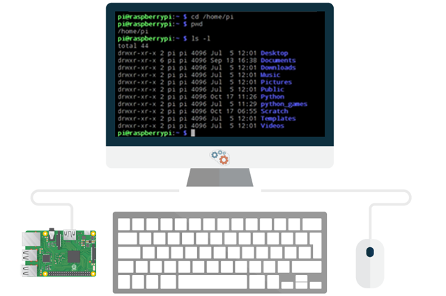
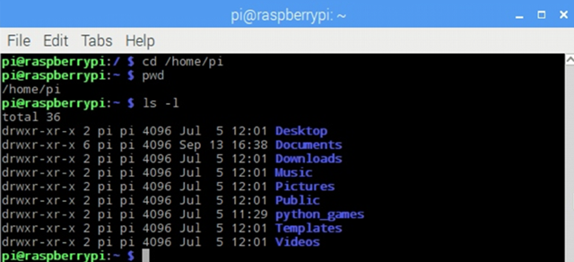

## Introducción

Este curso online de introducción a la Terminal o Consola de Linux está destinado a todos aquellos usuarios que quieran adentrarse en el manejo de comandos para administrar un sistema operativo de tipo Unix. A lo largo de las siguientes lecciones aprenderás a utilizar los comandos más utilizados En el sistema operativo Raspbian para Raspberry Pi.




<br />


## ¿Qué es una Terminal en Linux?

Los sistemas operativos basados en Unix disponen de un intérprete de comandos u órdenes (conocido como terminal, consola o shell) que hace de interfaz entre el usuario y el propio sistema operativo. Es decir, mediante la terminal o consola podemos acceder al sistema operativo sin utilizar la interfaz gráfica y realizar todo tipo de tareas en modo texto.

> La terminal o consola es una herramienta poderosa copaz de realizar tareas de forma más rápida que mediante la interfaz gráfica del sistema operativo.



Fijándonos en la terminal observamos la siguiente información que a continuación explicamos:

```sh
pi@raspberrypi: ~ $ cd /home/pi
```
- pi: indica el usuario conectado a la terminal
- @: significa "en"
- raspberrypi: indica el nombre de la máquina a la cual estamos conectados
- ~: indica la ruta en la cual nos encontramos, en este caso ruta de inicio predeterminada
- $: indicador para comenzar a escribir nuevas órdenes o comandos

A modo de ejemplo, podríamos decir que estamos conectados a la máquina raspberrypi con el usuario programoergosum, que está dentro de la carpeta /var/www y está ejecutando el comando de listar todos los ficheros mostrando todas sus propiedades:

```sh
programoergosum@raspberrypi: /var/www $ ls -la
```

### Comandos básicos en Linux

En las siguientes lecciones mostraremos los comandos básicos y más utilizados a la hora de administrar y configurar un sistema operativo GNU/Linux, en este caso, el sistema operativo Raspbian para Raspberry Pi.

- Comandos del sistema: Comandos sobre información y estado del sistema operativo
- Archivos y directorios: Comandos para crear, borrar y navegar entre diferentes ficheros
- Permisos y usuarios: Comandos para cambiar permisos de archivos y usuarios


<br />


## Comandos del sistema

```sh
pi@raspberrypi: ~ $ arch
```

- arch: muestra la arquitectura de la máquina

 
```sh
pi@raspberrypi: ~ $ uname
```

- uname: muestra el nombre del sistema operativo

 
```sh
pi@raspberrypi: ~ $ sudo raspi-config
```

- sudo raspi-config: ventana de configuración de Raspbian

 
```sh
pi@raspberrypi: ~ $ cat /proc/cpuinfo
```

- cat [fichero]: muestra por pantalla el fichero especificado
- cat /proc/version: muestra por pantalla la versión del sistema operativo
- cat /proc/cpuinfo: muestra por pantalla la información de la CPU
- cat /proc/meminfo: muestra por pantalla el estado de la memoria

 
```sh
pi@raspberrypi: ~ $ sudo top
```

- top: muestra los procesos activos

 
```sh
pi@raspberrypi: ~ $ vcgencmd measure_temp
```

- vcgencmd measure_temp: muestra la temperatura de la CPU

 
```sh
pi@raspberrypi: ~ $ lusb
```

- lusb: visualizar los dispositivos USB conectados

 
```sh
pi@raspberrypi: ~ $ history
```

- history: muestra el historial de comandos introducidos
- history -c: limpia el historial de comandos introducidos

 
```sh
pi@raspberrypi: ~ $ date
```

- date: muestra la fecha del sistema

Algunos comandos admiten varios parámetros para mostrar diferentes comportamientos. Por ejemplo, el comando que muestra el almanaque puede recibir parámetros para mostrar un año en concreto o una determinada cantidad de meses, etc.

```sh
pi@raspberrypi: ~ $ cal
pi@raspberrypi: ~ $ cal 2017
pi@raspberrypi: ~ $ cal 07 2017
pi@raspberrypi: ~ $ cal -A 3 -B 3 10 2017
```

- cal: muestra el almanaque de la fecha actual
- cal 2017: muestra el almanaque del 2017
- cal 07 2017: muestra el almanaque de julio de 2017
- cal -A 3 -B 2 10 2017: muestra el almanaque de octubre de 2017 y 3 meses antes y 2 meses después

Viendo lo anterior, es necesario disponer de un manual para entender todas las posibilidades que otorgan los comandos. Para ello, disponemos comando man que muestra el manual de un comando.

```sh
pi@raspberrypi: ~ $ man cal
```

- man [comando]: muestra el manual del comando especificado
- man cal: muestra el manual para el comando calendario

Para apagar, reiniciar o proceder a un apagado  planificado de la máquina, podemos utilizar los siguientes comandos.

```sh
pi@raspberrypi: ~ $ shutdown -h now
pi@raspberrypi: ~ $ shutdown -h 10:30 &
pi@raspberrypi: ~ $ shutdown -c
pi@raspberrypi: ~ $ shutdown -r now
```

- shutdown -h now: apagar la máquina
- shutdown -h 10:30 &: planificar un apagado de la máquina a las 10:30 (& es en segundo plano)
- shutdown -c: cancelar un apagado planificado
- shutdown -r now: reiniciar la máquina

```sh
pi@raspberrypi: ~ $ logout
```

- logout: cerrar la sesión del usuario

```sh
pi@raspberrypi: ~ $ exit
```

- exit: cerrar la terminal


<br />


## Ficheros y directorios

```sh
pi@raspberrypi: ~ $ pwd
```

- pwd: muestra la ruta actual donde nos encontramos

 
```sh
pi@raspberrypi: ~ $ ls
```

- ls: lista el directorio en el cual nos encontramos
- ls -l: lista el directorio en formato lista (uno debajo del otro con opciones)
- ls -la: lista el directorio en formato lista y además muestra todos los archivos ocultos

 
```sh
pi@raspberrypi: ~ $ cd /home/pi
```

- cd [directorio]: accedemos al directorio que le sigue
- cd /: accedemos al directorio raiz
- cd ~: accedemos al directorio por defecto, normalmente /home/pi
- cd ..: accedemos al directorio padre, o lo que es lo mismo, retrocedemos de nivel

 
```sh
pi@raspberrypi: ~ $ touch fichero
```

- tocuh [fichero]: crea un fichero vacio con el nombre especificado
- touch documento.txt: crea un fichero llamado documento.txt

 
```sh
pi@raspberrypi: ~ $ vi fichero
```

- vi [fichero]: crea un fichero para editar con vi
- vi documento: crea un fichero y se edita en vi

 
```sh
pi@raspberrypi: ~ $ mkdir nuevo
```

- mkdir [nombre]: crea un nuevo directorio
- mkdir nuevo: crea el directorio llamado nuevo en el directorio donde nos encontramos
- mkdir /home/pi/nuevo: crea el directorio llamado nuevo en la ruta absoluta especificada

 
```sh
pi@raspberrypi: ~ $ mv origen destino
```

- mv [origen] [destino]: mueve el fichero
- mv origen destino: mueve el fichero llamado origen a uno nuevo llamado destino
- mv origen /home/pi/destino: mueve el fichero origen situado en el directorio donde nos encontramos al directorio de trabajo llamándolo destino

 
```sh
pi@raspberrypi: ~ $ cp origen destino
```

- cp [origen] [destino]: copia los ficheros de un directorio a otro
- cp origen destino: copia los ficheros de origen a la carpeta destino

 
```sh
pi@raspberrypi: ~ $ rm fichero
```

- rm [fichero]: borra un fichero
- rm -r directorio: borra los ficheros de un directorio y el mismo
- rm -rf directorio: borra los ficheros de un directorio y el mismo sin confirmar

En ocasiones surge la necesidad de encontrar diferentes ficheros en nuestro sistema operativo. Para ello disponemos del comando find.

```sh
pi@raspberrypi: ~ $ find origen -name nombre
```

- find [origen] -name [nombre]: buscar ficheros
- find . -name *.jpg: busca todos los archivos con extensión jpg a partir de nuestro directorio actual
- find /home -name s*.doc: busca los ficheros que empiecen por s y tengan extensión doc de mi directorio /home


<br />


## Permisos y usuarios

```sh
pi@raspberrypi: ~ $ chmod -R 777 /home/pi
```

- chmod [permisos] [directorio]: cambia los permisos de un fichero
- cmod -R 777 /home/pi: asigna todos los permisos de forma recursiva al directorio /home/pi

Los usuarios en GNU/Linux se identifican por número único de usuario (UserID o UID) y pertenecen a un grupo principal de usuario, identificado también por un número único de grupo (GroupID GID). Un usuario puede pertenecer a todos los grupos que quiera.

```sh
pi@raspberrypi: ~ $ cat /etc/passwd
```

- cat /etc/passwd: muestra todos los usuarios agregados al sistema operativo
