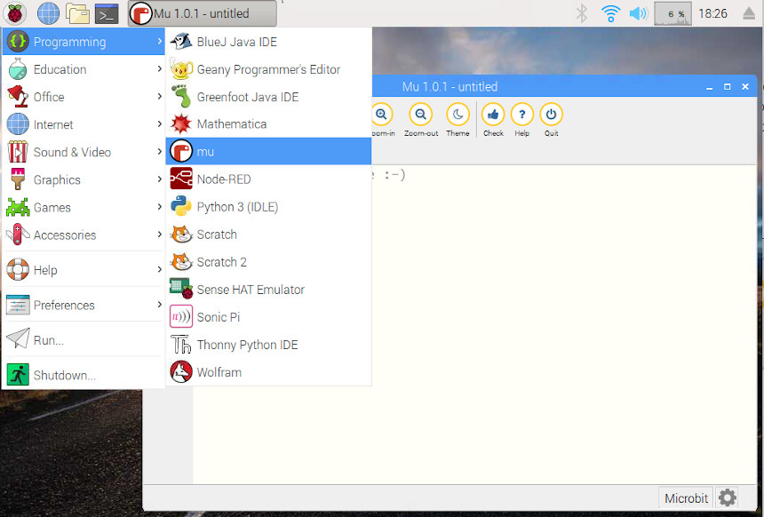
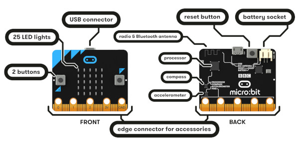
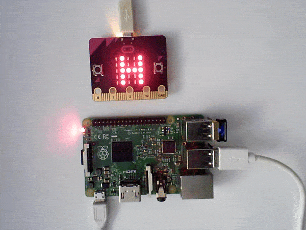

## Introducción

En este tutorial vamos a explicar cómo instalar Mu Editor para programar placas de electrónica en MicroPython.

### Antes de empezar

Vas a necesitar los siguientes componentes:

- Raspberry Pi con Raspbian
- Micro:Bit

Es recomendable acceder a los siguientes tutoriales:

- <a target="_blank" href="https://www.aprendeprogramando.es/cursos-online/python" title="Aprende a programar en Python">Aprender a programar en Python</a>


<br />


## Instalar Mu Editor

<a target="_blank" href="https://codewith.mu/">Mu Editor</a> es un editor de Python muy sencillo para principantes de la programación que permite programar en MicroPython. [MicroPython](http://micropython.org/) es una versión reducida de Python 3 diseñada para funcionar en microcontroladores, como es el caso de la placa micro:bit.

En primer lugar tenemos que habilitar el editor Mu desde `Inicio > Programas recomendados` y una vez instalado ya podemos acceder al editor desde el menú `Inicio > Programming > Mu`




<br />


## Micro:bit a Raspberry Pi

<a target="_blank" href="https://microbit.org/es/">BBCs Micro:bit</a> es una pequeña placa de electrónica programable diseñada para aprender a programar de forma sencilla. Cuenta con diferentes sensores y actuadores con los que poder interactuar mediante programación. Y para programarla vamos a utilizar el editor Mu. 



Para conectar la placa hacemos uso de cualquiera de los USB disponibles en la Raspberry Pi. Al conectarla aparecerá una ventana indicando que se ha introducido un dispositivo nuevo. Simplemente cancelamos la ventana haciendo clic en el botón `Cancelar`.


<br />


## Software Mu Editor

Para programar nuestra placa Micro:bit, vamos a utilizar el lenguaje de programación MicroPython. <a target="_blank" href="http://micropython.org/">MicroPython</a> es una versión reducida de Python 3 diseñada para funcionar en microcontroladores, como es el caso de la placa micro:bit. Esto se consigue con el Editor Mu. Vamos a ver las partes del editor.


- `New` abre un nuevo archivo.
- `Load` abre un código existente.
- `Save` guarda el código actual.
- `Flash` carga el código en la placa Micro:bit.
- `Repl` abre un Shell interactivo en línea de comandos para ejecutar instrucciones simples.
- `Zoom-in` y `Zoom-out` Altera el tamaño de la fuente.
- `Theme` altera el tono del editor
- `Check` comprueba la sintaxis del código.


<br />


## ¡Hola Mundo!

Una vez abierto el editor y conectada la placa Micro:bit, vamos a probar que funciona introduciendo el programa `Hola Mundo`. Para ello introducimos el siguiente código y presionamos sobre el botón `Flash`. Al cabo de unos segundos veremos como se desliza la frase `Hola Mundo` sobre los leds de nuestra placa Micro:bit.

```python
from microbit import *
display.scroll('Hola Mundo')
```



Otra opción consiste en mostrar una a una cada una de las letras de la frase `Hola Mundo` utilizando la función `show()`. Para hacer un retardo entre una letra y la siguiente utilizamos la función `sleep(500)` que hará un retardo de 500 milisegundos.

```python
from microbit import *
display.show('H')
sleep(500)
display.show('O')
sleep(500)
display.show('L')
sleep(500)
display.show('A')
sleep(500)
...
```


<br />


## Ejercicios propuestos

1.- Muestra tu nombre completo utilizando la función `scroll()`.

2.- Muestra tu nombre pero esta vez letra a letra utilizando la función `show()`.

3.- Muestra una cuentra atrás de 9 a 0 utilizando un bucle.

4.- Muestra números aleatorios de 0 a 9 de forma indefinida cada 500 milisegundos. Deberás importar la librería `import random` y llamar a la función `random.randint(num_inicial, num_final)`.
