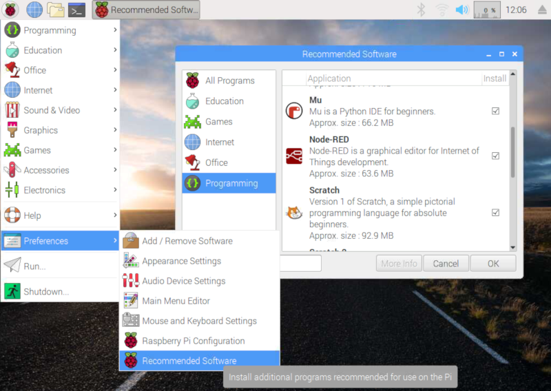
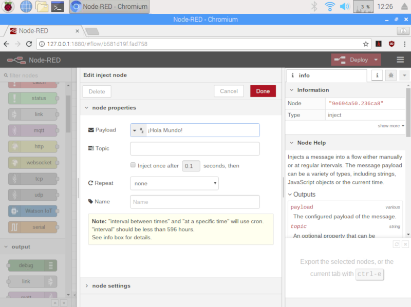
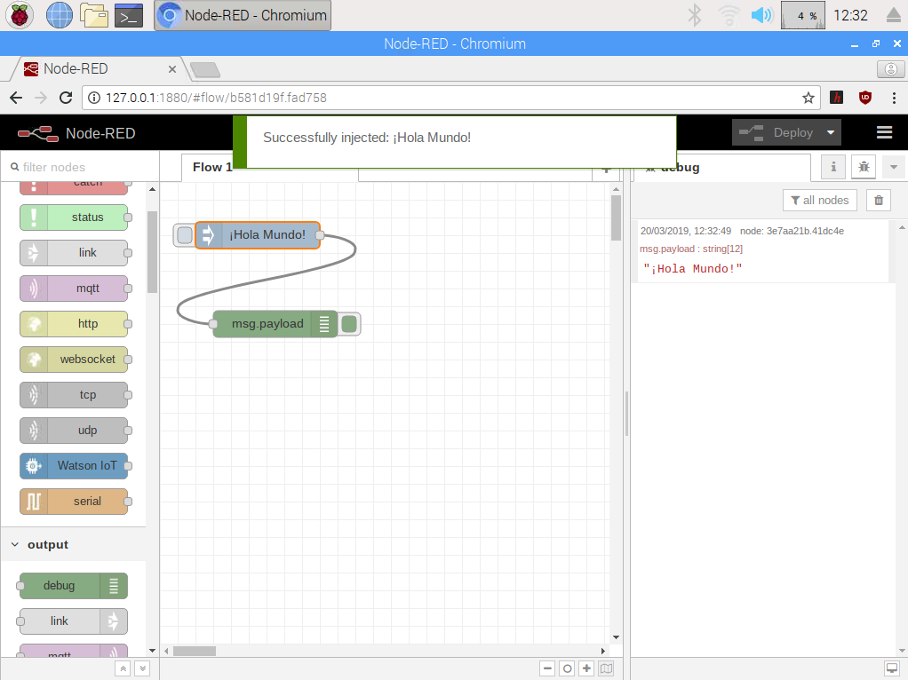

En este tutorial vamos a explicar cómo **utilizar Node-RED desde Raspberry Pi** de una forma muy sencilla para crear aplicaciones IoT sin saber programar en lenguaje de programación textual.

# Antes de empezar

Vas a necesitar los siguientes componentes:

- Raspberry Pi con Raspbian

# Node-RED

[Node-RED](https://nodered.org/) es un motor de flujos con enfoque IoT que permite definir gráficamente flujos de servicios a través de protocolos estándares como REST, MQTT, Websocket o AMQP. Se trata de una herramienta visual muy ligera programada en NodeJS y que puede ejecutarse en dispositivos ligeros como la Raspberry Pi.

## Instalación de Node-RED

Esta herramienta viene instalada por defecto en la versión de Raspbian con programas recomendados. En caso de utilizar otra versión y querer instalarla podemos hacerlo desde el menú `Preferences > Recommended Software` e instalarlo desde la pestaña `programming`.



## Node-RED en Raspberry Pi

Podemos abrir Node-RED accediendo al menú `Programming > Node-RED` y se abrirá en segundo plano una terminal encargada de arrancar la herramienta. Una vez abierta accedemos mediante nuestro navegador predeterminado a la dirección `http://127.0.0.1:1880` o a través de la red a la IP de nuestra Raspberry Pi seguido del mismo puerto.

```
URL: http://127.0.0.1:1880
```


Vamos a echar un vistazo rápido por Node-RED. Los programas en Node-RED se llaman **Flow** (flujos) y se puede crear tantos flujos como queramos y todos pueden ejecutarse al mismo tiempo.

- En el lado izquierdo tenemos todos los nodos disponibles. Los nodos son la unidad mínima que podemos encontrar en Node-RED. Podemos ver la lista de nodos que vienen instalados por defecto y organizados en categorías según su funcionalidad (entradas, salidas, etc.).
- En el centro es donde podemos arrastrar los nodos para crear el flujo de trabajo.
- En el lado derecho aparecerán los parámetros de configuración de cada nodo seleccionado. Normalmente haciendo doble clic sobre el nodo se desplegarán todas las opciones del nodo.
- En la parte superior derecha tenemos el botón de desplegar y guardar cambios.

## Hola Mundo

Vamos a probar un flujo muy simple encargado de mostrar el texto *¡Hola Mundo!* por el panel de debug. Para ello debemos arrastrar un nodo `inject` de la categoría input y un nodo `debug` de la categoría output al flujo del programa. Haciendo doble clic sobre el nodo `inject` establecemos el *Payload* a modo string y añadimos la cadena '¡Hola Mundo!'.



A continuación los conectamos entre ellos siguiendo el flujo `inject -> debug` y **desplegamos el programa** pulsando sobre el botón `deploy`. Una vez que lo hayas pulsado, volverá de nuevo al color gris oscuro. Esto quiere decir que ya tenemos guardados todos los cambios.

Para probar este primer flujo tenemos que abrir el panel de debug que está situado en la parte derecha. A continuación pulsa sobre el botón situado a la derecha del nodo 'Hola Mundo' y se ejecutará el flujo y se mostrará el mensaje '¡Hola Mundo!' sobre el debug.



# Resumen

En este tutorial hemos podido ver lo fácil que es programar utilizando nodos en vez de un lenguaje de programación. Aunque se puede complicar mucho más ya que tenemos diferentes tipos de nodos para conectarnos a tecnologías el IoT.

# Ejercicios propuestos

1.- ToDo
