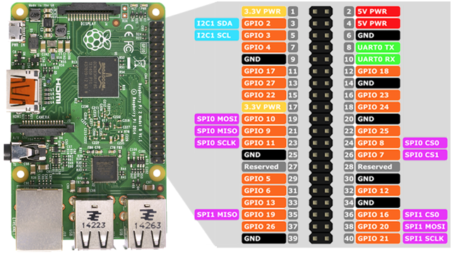
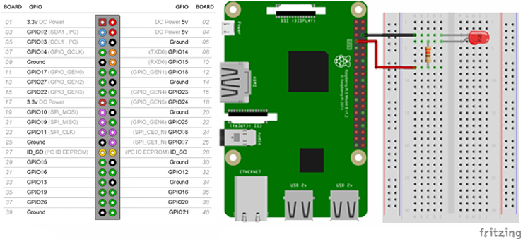
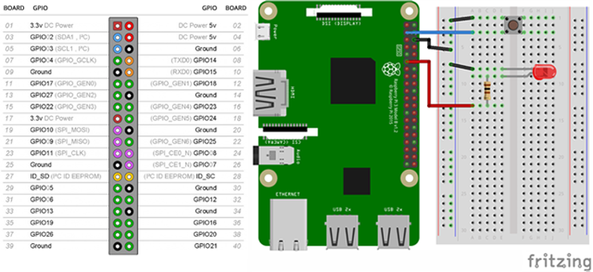

En este tutorial vamos a programar en Python **los pines GPIO** de nuestra Raspberry Pi para interactuar con ellos.

# Antes de empezar

Vas a necesitar los siguientes componentes:

- Raspberry Pi con Raspbian

## Pines GPIO

General Purpose Input Output (GPIO) es un sistema de entrada y salida de propósito general, es decir, consta de una serie de pines o conexiones que se pueden usar como entradas o salidas para múltiples usos. Estos pines están incluidos en todos los modelos de Raspberry Pi aunque con diferencias.



Hay que tener en cuenta que dependiendo del modelo de la Raspberry Pi encontramos una cantidad de pines diferentes, por ejemplo, en la versión 1 de Raspberry Pi se tienen 26 pines GPIO mientras que a partir de la versión 2 de Raspberry Pi el número de pines aumentó a 40. Sin embargo la compatibilidad es total, puesto que los 26 primeros pines mantienen su función original.

Una forma sencilla de ver el pinout de nuestra Raspberry Pi es introduciendo el comando `gpio readall`.

```sh
pi@raspberrypi:~ $ gpio readall
 +-----+-----+---------+------+---+---Pi 2---+---+------+---------+-----+-----+
 | BCM | wPi |   Name  | Mode | V | Physical | V | Mode | Name    | wPi | BCM |
 +-----+-----+---------+------+---+----++----+---+------+---------+-----+-----+
 |     |     |    3.3v |      |   |  1 || 2  |   |      | 5v      |     |     |
 |   2 |   8 |   SDA.1 |   IN | 1 |  3 || 4  |   |      | 5v      |     |     |
 |   3 |   9 |   SCL.1 |   IN | 1 |  5 || 6  |   |      | 0v      |     |     |
 |   4 |   7 | GPIO. 7 |   IN | 1 |  7 || 8  | 0 | IN   | TxD     | 15  | 14  |
 |     |     |      0v |      |   |  9 || 10 | 1 | IN   | RxD     | 16  | 15  |
 |  17 |   0 | GPIO. 0 |   IN | 0 | 11 || 12 | 0 | IN   | GPIO. 1 | 1   | 18  |
 |  27 |   2 | GPIO. 2 |   IN | 0 | 13 || 14 |   |      | 0v      |     |     |
 |  22 |   3 | GPIO. 3 |   IN | 0 | 15 || 16 | 0 | IN   | GPIO. 4 | 4   | 23  |
 |     |     |    3.3v |      |   | 17 || 18 | 0 | IN   | GPIO. 5 | 5   | 24  |
 |  10 |  12 |    MOSI |   IN | 0 | 19 || 20 |   |      | 0v      |     |     |
 |   9 |  13 |    MISO |   IN | 0 | 21 || 22 | 0 | IN   | GPIO. 6 | 6   | 25  |
 |  11 |  14 |    SCLK |   IN | 0 | 23 || 24 | 1 | IN   | CE0     | 10  | 8   |
 |     |     |      0v |      |   | 25 || 26 | 1 | IN   | CE1     | 11  | 7   |
 |   0 |  30 |   SDA.0 |   IN | 1 | 27 || 28 | 1 | IN   | SCL.0   | 31  | 1   |
 |   5 |  21 | GPIO.21 |   IN | 1 | 29 || 30 |   |      | 0v      |     |     |
 |   6 |  22 | GPIO.22 |   IN | 1 | 31 || 32 | 0 | IN   | GPIO.26 | 26  | 12  |
 |  13 |  23 | GPIO.23 |   IN | 0 | 33 || 34 |   |      | 0v      |     |     |
 |  19 |  24 | GPIO.24 |   IN | 0 | 35 || 36 | 0 | IN   | GPIO.27 | 27  | 16  |
 |  26 |  25 | GPIO.25 |   IN | 0 | 37 || 38 | 0 | IN   | GPIO.28 | 28  | 20  |
 |     |     |      0v |      |   | 39 || 40 | 0 | IN   | GPIO.29 | 29  | 21  |
 +-----+-----+---------+------+---+----++----+---+------+---------+-----+-----+
 | BCM | wPi |   Name  | Mode | V | Physical | V | Mode | Name    | wPi | BCM |
 +-----+-----+---------+------+---+---Pi 2---+---+------+---------+-----+-----+
```

## Salidas digitales

En primer lugar se importa la librería `GPIO` y `time`. Vamos a utilizar el pin situado en su posición de la placa 7. La siguiente instrucción será la inicialización del pin, es decir, los pines pueden ser utilizados como entradas o salidas. Por último, solamente nos quedará activar (True) o desactivar (False) el pin seleccionado. Para ello, se va a situar el código dentro de un bucle infinito.

```python
import RPi.GPIO as GPIO
import time

GPIO.setmode(GPIO.BOARD)
GPIO.setup(7, GPIO.OUT)

while True:
  GPIO.output(7, True)
  time.sleep(1)
  GPIO.output(7, False)
  time.sleep(1)
```



## Entradas digitales

El interruptor lo declaramos de tipo entrada y en la condición se puede observar que al pulsar sobre el botón se encenderá el led situado en la posición 7 de nuestro pin GPIO y en caso contrario se apagará.

```python
import RPi.GPIO as GPIO
import time

GPIO.setmode(GPIO.BOARD)
GPIO.setup(3, GPIO.IN)
GPIO.setup(7, GPIO.OUT)

while True:
  if GPIO.input(3):
    GPIO.output(7, False)
  else:
    GPIO.output(7, True)
```



# Resumen

En Raspberry Pi no disponemos de un conversor de analógico a digital, con lo cual, para medir ciertos sensores utilizaremos de forma conjunta una placa de Arduino para que se comuniquen a través del serial con PySerial.

# Ejercicios propuestos

1.- Programa un led intermitente en Python utilizando los pines GPIO.
