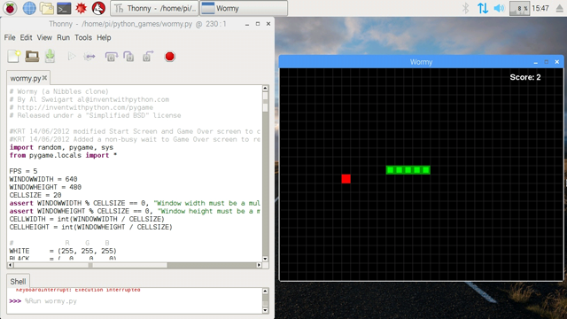
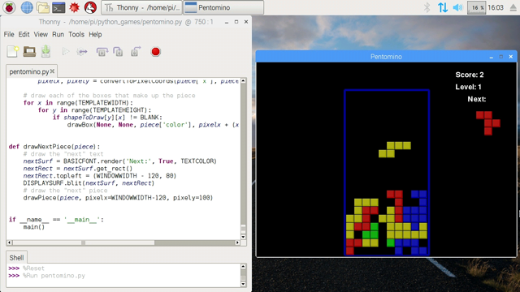
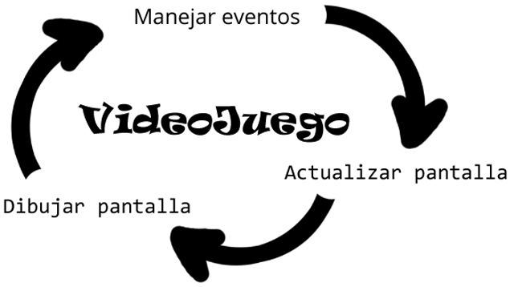
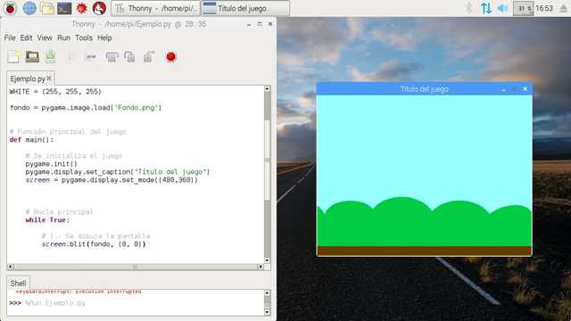
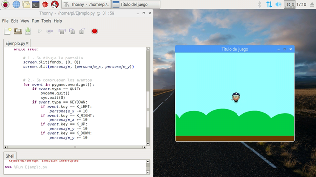

# Introducción a PyGame en Raspberry Pi

En este curso aprenderás los conceptos necesarios para empezar a programar videojuegos en Python utilizando el módulo de PyGame. Se recomienda conocer el lenguaje de programación en Python para continuar con las siguientes lecciones. Si todavía no sabes programar en Python, accede al curso de iniciación a la programación en Python de esta misma plataforma.

El módulo de PyGame para Python viene instalado por defecto en la versión de Raspbian para Raspberry Pi. No obstante si dispones de otro sistema operativo, puedes acceder a la web del proyecto para instalarlo y continuar con el resto de lecciones del curso.




<br />


## ¿Qué es PyGame?

PyGame es un módulo del lenguaje de programación Python que permiten la creación de videojuegos en dos dimensiones de una manera sencilla. Mediante PyGame podemos utilizar sprites (objetos), cargar y mostrar imágenes en diferentes formatos, sonidos, etc. Además, al ser un módulo destinado a la programación de videojuegos se puede monitorizar el teclado o joystick de una manera bastante sencilla.



El módulo de PyGame para Python viene instalado por defecto en la versión de Raspbian para Raspberry Pi. No obstante si dispones de otro sistema operativo, puedes acceder a la web del proyecto para instalarlo y continuar con el resto de lecciones del curso.


<br />


## Primeros pasos

Siempre que se empieza a programar un videojuego se suele utilizar una plantilla predefinida con las instrucciones básicas o esenciales. La idea es no escribir el código básico cuando se puede reutilizar.



Todo videojuego consta de 3 partes principales que se suelen declarar dentro de la función principal main():

- Se dibuja la pantalla. En este caso pintaremos los escenarios, sprites, textos y demás objetos que queramos representar a los largo de la partida del juego.
- Se comprueban los eventos. Los eventos típicos que se suelen utilizar son el de finalización de la partida al presionar sobre el cierre de la ventana, así como los diferentes eventos que se prograrán al presionar una tecla, etc.
- Se actualiza la pantalla. Una vez se actúa sobre cada elemento, se actualiza la pantalla para que queden fijados los componentes del videojuego.

A continuación puedes copiar y pegar el código en tu editor Thonny Python y ejecutar el código para ver como se abre una nueva ventana preparada para empezar a programar videojuegos.

```python
import random, pygame, sys
from pygame.locals import *

# Declaración de constantes y variables
WHITE = (255, 255, 255)

# Función principal del juego
def main():
  # Se inicializa el juego
  pygame.init()
  pygame.display.set_caption("Título del juego")
  screen = pygame.display.set_mode((480,360))

  # Bucle principal
  while True:

    # 1.- Se dibuja la pantalla
    screen.fill(WHITE)

    # 2.- Se comprueban los eventos
    for event in pygame.event.get():
      if event.type == QUIT:
        pygame.quit()
        sys.exit(0)

    # 3.- Se actualiza la pantalla
    pygame.display.update()

# Este fichero es el que ejecuta el juego principal
if __name__ == '__main__':
  main()
```

Una vez copiado el código en tu editor y ejecutado verás que aparece una ventana con unas determinadas dimensiones, título, color de fondo. Si observas en las primeras líneas del código, y modificas dicho parámetros, tendrás una ventana diferente. ¡Pruébalo!

### Escenario

Hasta ahora, cuando ejecutamos nuestro videojuego aparece una ventana con el fondo de color blanco, porque le estamos diciendo dentro del bucle while que fije el color al color de la constante WHITE, blanco en este caso (formato RGB). Sin embargo, también se pueden añadir imágenes de fondo. Para ello tenemos que seguir los pasos de importar la imagen y establecerla en la posición deseada mediante coordenadas.

```python
...
def main():
  # Se inicializa el juego
  ...
  fondo = pygame.image.load('ruta_del_fondo')
  ...
  # Bucle principal
  while True:
    # 1.- Se dibuja la pantalla
    screen.blit(fondo, (0, 0))
...
```

Observa que la carga de la imagen se realiza dentro de la función principal y antes del bucle while. Sin embargo, dentro del bucle while establecemos sobre la pantalla y en las coordenadas (0, 0) la imagen. Recuerda que las coordenadas (0, 0) en PyGame se sitúan en la esquina superior izquierda.



### Personaje principal

Para importar un personaje e interactuar sobre él deberemos proceder de la siguiente manera. En primer lugar se importa la imagen del sprite y se declaran las coordenadas de su posición. (En cursos más avanzados veremos como es conveniente crear una clase para el objeto).

Una vez tenemos al personaje situado sobre su posición, programamos los eventos que efectuarán los cambios de coordenadas, y esto como puedes observar, se realiza dentro del apartado de eventos en el bucle while.

Los eventos que vamos a utilizar son los movimientos básicos de las teclas del teclado para que el personaje se mueva en todas las direcciones.

```python
...
def main():
  personaje = pygame.image.load('ruta_de_la_imagen')
  personaje_x = 240
  personaje_y = 180
  ...
  # Bucle principal
  while True:
    ...
    # 1.- Se dibuja la pantalla
    screen.blit(personaje, (personaje_x, personaje_y))
    ...
    # 2.- Se comprueban los eventos
    for event in pygame.event.get():
      ...
      if event.type == KEYDOWN:
        if event.key == K_LEFT:
            personaje_x -= 10
        if event.key == K_RIGHT:
            personaje_x += 10
        if event.key == K_UP:
            personaje_y -= 10
        if event.key == K_DOWN:
            personaje_y += 10
...
```

Una vez programado, observa como al presionar las diferentes teclas de movimiento tu personaje se moverá de una posición a otra. Puedes probar a modificar las coordenadas para crear el videojuego que más te guste.


