## Introducción

En este curso aprenderás a programar en Python utilizando la Raspberry Pi para iniciarte en el mundo de la programación. Este es un tutorial de nivel iniciación para aquellos usuarios que todavía no han programado ningún lenguaje de programación en modo texto.

En el tutorial se va a explicar la versión de Python 3 (IDLE) que viene instalada por defecto en el sistema operativo de Raspbian para Raspberry Pi. No obstante, también podrás acceder al tutorial en caso de instalar Python en tu sistema operativo Windows, Linux o MAC.

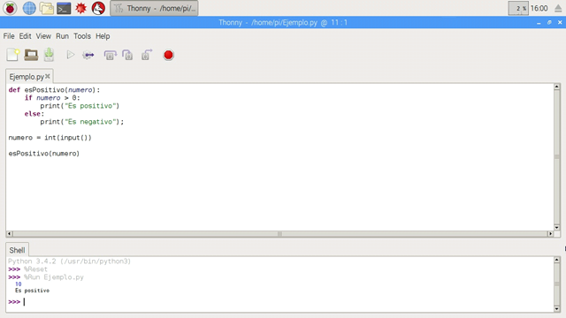

> También puedes acceder a la plataforma <a target="_blank" href="https://www.aprendeprogramando.es/cursos-online/python">AprendeProgramando</a> para aprender a programar en Python a través de lecciones de teoría y ejercicios prácticos.

 

## ¿Qué es PYthon?

Python es un lenguaje de programación interpretado de tipado dinámico cuya filosofía hace hincapié en una sintaxis que favorezca un código legible. Se trata de un lenguaje de programación multiparadigma y disponible en varias plataformas.

Dicho de otro modo, Python es:

- Interpretado: Se ejecuta sin necesidad de ser procesado por el compilador y se detectan los errores en tiempo de ejecución.
- Multiparadigma: Soporta programación funcional, programación imperativa y programación orientada a objetos.
- Tipado dinámico: Las variables se comprueban en tiempo de ejecución.
- Multiplataforma: disponible para plataformas de Windows, Linux o MAC.
- Gratuito: No dispone de licencia para programar.

Al hacer uso de una sintaxis legible, la curva de aprendizaje es muy rápida, siendo de este modo, uno de los mejores lenguajes para iniciarse en la programación en modo texto. Por ejemplo, si comparamos un código escrito en lenguaje de programación por bloques como Blockly y el mismo código lo escribimos utilizando Python, vemos las similitudes en las instrucciones.

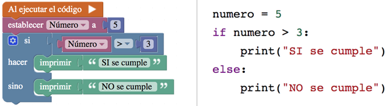

Python contiene una gran cantidad de librerías, tipos de datos y funciones incorporadas en el propio lenguaje, que ayudan a realizar muchas tareas comunes sin necesidad de tener que programarlas desde cero. Pero lo que realmente le hace brillante utilizándolo en una Raspberry Pi, es por la capacidad de poder utilizar los pines GPIO para conectar el mundo físico con el mundo digital.

 

## Mi primer programa en Python

  <iframe src="//www.youtube.com/embed/pMGIJsnsFGA" allowfullscreen></iframe>

En programación, el primer programa que se crea es el que imprime el texto "Hola Mundo" en un dispositivo de visualización, terminal o shell. Este programa suele ser usado como introducción al estudio de un lenguaje de programación siendo un primer ejercicio típico, y considerándose fundamental desde el punto de vista didáctico.

> El Hola Mundo se caracteriza por su sencillez, especialmente cuando se ejecuta en una terminal o shell.

Si tenemos instalado el sistema operativo Raspbian en nuestra Raspberry Pi, encontraremos las versiones 2 y 3 de Python instaladas. En este tutorial se va a explicar la versión de Python 3 (IDLE), con lo cual recomendamos que si todavía no tienes instalada esta versión, sea el primer paso que hagas. Recuerda que Python es gratuito y multiplataforma.

Además, en este tutorial se utilizará el programa Thony Python IDE que viene instalado por defecto en la instalación de Raspbian. No obstante, puedes utilizar el IDE que más te gusta ya que no es importante para aprender a programar.

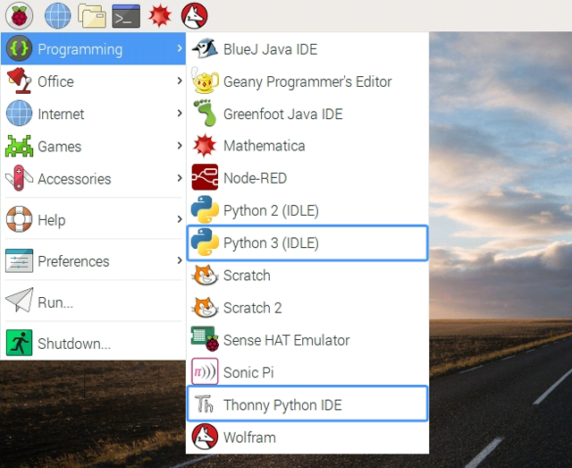

Suponiendo que tienes instalado Python 3 (IDLE) y Thonny Python IDE, accede a los programas y escribe tu primer programa. Recuerda que este programa mostrará por la pantalla el texto "Hola Mundo". Puedes probar a cambiar el texto y volver a ejecutar el código para ver que escribe lo que se le espera.

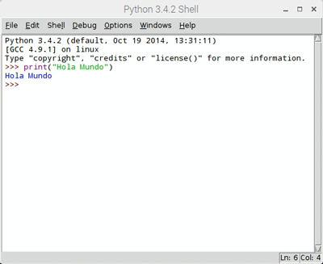

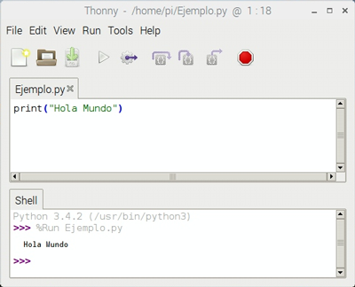

### ¿Qué es un tipo de dato?

  <iframe src="//www.youtube.com/embed/3EdCnHi4AKE" allowfullscreen></iframe>

En programación un tipo de dato es la forma de representación del dato e indica la clase de dato que se va a manejar. Esto incluye imponer restricciones en los datos, como qué valores pueden tomar y qué operaciones se pueden realizar.

Python es un lenguaje de programación de propósito general y por ello contiene una gran cantidad de tipos de datos con los que se puede programar.

- Numéricos: En Python los números pueden ser enteros, flotantes o complejos.
- Booleanos: Los tipos de datos booleanos se utilizan para representar verdadero y falso, mediante las palabras reservadas True o False respectivamente. Este tipo de datos es muy importante en para el control de flujo de un programa como veremos en las siguientes lecciones.
- Cadenas: Aunque las cadenas no son usualmente importantes para análisis numérico, sí lo son para mostrar resultados por la terminal o shell. Una cadena debe delimitarse con comillas simples o dobles y admite caracteres de escape.
- Listas: Una lista es una colección de objetos: números enteros, flotantes, complejos, cadenas, etc. Una lista se delimita utilizando [] y sus elementos han de separarse con comas. Es posible acceder a sus elementos indicando el índice del elemento deseado.
- Tuplas: En muchos sentidos una tupla es como una lista, contienen una colección de objetos de distinto tipo. Es decir, son lista de elementos de diferente tipo de dato.
- Diccionario: Un diccionario se compone de dos partes: una llave (palabra) y un valor (definición). Las llaves siempre deben ser un tipo de dato primitivo. La llave y el valor se separan con : y sus elementos con comas.

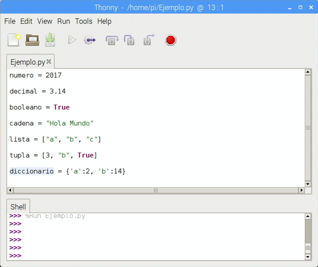

### ¿Qué es una variable?

Se define como variable al espacio reservado de la memoria que almacena un dato, que como su propio nombre indica, puede cambiar de valor en tiempo de ejecución. En Python tenemos tipos de datos simples (números enteros, de coma flotante) cadenas de texto, y valores booleanos. Todos estos pueden almacenarse en la misma variable sin especificar de antemano el tipo de datos que almacenará, de ahí a que Python sea un lenguaje de programación de tipado dinámico, como se explica en la primera lección de este curso.

> Python es un lenguaje de programación de tipado dinámico. Las variables se comprueban en tiempo de ejecución.

Ejecutando el siguiente ejemplo, podemos observar que la variable llamada "variable" va tomando diferentes valores en las diferentes líneas del programa. En la última línea se imprime el valor, que al ser dinámico obtiene el valor de las dos anteriores instrucciones, es decir, 79 + 1.

### ¿Qué es una lista?

En Python también disponemos de listas (colección de elementos), que aunque no forman parte del concepto de tipos primitivos, se pueden explicar en este nivel iniciación del curso.

> Las listas son tipos de datos abstractos que se verán en tutoriales más avanzados de Python.

En el siguiente ejemplo vamos a crear una lista llamada "lista" que va a contener los caracteres "a, b, c, d y e". Este mismo ejemplo se podría reutilizar para crear una lista de personas, lista de objetos, e incluso una lista donde aparezcan diferentes tipos de datos (números, palabras, e incluso otras listas).

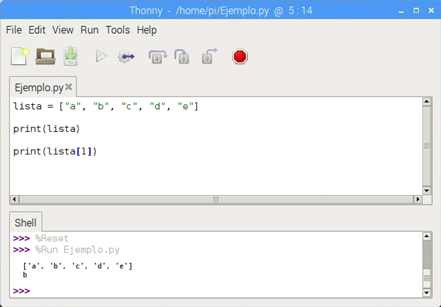

### ¿Cómo solicitar datos por teclado?

En la mayoría de los programas necesitamos interactuar con el usuario para solicitarle diferentes datos. Para ello vamos a utilizar la función prevista en Python para tal fin.

Sabiendo lo que se explicaba en la anterior lección referente al tipo de datos, en este caso debemos saber qué es lo que se le solicita al usuario para saber qué es lo que nos tiene que proporcionar. De esta forma al dato introducido deberemos realizar un casting acorde con el dato esperado.

Al procedimiento de transformar una variable primitiva a otro tipo se le conoce como casting.

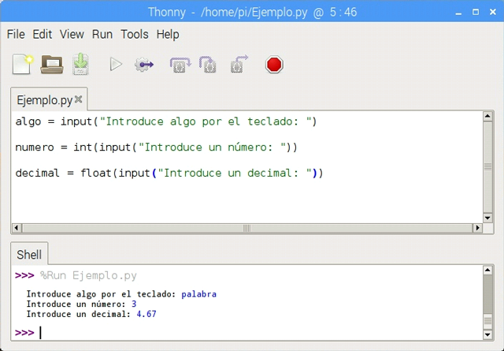

### ¿Cómo imprimir datos por pantalla?

En la primera lección del curso vimos como imprimir el texto "Hola Mundo" por la terminal o shell de Python. Sin embargo en ocasiones no solamente queremos imprimir una frase, sino que además queremos concatenar diferentes tipos de datos para mostrar una única línea de texto.

Por ejemplo, supongamos que queremos mostrar en una única línea un texto seguido de nuestro nombre. En este caso deberemos concatenar el valor de la frase con el valor de la variable, y utilizaremos el símbolo reservado "+".

Pero además, podemos llegar más lejos, en el caso de querer mostrar un texto y concatenar un número entero o en coma flotante. Si recuerdas la lección anterior, cuando se hablaba de tipos de datos, si intentamos imprimir un texto con un número el intérprete de Python mostrará un error en tiempo de ejecución por la compatibilidad de tipos de datos. Para solucionarlo, tenemos que decirle al intérprete el tipo de dato que queremos mostrar, y para ello, se debe convertir a tipo texto, haciendo un casting sobre él, como se explica en la anterior lección.

> Al procedimiento de transformar una variable primitiva a otro tipo se le conoce como casting.

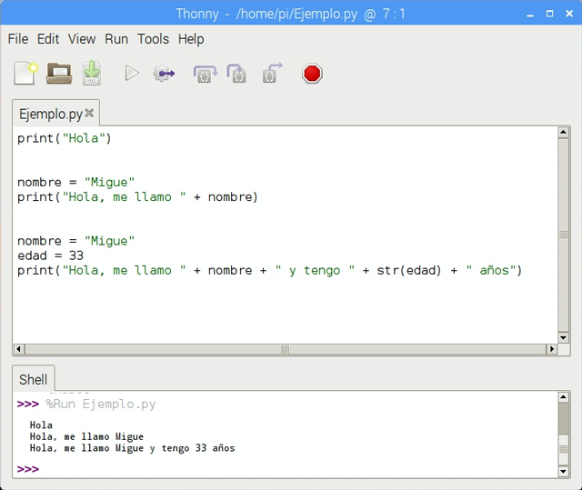

 

## Condiciones

  <iframe src="//www.youtube.com/embed/cz0lAMUEKYE" allowfullscreen></iframe>

En programación, una condición es toda sentencia de la cual se puede determinar su veracidad (True) o falsedad (False). En la mayoría de las ocasiones son comparaciones que podemos encontrar tanto en las condiciones como en bucles.

A diferencia que en otros lenguajes de programación, en Python no existen llaves para incluir las instrucciones de la condición. En Python es obligatorio indentar las instrucciones que forman parte de una condición, bucle, función, etc. De esta forma el código queda muy legible como se comentaba en la primera lección del curso.

Otra diferencia de Python sobre el resto de lenguajes de programación, es que en Python no existen los famosos ";" que se sitúan al final de las instrucciones. Sin embargo, en el caso de las condiciones, bucles o funciones debemos añadir ":" para indicarle al interprete que empieza una estructura.

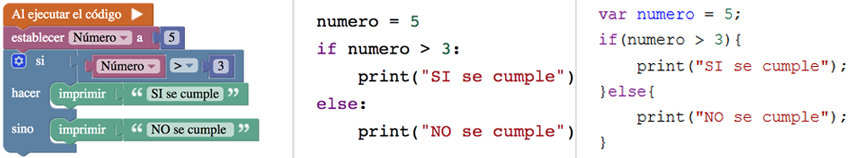

El ejemplo más sencillo lo podemos ver cuando queremos determinar si un número introducido por el usuario es positivo o negativo. La comparación en este caso consiste en comprobar si el número es mayor o igual que 0 para el caso del positivo, y en caso contrario será negativo.

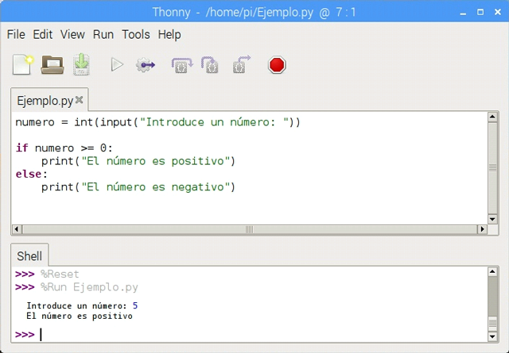

Sin embargo, en ciertas ocasiones queremos comprobar varios casos, como en este ejemplo, donde queremos saber si un número es positivo, negativo o neutro. A este tipo de condición se le conoce como condición anidada ya que aparece una condición en el interior de otra indentadas correctamente.

Es importante no caer en la tentación de anidar condiciones tras condiciones, podríamos caer en lo que se conoce como código espagueti.

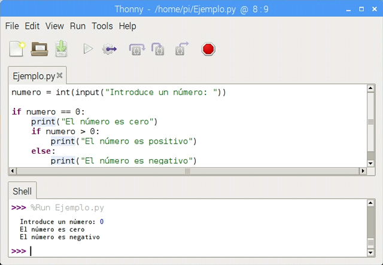

 

## Bucles

  <iframe src="//www.youtube.com/embed/8aiO07OYLV0" allowfullscreen></iframe>

En programación, un bucle es una sentencia que ejecuta repetidas veces un conjunto de código, hasta que la condición asignada a dicho bucle deja de cumplirse. Los tres bucles más utilizados en programación son el bucle while, el bucle for y el bucle do-while.

### Bucle (for)

Un bucle for es un bucle que repite el bloque de instrucciones un número prederminado de veces. El bloque de instrucciones que se repite se suele llamar cuerpo del bucle y cada repetición se suele llamar iteración.

En los siguientes ejemplos se aprecia como podemos mostrar una determinada cantidad de iteraciones mediante la función range, o por el contrario como podemos recorrer uina lista para mostrar todos los elementos de la misma.

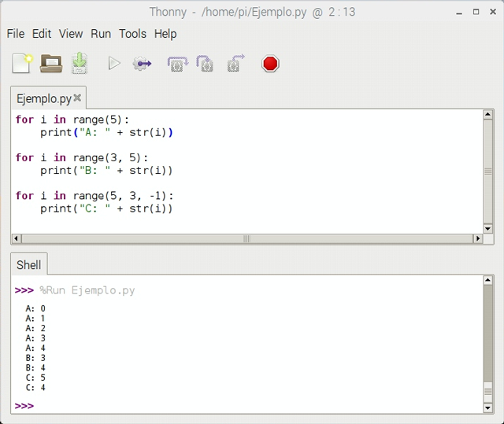

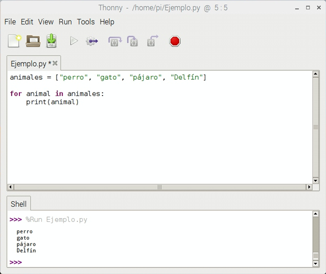

### Bucle (while)

Un bucle while permite repetir la ejecución de un grupo de instrucciones mientras se cumpla una condición (es decir, mientras la condición tenga el valor True). En este tipo de bucle hay que llevar cuidado porque es muy común caer en bucles infinitos cuando se empieza a programar. Es decir, fíjate como en el bucle de la siguiente imagen, decrementamos el valor de número en cada iteración.

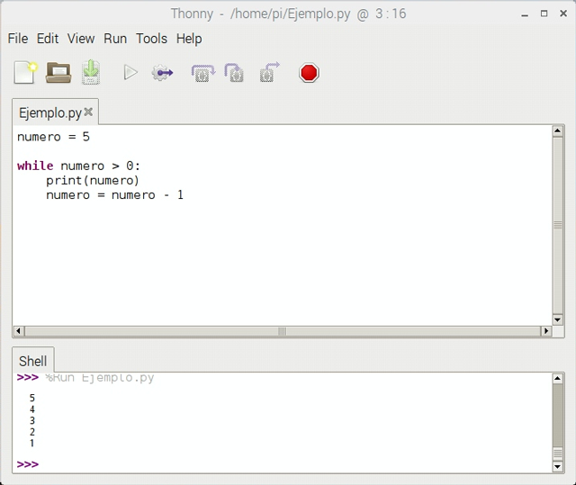
