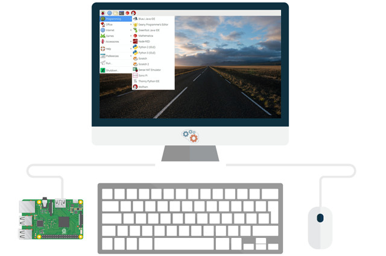
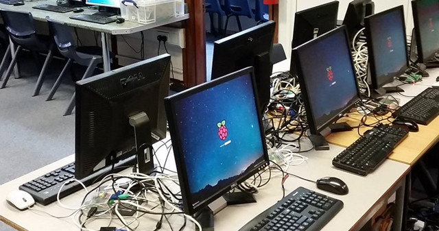
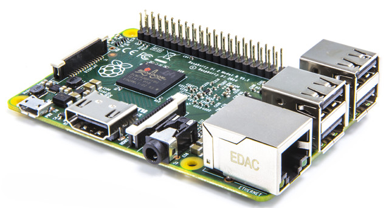
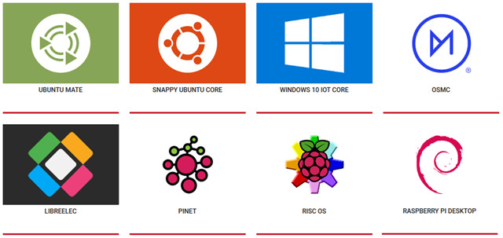
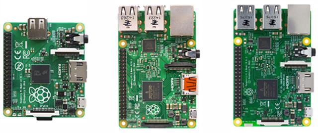
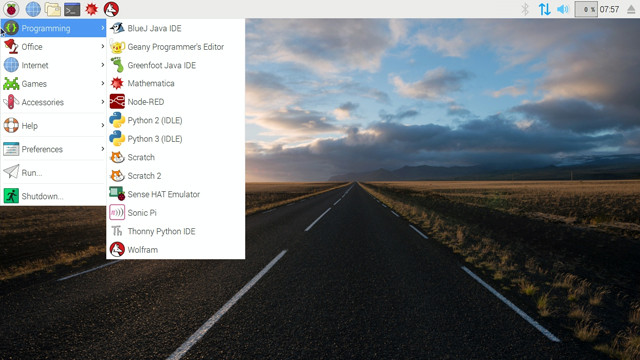
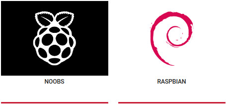
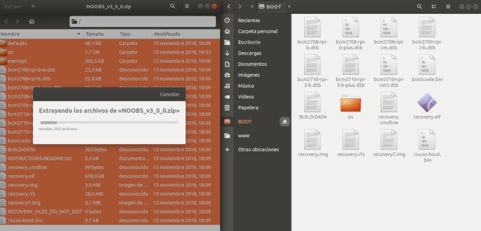
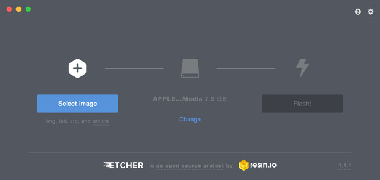

## Introducción

Este tutorial de introducción a Raspberry Pi está destinado a todos aquellos usuarios que quieran introducirse en el mundo de la informática a través de este mini ordenador. A lo largo de las siguientes lecciones aprenderás a instalar y configurar el sistema operativo Raspian para Raspberry Pi desde cero. Además te mostraremos diferentes usos que puedes darle tanto a nivel particular como educativo.



### Antes de empezar

Vas a necesitar los siguientes componentes:

- Raspberry Pi
- Alimentación micro-USB
- Tarjeta microSD mínimo 8Gb
- Monitor con HDMI (o adaptador VGA-HDMI)
- Teclado USB
- Ratón USB
- Conexión a internet


<br />


## ¿Qué es Raspberry Pi?

Raspberry Pi es un mini ordenador de pequeñas dimensiones y precio destinado principalmente al desarrollo de pequeños prototipos y a estimular la enseñanza de las ciencias de la computación en los centros educativos. Desarrollado en hardware libre cuenta con sistemas operativos GNU/Linux como Raspbian aunque podemos encontrar otros sistemas operativos optimizados para el hardware de la Raspberry Pi.



### Hardware de la Raspberry Pi

El hardware es abierto, a excepción del chip principal, el Broadcomm, basado en arquitectura ARM (Advanced RISC Machine) distinta a la que estamos acostumbrados a utilizar en nuestros ordenadores de sobremesa o portátiles. Esta arquitectura es de tipo RISC (Reduced Instruction Set Computer), es decir, utiliza un sistema de instrucciones realmente simple lo que le permite ejecutar tareas con un mínimo consumo de energía.

> La arquitectura ARM es la que poseen la mayoría de nuestros smartphone donde el objetivo primordial es el bajo consumo de energía.

**RISC** (Reduced Instruction Set Computer)

- Énfasis en el Hardware
- Idea básica: Instrucciones sencillas
- MIPS: 140 instrucciones aprox.

**CISC** (Complex Instruction Set Computer)

- Énfasis en el Software
- Idea básica: Instrucciones complejas
- MIPS: 325 instrucciones aprox.



### Software de la Raspberry Pi

El software es open source siendo su sistema operativo oficial una versión adaptada de la distribución Debian, denominada Raspbian, aunque permite usar otros sistemas operativos, incluido una versión de Windows 10 IoT Core. La fundación da soporte para las descargas de las distribuciones para arquitectura ARM (explicada anteriormente).

> La fundación Raspberry Pi recomienda utilizar el sistema operativo Raspbian al estar optimizado para el hardware de la placa.



### ¿Qué Raspberry Pi es mejor?

La respuesta en este caso es depende ya que existen muchos modelos de Raspberry Pi destinados a diferentes usos o proyectos. En vez de realizar la pregunta "cuál es mejor" deberíamos realizar la pregunta "qué necesito".



**Raspberry Pi Zero**

La Raspberry Pi Zero están muy limitada en cuanto a velocidad y suelen ser utilizada cuando la velocidad no es un factor importante, además de ser la más económicas.

**Raspberry Pi (A, A+, B, B+)**

La Rasperry Pi (en sus modelo A, A+, B y B+) tiene una potencia cercana a la de un Pentium II con la capacidad gráfica similar a la de una videoconsola Xbox.

**Raspberry Pi 2 (B, B+)**

La raspberry Pi (en sus modelos B y B+) es seis veces más potente que las anteriores gracias a su procesador de 4 núcleos Quadcore.

**Raspberry Pi 3 (B, B+)**

Con características similares a la Raspberry Pi 2, en este destacada por su mayor memoria y procesador, así como la incorporación de Wifi integrada, lo cual es una gran ventaja para utilizar en proyectos donde se necesite de una fuente de internet.

**Raspberry Pi 4 (B, B+)**

Con características similares a la Raspberry Pi 3, la mayor diferencia es el procesador de 1.5GHz y RAM de 1GB a 4GB, así como la capacidad de manejar pantallas 4K a 60Hz.

> Para más información sobre versiones y modelos puedes acceder a este <a target="_blank" href="https://es.wikipedia.org/wiki/Raspberry_Pi">enlace</a>.


<br />


## ¿Qué es Raspbian?

Raspbian es el sistema operativo recomendado para Raspberry Pi (al estar optimizado para su hardware) y se basa en una distribución de GNU/Linux llamada Debian.

Para instalar Raspbian en nuestra Raspberry Pi disponemos de dos versiones; una más completa con entorno gráfico y otra más reducida sin entorno gráfico:

- **Raspbian Pixel**: Versión completa con entorno gráfico de Raspbian, es decir, la versión de escritorio con menús, ventanas, iconos, fondos de pantalla, etc. utilizado por la mayoría de los usuarios como ordenador de sobremesa.
- **Raspbian Lite**: Versión reducida sin entorno gráfico, es decir, la versión en modo consola sin gráficos. Esta opción generalmente es para usuarios avanzados con conocimientos de Linux que utilizan la Raspberry Pi como servidor.



Para instalar el sistema operativo Raspbian, primero debemos acceder al apartado de descargas desde la web de la Fundación de Raspberry Pi y observaremos que aparecen dos formas diferentes de instalación, una mediante asistente y otra para expertos:

- **Mediante NOOBS**: Instalación mediante asistente de instalación recomendada para usuarios generalmente poco expertos.
- **Mediante una imagen del SO**: Instalación mediante la imagen del sistema operativo Raspbian para usuarios avanzados.




<br />


## Instalar Raspbian con NOOBS

<div class="iframe">
  <iframe src="//www.youtube.com/embed/CmDL8VWMUQU" allowfullscreen></iframe>
</div>

NOOBS es el acrónimo de "New Out Of Box Software" y básicamente consiste en un instalador sencillo guiado paso a paso. Al igual que hemos explicado en la lección anterior, disponemos de la versión completa de NOOBS con Pixel y la versión reducida de NOOBS Lite sin Pixel.

NOOBS incluye también un método de edición rápida de configuración del nuevo sistema, un navegador web preinstalado y un modo de recuperación por línea de comandos a partir de una partición de rescate que se crea automáticamente.




<br />


## Instalar Raspbian desde imagen

<div class="iframe">
  <iframe src="//www.youtube.com/embed/EqsjmwufFp8" allowfullscreen></iframe>
</div>

Una imagen es un archivo que contiene la estructura y los contenidos completos de un sistema operativo, es decir, una copia exacta del sistema operativo y contenido, en este caso de Raspbian.

Esto es útil cuando queremos que todos nuestros equipos dispongan de la misma configuración y con los mismos programas instalados, mismas carpetas, etc. Es muy común crear una imagen por defecto con la configuración deseada y guardarla como copia de seguridad, para con el tiempo, resetear nuestra Raspberry Pi ahorrando el tiempo de instalar y configurarla nuevamente.




<br />


## Actualizar Raspbian

<div class="iframe">
  <iframe src="//www.youtube.com/embed/EDj1nHo41MM" allowfullscreen></iframe>
</div>

Una vez hemos instalado Raspbian en nuestra Raspberry Pi, ya sea siguiendo el asistente de NOOBS o mediante la instalación de una imagen, conviene actualizar. Para ello, accede a la terminal y ejecuta los siguientes comandos:

```sh
pi@raspberrypi: ~ $ sudo apt update
pi@raspberrypi: ~ $ sudo apt upgrade
```

Con el primer comando, apt update, lo que en realidad estamos haciendo es actualizar los repositorios, es decir, actualizar la lista de todos los paquetes con la dirección de dónde obtenerlos para que a la hora de su descarga lo encuentre más rápido.

En cambio, con el comando apt upgrade, lo que hacemos es una actualización de nuestro sistema con todas las posibles actualizaciones que pudiera haber, es decir, no sólo actualiza nuestro sistema operativo sino que también las aplicaciones que están contenidas en los repositorios.


<br />


## Recomendaciones

Antes de encender la Raspberry Pi por primera vez, probablemente te hagas una de las siguientes preguntas.

**¿Cómo enciendo la Raspberry Pi?**

Suponiendo que tienes todos los componentes y vas a utilizar la Raspberry Pi como PC, deberás seguir los siguientes pasos:

- Introduce la tarjeta micro SD con el sistema operativo debidamente instalado.
- Conecta el teclado, el ratón y el monitor.
- Conecta la fuente de alimentación y espera a que inicie el sistema operativo.

Por otro lado, es probable que quieras acceder a la Raspberry Pi a través de SSH o escritorio remoto, en cuyo caso no será necesario conectar los periféricos.

**¿Qué fuente de alimentación elijo?**

En muchas ocasiones se suele adquirir la fuente de alimentación de la Raspberry Pi por separado. En este caso tienes que tener en cuenta que la especificación eléctrica adecuada para una Raspberry Pi es de 5V.

Además, la cantidad de corriente que la fuente de alimentación debe ser capaz de proporcionar depende del modelo y de la cantidad de periféricos conectados a la misma. Como mínimo necesitará 700mA, pero si utilizas teclado y ratón necesitarás una fuente de alimentación de 1.5A o incluso 2A que es lo que recomienda la fundación Raspberry Pi.

**¿Cómo conecto la Raspberry Pi al monitor?**

Probablemente no dispongas de un monitor con HDMI al cual quieres conectar la Raspberry Pi. En este caso, una opción económica pasa por adquirir por separado un conversor de VGA-HDMI.

**¿Cómo conecto el teclado y ratón a la Raspberry Pi?**

Lo ideal sería conectar el teclado y ratón mediante USB aunque también podríamos conectarlos mediante bluetooth para minimizar el uso de puertos. En este último caso debemos instalar los drivers en el sistema operativo si todavía no ha sido instalado.

**¿Cómo pongo en hora la Raspberry Pi?**

La forma más sencilla de poner en hora una Raspberry Pi es accediendo a la terminal y estableciendo la hora mediante el comando date mmddHHMMyy, donde los 2 primeros números corresponden al mes, los 2 siguientes al día del mes, los 4 siguientes representan la hora y minutos, y los 2 últimos el año.

```sh
pi@raspberrypi: ~ $ sudo date 1027113017
```
