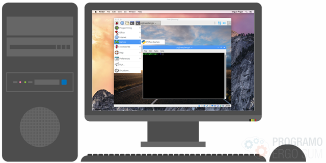
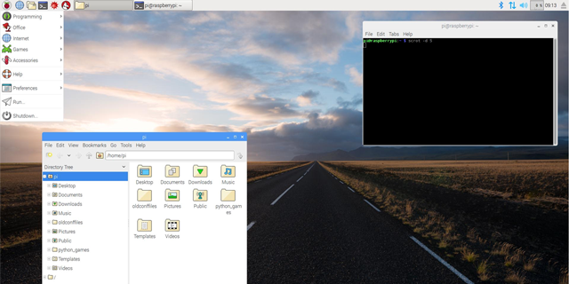

# Máquina virtual de Raspberry Pi con Pixel

El siguiente curso ha sido solicitado por varios de nuestros docentes con el fin de poder emular en un PC un sistema operativo de Raspberry PI, en este caso el Sistema Operativo Pixel. De esta forma podrás utilizar las ventajas educativas que ofrece una raspberry PI sin necesidad de disponer del hardware. Además te vamos a explicar qué es una máquina virtual para que puedas instalar diferentes sistemas operativos sin miedo a borrar información importante de tu ordenador.

 

## ¿Qué es Pixel?

  <iframe src="//www.youtube.com/embed/3vpowX-ORMo" allowfullscreen></iframe>

Pi Improved Xwindows Environment Lightweight (Pixel) es un sistema operativo para procesadores Intel x86 desarrollado por la fundación Raspberry Pi, es decir, podemos instalarlo en nuestro propio ordenador de sobremesa o portatil.

> Raspberry Pi utiliza una arquitectura de procesador conocida como ARM, similar a la mayoría de los procesadores de nuestros smartphone.

Este sistema operativo es una versión de la distribución Debian de GNU/Linux diseñada para funcionar en ordenadores PC y Mac sin necesitar físicamente la Raspberry Pi. Incluye la suite ofimática LibreOffice, el navegador Chromium y otro software preinstalado. Puede ser una gran opción para aquellos equipos antiguos que no disponen de la suficiente potencia como para mover sistemas operativos más modernos.

### ¿Dónde descargo Pixel?

Pixel se obtiene gratuitamente desde la página web de la Fundación Raspberry Pi y se encuentra en versión experimental, es decir, puedes encontrarte algún error al utilizarlo.

Para continuar con el tutorial, deberás descargar la imagen del sistema operativo desde el siguiente enlace:

<a target="_blank" href="http://downloads.raspberrypi.org/pixel_x86/images/pixel_x86-2016-12-13/2016-12-13-pixel-x86-jessie.iso">Descarga Pixel</a>

También puedes descargar Pixel con Jessie, una versión mejorada que incluye Scratch 2.0 y Thonny (entorno de desarrollo para aprendizaje de Python).

<a target="_blank" href="https://www.raspberrypi.org/downloads/raspberry-pi-desktop">Descarga Pixel con Jessie</a>

 

## ¿Qué es una máquina virtual?

  <iframe src="//www.youtube.com/embed/PB_Z3wKyP_U" allowfullscreen></iframe>

Una máquina virtual es un programa que simula ejecutar otros sistemas operativos como si fuesen un ordenador real. Estos sistemas operativos se emulan dentro de una ventana en nuestro sistema operativo sin modificar ni borrar nada de nuestros ordenador, es decir, aparece aislado del resto de información de nuestro equipo.

En este caso vamos a utilizar VirtualBox que es una herramienta de virtualización de código abierto multiplataforma disponible para Windows, Linux y Mac OS X u otros sistemas operativos, que permite crear unidades de disco virtuales donde podemos instalar un sistema operativo dentro del que utilizamos normalmente en nuestro equipo y así poder usarlo del mismo modo que si hubiera sido instalado realmente.

### ¿Dónde descargo VirtualBox?

VirtualBox se obtiene gratuitamente desde su página web. Para continuar con el tutorial deberás descargar e instalar el programa desde el siguiente enlace:

<a target="_blank" href="https://www.virtualbox.org/wiki/Downloads">Descarga VirtualBox</a>

 

## Más información

Un inconveniente que nos hemos encontrado es la ausencia de programas muy utilizados en Raspbian como Minecraft PI o Mathematica Wolfram. Esto es debido a que el sistema operativo por excelencia de Raspberry PI, Raspbian, está programado bajo la arquitectura para dispositivos de reducido tamaño, mientras que este nuevo sistema operativo, Pixel, está basado en la arquitectura de nuestros ordenadores de sobre mesa o portátiles.

Desde el blog oficial de Raspberry Pi nos recuerdan que esta imagen de Pixel para PC aún es experimental por lo que es muy fácil que nos encontremos errores y problemas mientras la utilizamos. Sin embargo, cuando alcance su fase estable, este sistema operativo se va a convertir en una excelente alternativa para todos aquellos usuarios que necesiten devolver la vida a un ordenador demasiado viejo como para ejecutar las versiones modernas de Windows.

### Instalar Pixel en un PC

Aunque en este tutorial hemos explicado cómo ejecutar Pixel desde una máquina virtual, puedes instalarlo directamente en un ordenador antiguo. Para ello, y aunque queda fuera de este tutorial, te indicamos los pasos que deberás realizar:

- Descarga la imagen ISO
- Copias la imagen en un DVD o en una memoria USB
- Seguir los pasos de instalación
