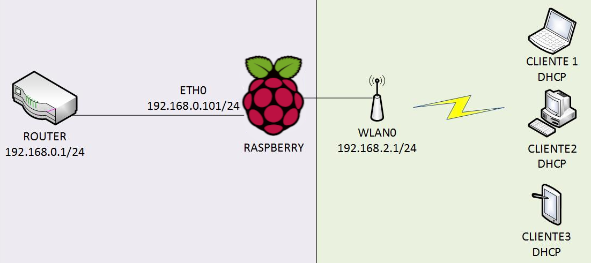
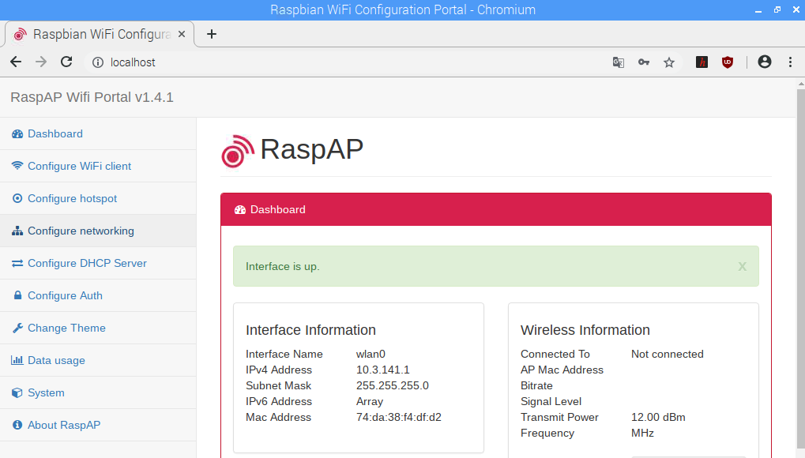

## Introducción

En este tutorial vamos a explicar cómo **crear un punto de acceso WiFi con Raspberry Pi** utilizando el asistente RaspAP con editor web para administrar y configurar los dispositivos conectados.

### Antes de empezar

Vas a necesitar los siguientes componentes:

- Raspberry Pi con Raspbian
- Acceso al router


<br />


## Punto de acceso

Un punto de acceso WiFi es un dispositivo que crea una red de área local inalámbrica (WLAN). Un punto de acceso se conecta a un red local de un router por cable Ethernet y proyecta una señal WiFi en otra red local. Esto es útil cuando queremos conectar más dispositivos a una red local, cuando queremos proteger el acceso a ciertos dispositivos, etc.




<br />


## Instalar RaspAp Webgui

Una de las formas más sencillas de convertir nuestra Raspberry Pi en punto de acceso es mediante el asistente de código abierto [RaspAp Webgui](https://github.com/billz/raspap-webgui).

> Recuerda que antes de instalar un programa es recomendable actualizar Raspbian como se explica en el tutorial de actualizar Raspbian. 

Una vez actualizado el sistema procedemos a la instalación de `raspap`.

```sh
pi@raspberrypi:~ $ wget -q https://git.io/voEUQ -O /tmp/raspap && bash /tmp/raspap
```

Con el instalador se creará la configuración básica y tras finalizar la instalación se configurará el punto de acceso con los siguientes datos:

- IP address: 10.3.141.1
   - Username: admin
   - Password: secret
- DHCP range: 10.3.141.50 to 10.3.141.255
- SSID: raspi-webgui
- Password: ChangeMe


<br />


## Configurar RaspAp Webgui

Para la configuración de RaspAp deberás acceder a la dirección web `localhost` e introducir el usuario `admin` y password `secret` definidos en la configuración inicial. 




<br />


## Deshabilitar hibernación

Por defecto la duración de la pantalla en Raspbian es de 600 segundos. Esto se obtiene tras ejecutar el comando `xset q`. 

```sh
pi@raspberrypi:~ $ xset q
...
DPMS (Energy Star):
  Standby: 600    Suspend: 600    Off: 600
  DPMS is Enabled
  Monitor is On
```

Con el comando `xset s off` se desactiva el protector de pantalla, con `xset -dpms` se desactiva el DPMS (Mostrar señalización de administración de energía) y con el comando `xset s noblank` se le dice al servidor X que no deje en blanco el dispositivo de video.

```sh
pi@raspberrypi:~ $ xset s off
pi@raspberrypi:~ $ xset -dpms
pi@raspberrypi:~ $ xset s noblank
```

Tras configurar nuestra Raspberry Pi como punto de acceso, prabablemente nos interese que no se suspenda para no perder la conexión de los dispositivos conectados. Con lo cual, para deshabilitar la suspensión ejecutamos el comando `xset -dpms` y veremos como se deshabilita.

```sh
pi@raspberrypi:~ $ xset -dpms
pi@raspberrypi:~ $ xset q
DPMS (Energy Star):
  Standby: 600    Suspend: 600    Off: 600
  DPMS is Disabled
```

Sin embargo, en recientes versiones de Rasbian, la mejor opción para por instalar *xscreensaver* y configurar las diferentes opciones desde el menú configuración de salvapantallas.

```sh
pi@raspberrypi:~ $ sudo apt install xscreensaver
```


<br />


## Ejercicios propuestos

1.- Monta el punto de acceso WiFi con tu Raspberry Pi y conéctate desde tu dispositivo móvil para probar el correcto funcionamiento.

2.- Cambia la contraseña inicial de acceso al panel de administración.

3.- Cambia el nombre de la red y clave de conexión a la WiFi.
