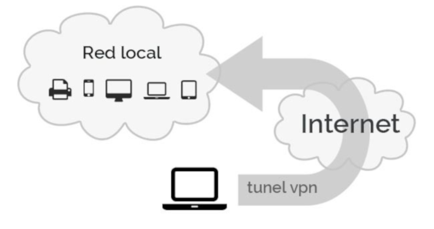
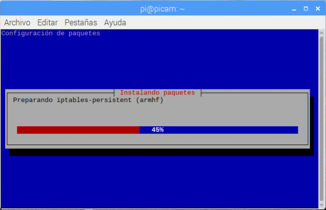
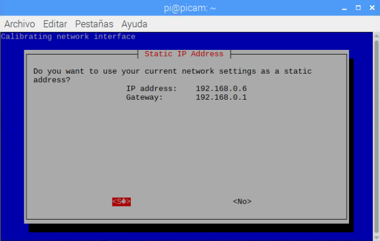
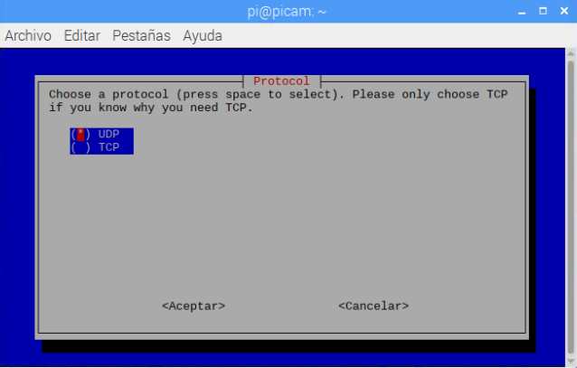
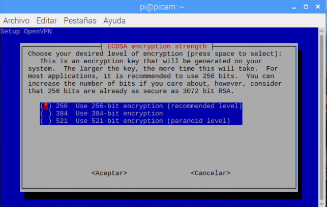
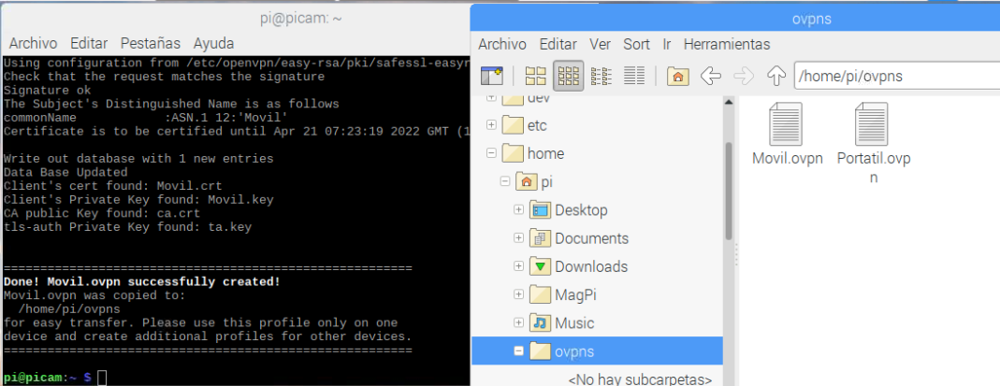
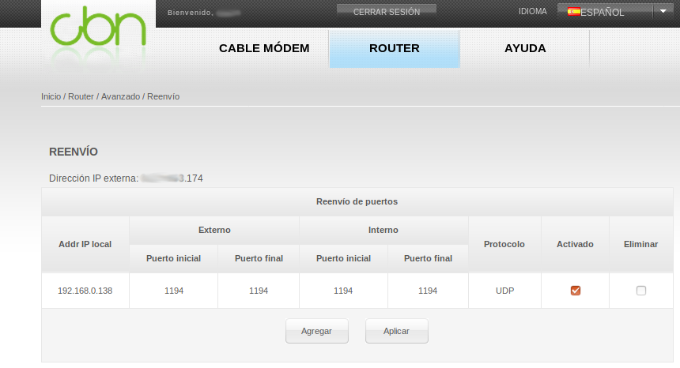

En este tutorial aprenderás a **conectarte de forma remota a través de una Red Privada Virtual (VPN)** para acceder a tu red o equipos desde fuera de tu casa.

# Antes de empezar

Vas a necesitar los siguientes componentes:

- Raspberry Pi con Raspbian

# Virtual Private Network (VPN)

Una conexión VPN lo que te permite es crear una red local sin necesidad de que sus integrantes estén físicamente conectados entre sí, sino a través de Internet. Dicho de otro modo, imagina que tienes un cable imaginario conectado a tu teléfono móvil y conectado a tu router aunque estés a cientos o miles de kilómetros.



Cuando te conectas a una conexión VPN, tu tráfico de red sigue yendo desde tu dispositivo a tu proveedor de Internet. La conexión está cifrada para aseguridad la conexión y los datos.

Por un lado vamos a contar con el **Servidor de VPN instalado en tu Raspberry Pi** y el **Cliente de VPN instalado en tu dispositivo móvil o PC**. Ambos compartirán un fichero cifrado y con contraseña, de tal manera que solamente tú podrás acceder desde el cliente al servidor.

## Instalar OpenVPN Server

En primer lugar instalamos *OpenVPN Server para Raspberry Pi*. Es decir, vamos a convertir nuestra Raspberry Pi en Servidor para VPN. Para instalar el software introducimos el siguiente comando:

```sh
pi@raspberrypi:~ $ curl -L https://install.pivpn.io | bash
```

Según se vaya descargando e instalando nos irá pidiendo datos de configuración básicos. De todas las pantallas que aparecerán en el instalador de OpenVPN, marcamos las opciones que vienen por defecto. Una vez finalizado el proceso de instalación nos aparecerá el siguiente pasos que debemos realizar, pero antes, reiniciamos el sistema.



Recuerda fijar una dirección que esté fuera del rango de direcciones DHCP del router.



El protocolo UDP es útil para aplicaciones que necesitan transmisión rápida y efectiva de datos sin comprobación de errores.



Seleccionamos una encriptación segura.



Con el comando "pivpn add" creamos los ficheros de perfiles de los clientes. Es decir, si queremos acceder desde un PC, creremos un perfil para ese PC y desde el mismo PC se importará en el OpenVPN como cliente. Realizaremos lo mismo para cada dispositivo que queramos tener, además cada cliente podrá tener una clave distinta de acceso.

```sh
pi@raspberrypi:~ $ sudo pivpn add
Enter a Name for the Client: 
Enter the password for the client:  
Enter the password again to verify: 
```

Si nos fijamos, en nuestro caso hemos creado el usuario que compartiremos con el dispositivo cliente y lo tenemos en la carpeta "/home/pi/ovpns".

En nuestro caso se han creado los ficheros de claves para un portatil y un móvil. Así podemos tenerlos controlados y habilitarlos o cancelarlos según nos interese.



### Instalar OpenVPN Cliente

Instalamos *OpenVPN Connect - Fast & Safe SSL VPN Client* en nuestro dispositivo Android o también descargarlo desde la [web oficial](https://openvpn.net/community-downloads/) para PC.

Incoorporamos el fichero `*.ovpn` e introducimos la contraseña del usuario creado anteriormente y al conectar estaremos dentro de la misma red.

### Abrir puertos en el router

Ya solamente nos faltará abrir el puerto seleccionado en el paso anterior en nuestro router para que se permita el acceso desde el exterior. En nuestro caso hemos seleccionado el puerto que viene por defecto al instalar OpenVPN con la dirección IP de nuestra Raspberry Pi.



# Resumen

Con este sencillo ejemplo podemos conectarnos a nuestra propia red desde el exterior simulando que estamos dentro de ella.

# Ejercicios propuestos

1.- Crea una VPN y conéctate desde tu dispositivo móvil para probar el correcto funcionamiento.

