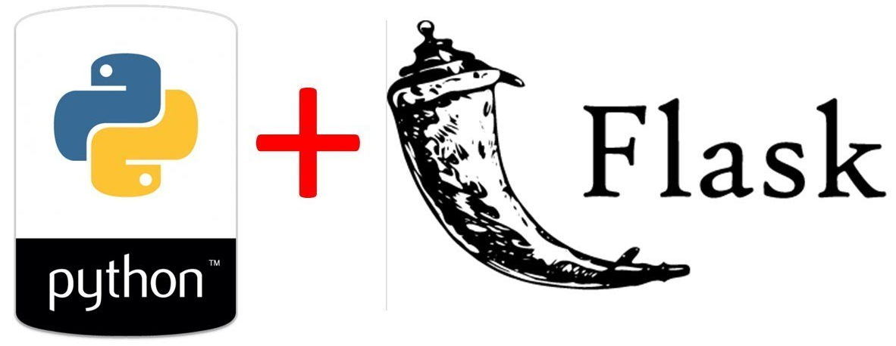
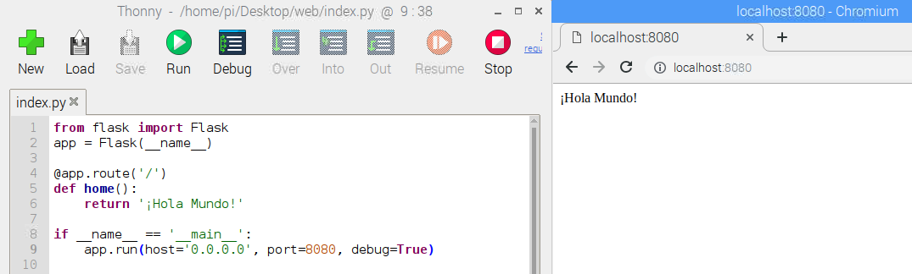
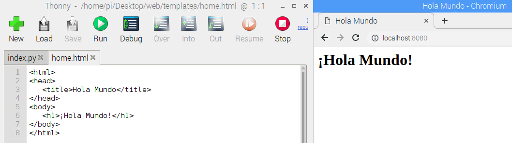
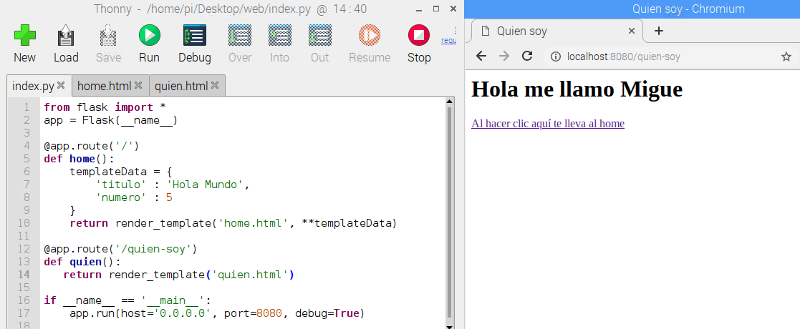
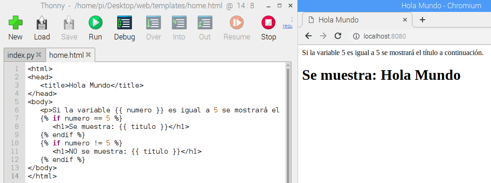

En este tutorial vamos a explicar cómo **montar un servidor web para Python con Flask** en nuestra Raspberry Pi.

# Antes de empezar

Para este tutorial vas a necesitar los siguientes componentes:

- Raspberry Pi con Raspbian

Es recomendable acceder a los siguientes tutoriales:

- [Aprender a programar en Python](https://www.aprendeprogramando.es/cursos-online/python)

# Servidor Web con Flask

Flask es un microframework creado para facilitar el desarrollo de aplicaciones web en Python. Es utilizado normalmente para construir servicios web como APIs REST o aplicaciones de contenido estático.



## Instalar Flask

> Antes de instalar cualquier software es conveniente actualizar la Raspberry Pi como se explica en el tutorial [Raspberry Pi - Raspbian - Update](raspberry_pi-raspbian-update)

Una vez actualizada instalamos el servidor de Flask para Python 3.

```sh
pi@raspberrypi:~ $ sudo apt install python3-flask
```

## Hola Mundo

El primer ejemplo que vamos a crear es el típico "Hola Mundo", es decir, vamos a crear un servicio que al acceder a una determinada URL se muestre por la pantalla dicho mensaje. Para ello, vamos a crear un directorio llamado `web` y dentro un fichero llamado `index.py` con el siguiente código.

```python
from flask import *
app = Flask(__name__)

@app.route('/')
def home():
   return '¡Hola Mundo!'

if __name__ == '__main__':
   app.run(host='0.0.0.0', port=8080, debug=True)
```

Como hemos dicho, Flask se utiliza para servicios, en este caso, hemos creado el servicio sobre la URL principal `@app.route('/')` seguido de la función que ejecutará el servicio, en este caso, devolver el mensaje 'Hola Mundo' que será mostrado por la pantalla al ejecutar el código y acceder mediante el navegador a la dirección `localhost:8080`. También podrás acceder desde tu propia IP `xxx.xxx.xxx.xxx:8080` en un dispositivo situado en la misma red.

```
URL: localhost:8080
```



## Añadir un template HTML

En ocasiones nos vemos en la necesidad de generar el código HTML como fichero externo para mostrar una web con su estructura en HTML, código CSS y JS, etc. Para ello debemos renderizar el template en la función y crear un fichero dentro de una carpeta llamada `templates`. Dentro de esta crearemos el fichero con el código HTML, por ejemplo `home.html`.

```python
from flask import *
app = Flask(__name__)

@app.route('/')
def home():
   return render_template('home.html')

if __name__ == '__main__':
   app.run(host='0.0.0.0', port=8080, debug=True)
```

```html
<html>
<head>
   <title>Hola Mundo</title>
</head>
<body>
   <h1>¡Hola Mundo!</h1>
</body>
</html>
```

```
URL: localhost:8080
```



## Añadir otra ruta

De momento solamente estamos accediendo a la ruta principal `/`. Supongamos que queremos acceder a otra ruta `/quien-soy` donde se muestra información adicional. En este caso necesitamos añadir una nueva función al fichero principal de nuestra aplicación así como un nuevo template donde mostrar dicha información.

```python
from flask import *
app = Flask(__name__)

@app.route('/')
def home():
   return render_template('home.html')

@app.route('/quien-soy')
def quien():
   return render_template('quien.html')

if __name__ == '__main__':
   app.run(host='0.0.0.0', port=8080, debug=True)
```

```html
<html>
<head>
   <title>Quien soy</title>
</head>
<body>
   <h1>Hola me llamo Migue</h1>
   
   <a href="/">Al hacer clic aquí te lleva al home</a>
</body>
</html>
```

```
URL: localhost:8080/quien-soy
```



## Pasar parámetros al template

En ocasiones nos gustaría pasar parámetros desde el código principal al template. Para ello, al renderizar el template tenemos que añadirle un array con los valores que serán leídos en el HTML.

```python
from flask import *
app = Flask(__name__)

@app.route('/')
def home():
   templateData = {
      'titulo' : 'Hola Mundo',
      'numero' : 5
   }
   return render_template('home.html', **templateData)

if __name__ == '__main__':
   app.run(host='0.0.0.0', port=8080, debug=True)
```

```html
<html>
<head>
   <title>Hola Mundo</title>
</head>
<body>
   <p>Si la variable número "{{ numero }}" es igual a 5 se mostrará el título a continuación.</p>
   
   
      <h1>Se muestra: {{ titulo }}</h1>
   
      <h1>NO se muestra: {{ titulo }}</h1>
   
</body>
</html>
```

```
URL: localhost:8080
```



# Resumen

Con este sencillo ejemplo hemos visto como crear un sencillo servidor web en Python para crear una web utilizando HTML en nuestra Raspberry Pi.

# Ejercicios propuestos

1.- Crea una sencilla página web con 2 enlaces como se explica en el tutorial.

2.- Añade código CSS para pintar de colores el fondo, el texto, cambia el tamaño de la fuente, etc.
