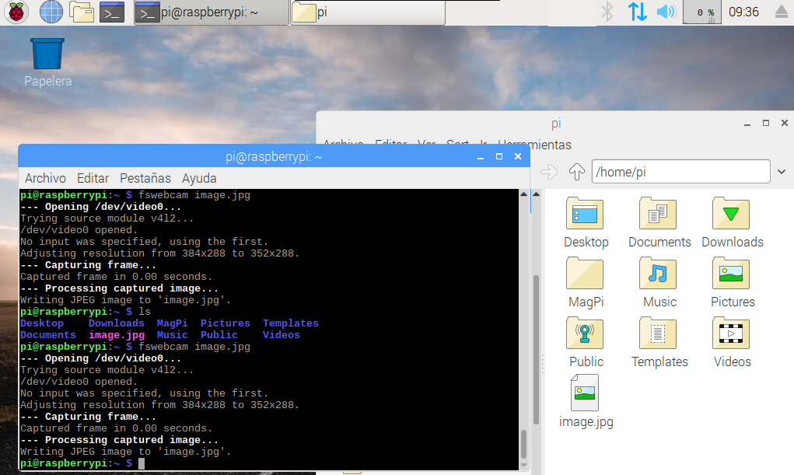

## Introducción

En este tutorial vamos a explicar cómo **instalar fswebcam** para tomar imágenes de forma automática en Raspberry Pi.

### Antes de empezar

Vas a necesitar los siguientes componentes:

- Raspberry Pi con Raspbian
- Webcam USB

Es recomendable acceder a los siguientes tutoriales:

- Configurar Webcam en Raspberry Pi


<br />


## Software fswebcam

Fswebcam es una programa optimizado para la toma de imágenes utilizando una webcam. Se utiliza mediante la línea de comandos con lo que es muy útil para programar scripts automáticos en bash que se ejecuten cada cierto tiempo, o incluso controlando los pines GPIO de nuestra Raspberry Pi.


<br />


## Instalar fswebcam

Antes de instalar un programa es recomendable actualizar Raspbian como se explica en el tutorial [Raspberry Pi - Raspbian - Update](raspberry_pi-raspbian-update). Una vez actualizado el sistema procedemos a la instalación del software mediante el comando `apt install fswebcam`.

```sh
pi@raspberrypi:~ $ sudo apt install fswebcam
```

Para comprobar que se ha instalado correctamente ejecutamos la aplicación para que tome una imagen y la guarde en el directorio raíz de nuestro usuario con el nombre `imagen.jpg`.

```sh
pi@raspberrypi:~ $ fswebcam image.jpg

--- Opening /dev/video0...
Trying source module v4l2...
/dev/video0 opened.
No input was specified, using the first.
Adjusting resolution from 384x288 to 352x288.
--- Capturing frame...
Captured frame in 0.00 seconds.
--- Processing captured image...
Writing JPEG image to 'image.jpg'.
pi@raspberrypi:~ $ 
```




<br />


## Imágenes automáticas

Para tomar imágenes de forma automática vamos a utilizar un script en bash encargado de tomar imágenes y guardarlas en una carpeta con la fecha de la captura. Además deberemos crear un cron que se ejecute cada cierto tiempo.

En primer lugar creamos el fichero `webcam.sh` que guardaremos dentro de una carpeta `webcam`. Podemos crearla desde consola mediante el comando `mkdir /home/pi/webcam`.

```sh
pi@raspberrypi:~ $ mkdir webcam
pi@raspberrypi:~ $ cd webcam
pi@raspberrypi:~/webcam $ sudo leafpad webcam.sh
```

Añadimos el siguiente código encargado de tomar una foto. Fíjate como se crea una variable que contendrá la fecha del sistema para guardar la foto con la fecha y hora de la captura.

```bash
#!/bin/bash

DATE=$(date +"%Y-%m-%d_%H%M")

fswebcam /home/pi/webcam/$DATE.jpg
```

El siguiente paso será dar permisos al fichero para que se pueda ejecutar.

```sh
pi@raspberrypi:~/webcam $ sudo chmod +x webcam.sh
```

Comprobamos que tenemos permisos para ejecutar el comando y además comprobamos que se ha creado la captura correctamente con la fecha del sistema.

```sh
pi@raspberrypi:~/webcam $ ./webcam.sh
```


<br />


## Cron que se ejecuta cada minuto

Las tareas cron siguen una determinada sintaxis. Tienen 5 asteriscos seguidos del comando a ejecutar. `* * * * * /bin/ejecutar/script.sh`

Los 5 asteriscos, de izquierda a derecha, los asteriscos representan:

- Minutos: de 0 a 59.
- Horas: de 0 a 23.
- Día del mes: de 1 a 31.
- Mes: de 1 a 12.
- Día de la semana: de 0 a 6, siendo 0 el domingo.

En este ejemplo, como queremos tomar una imagen cada minuto crearemos una entrada similar a la anterior. Pero en primer lugar debemos acceder al cron mediante el comando `sudo crontab -e` y seleccionamos la opción 3.

```sh
pi@raspberrypi:~ $ sudo crontab -e
```

A continuación entramos en modo edición haciendo clic en la letra `i` y nos situamos al final del documento para introducir el cron. Por último presionamos la combinación de teclas `:wq` para guardar los cambios.

```bash
* * * * * /home/pi/webcam/webcam.sh
```

Ahora solo nos queda esperar y ver como en cada cambio de minuto se realiza una fotografía.


<br />


## Ejercicios propuestos

1.- Conecta una webcam USB y comprueba el correcto funcionamiento de las capturas de pantalla mediante consola.

2.- Crea una cron o tarea personalizada que se ejecute cada media hora y tome una imagen.

3.- Comenta la tarea del cron para que deje de realizar capturas de pantalla.
