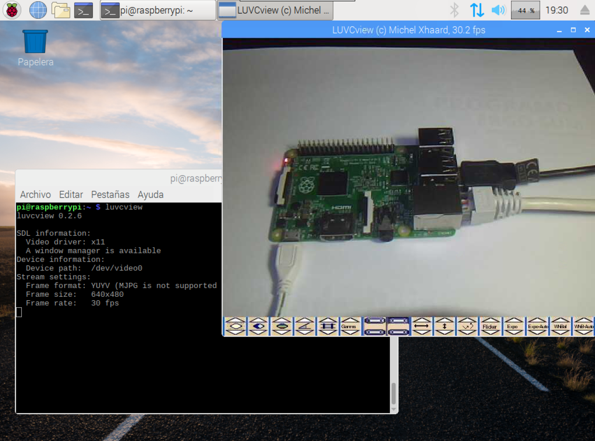

En este tutorial vamos a explicar cómo **instalar LUVCview** para visualizar una webcam USB en Raspberry Pi.

# Antes de empezar

Vas a necesitar los siguientes componentes:

- Raspberry Pi con Raspbian
- Webcam USB

# Reproductor LUVCview

LUVCview (l-UVC-view) es un reproductor de video muy sencillo para Linux que utiliza el controlador UVC para cámaras web y que vamos a utilizar para visualizar las imágenes captadas por la webcam.

Podemos buscar las cámaras soportadas en el siguiente [listado](https://elinux.org/RPi_USB_Webcams)

## Listar dispositivos USB

En primer lugar conectamos la webcam USB a nuestra Raspberry Pi para comprobar que el sistema operativo la reconoce correctamente. Una vez conectada, abrimos una terminal para listar todos los dispositivos USB que ha reconocido mediante el comando `lsbusb`.

> lsbusb: Muestra información referente a los dispositivos conectados a los puertos USB

```sh
pi@raspberrypi:~ $ lsusb
Bus 001 Device 004: ID 0c45:6340 Microdia Camera
...
```

En nuestro caso se puede observar que nos ha reconocido una webcam *Microdia Camera* en el Bus 001 con los identificadores vid:pid `0c45:6340`. Si quisiésemos obtener más información sobre la webcam introduciríamos el comando `lsusb -d 0c45:6340 -v` donde nos mostraría los parámetros reconocidos por el sistema operativo.

## Instalar LUVCview

Antes de instalar un programa es recomendable actualizar Raspbian como se explica en el tutorial [Raspberry Pi - Raspbian - Update](raspberry_pi-raspbian-update).
 
Una vez actualizada la lista de paquetes del repositorio, podemos instalar LUVCview mediante el comando `apt install luvcview`.

```sh
pi@raspberrypi:~ $ sudo apt install luvcview
```

Para comprobar que se ha instalado correctamente ejecutamos la aplicación a través de la terminal utilizando el comando `luvcview` y se deberá abrir una ventana nueva con la webcam, como se observa en la siguiente imagen.

```sh
pi@raspberrypi:~ $ luvcview
luvcview 0.2.6
...
```



# Resumen

Con este sencillo programa podemos visualizar una webcam en Raspbian además de utilizar las diferentes opciones que nos proporciona el programa.

# Ejercicios propuestos

1.- Conecta una webcam USB y comprueba el correcto funcionamiento utilizando LUVCview.
