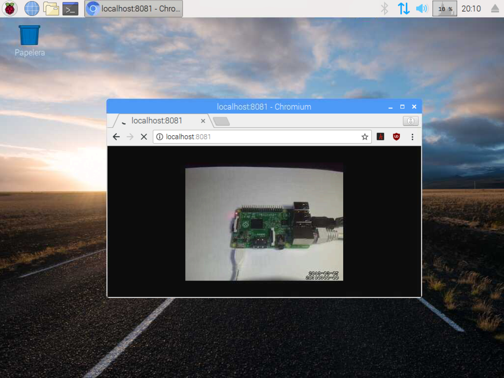
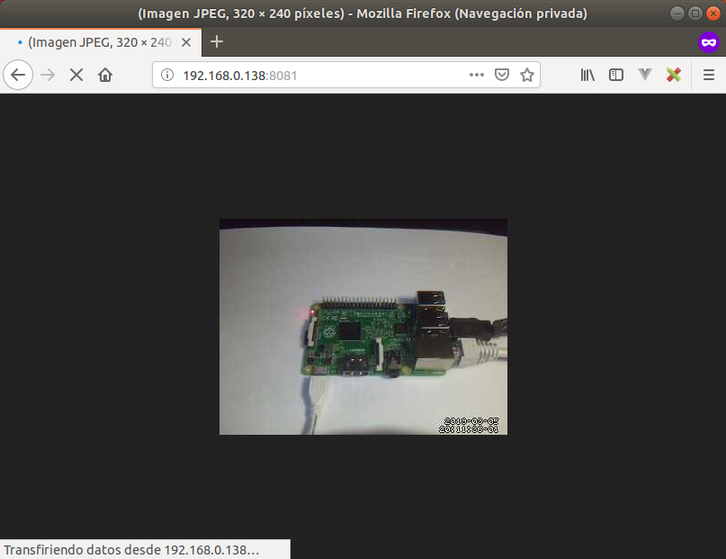
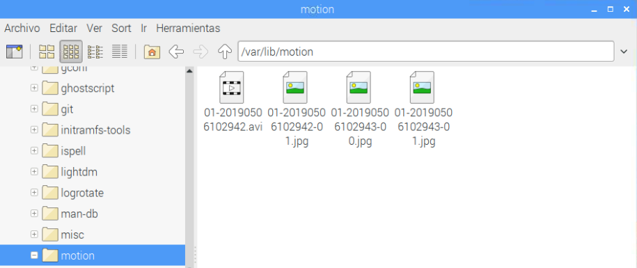

En este tutorial vamos a explicar cómo **instalar y configurar motion** para montar un sistema de videovigilancia.

# Antes de empezar

Vas a necesitar los siguientes componentes:

- Raspberry Pi con Raspbian
- Webcam USB

Es recomendable acceder a los siguientes tutoriales:

- [Configurar Webcam en Raspberry Pi](raspberry_pi-webcam-luvcview)

# Software Motion

[Motion](https://motion-project.github.io/) es uno de los programas más populares para utilizar con webcams, cuya utilidad es la de detectar movimientos. De esta forma podemos grabar momentos en los cuales se ha detectado movimiento. 

## Instalar Motion

Antes de instalar un programa es recomendable actualizar Raspbian como se explica en el tutorial [Raspberry Pi - Raspbian - Update](raspberry_pi-raspbian-update). Una vez actualizada la lista de paquetes del repositorio, podemos instalar Motion mediante el comando `apt install motion`.

```sh
pi@raspberrypi:~ $ sudo apt install motion
```

Para comprobar que se ha instalado correctamente, abrimos un navegador en la misma Raspberry Pi, accedemos a la dirección `localhost:8081` y se debe ver la webcam.



## Configuración (solo para módulo PICAM)

Solo si dispones de un módulo PICAM deberás activar el driver que haga funcionar el programa motion. En caso de disponer de una webcam omite esta sección.

```sh
pi@raspberrypi:~ $ sudo modprobe bcm2835-v4l2
```

Añadimos el módulo de PICAM.

```sh
pi@raspberrypi:~ $ sudo leafpad /etc/modules
```

```
# añadir al final del fichero
bcm2835-v4l2
```

Reinicia el sistema antes de continuar con el siguiente paso.

## Arrancar Motion al encender la Raspberry Pi

En este caso vamos a configurar el fichero de configuración encargado de habilitar el daemon de Motion al iniciar la Raspberry Pi. Para ello accedemos al fichero `/etc/default/motion`. Para abrirlo de una forma sencilla y con privilegios de administrador introducimos el comando `sudo leafpad /etc/default/motion`.

```sh
pi@raspberrypi:~ $ sudo leafpad /etc/default/motion
```

```
# set to 'yes' to enable the motion daemon
start_motion_daemon=yes
```

Por último, reseteamos el servicio con el comando `service motion restart` para que los cambios tengan efecto y una vez reiniciado el servicio ya podemos acceder a través de la dirección `localhost:8081`.

```sh
pi@raspberrypi:~ $ sudo service motion restart
```

## Acceder a Motion de forma remota

Probablemente lo que nos interese sea ver el contenido de la webcam desde fuera de la Raspberry Pi, por ejemplo, para controlar un bebe desde otra habitación. Para ello vamos a configurar Motion para que nos permita acceder desde la propia red local.

En primer lugar accedemos al fichero `/etc/motion/motion.conf` donde aparecen todas las opciones de configuración de Motion. Para abrirlo de una forma sencilla y con privilegios de administrador introducimos el comando `sudo leafpad /etc/motion/motion.conf`.

```sh
pi@raspberrypi:~ $ sudo leafpad /etc/motion/motion.conf
```

Vamos a indicar en el fichero de configuración que el software arranque como servicio. Para ello cambiamos el valor `daemon on`. También debemos especificar el puerto web por el cual veremos nuestra webcam y que no solamente se va a reproducir en modo local sino que además debemos permitir el acceso desde fuera de la red local.

> Como se puede observar, en este fichero aparecen diferentes configuración por defecto, y a medida que vayamos teniendo experiencia podemos ir probando.

```
# Start in daemon (background) mode and release terminal (default: off)
daemon on

# The mini-http server listens to this port for requests (default: 0 = disabled)
stream_port 8081

# Restrict stream connections to localhost only (default: on)
stream_localhost off
```

Reiniciamos el sistema y accedemos desde otro dispositivo conectado a la misma red local.



## Detectar movimientos

Por defecto, Motion guarda en imagen y vídeo cualquier evento que ocurra delante de la webcam y lo guarda en el directorio `/var/lib/motion`. Estos ajustes podemos modificarlos en el fichero de onfiguración.

```sh
pi@raspberrypi:~ $ sudo leafpad /etc/motion/motion.conf
```

```
# Output 'normal' pictures when motion is detected (default: on)
output_pictures on

# Recommended to use absolute path. (Default: current working directory)
target_dir /var/lib/motion
```



Recuerda que al cambiar parámetros del fichero de configuración deberás reiniciar el servicio motion con el comando `sudo service motion restart`.

```sh
pi@raspberrypi:~ $ sudo service motion restart
```

# Resumen

Hasta ahora ya tenemos Motion configurado para ver una webcam desde la propia Raspberry Pi o desde la red local. Sin embargo, en ocasiones nos gustaría poder ver qué ocurre desde fuera de la red, es decir, desde el trabajo o desde nuestro lugar de vacaciones.

# Ejercicios propuestos

1.- Conecta una webcam USB e instala y configura Motion correctamente.

2.- Accede desde un dispositivo móvil en la misma red para comprobar que puedes ver la webcam desde el móvil.

3.- Deshabilita la captura de movimiento y grabación automática en Motion.
