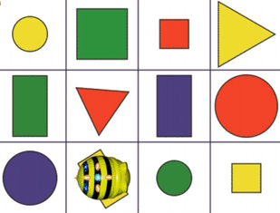
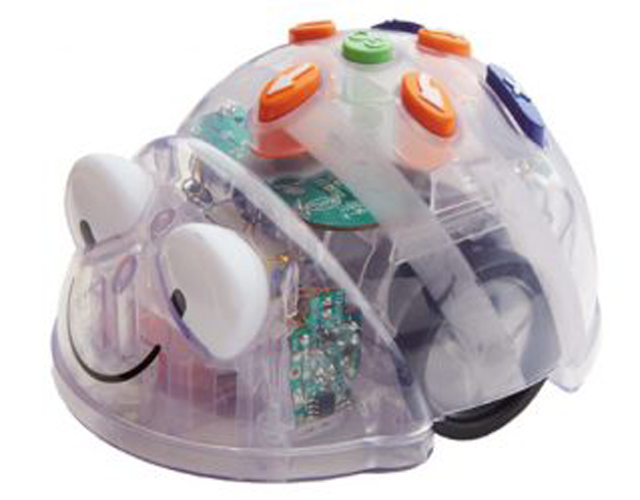
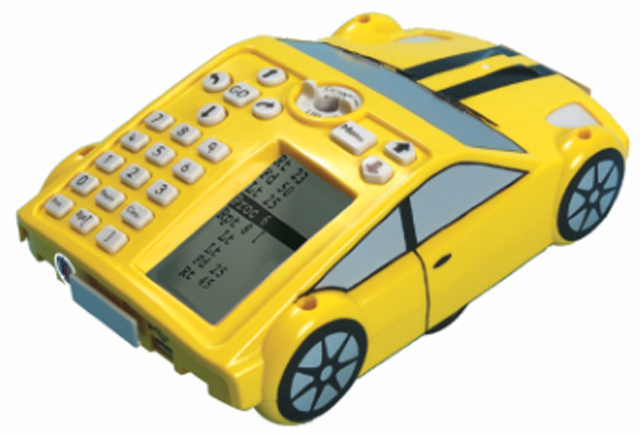
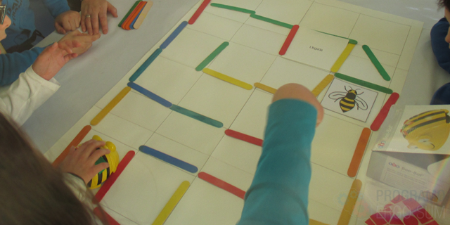
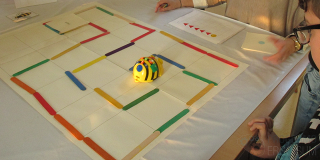
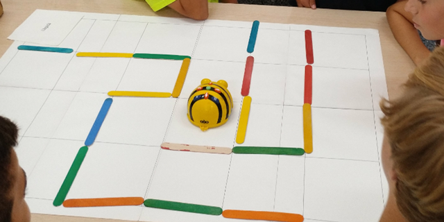
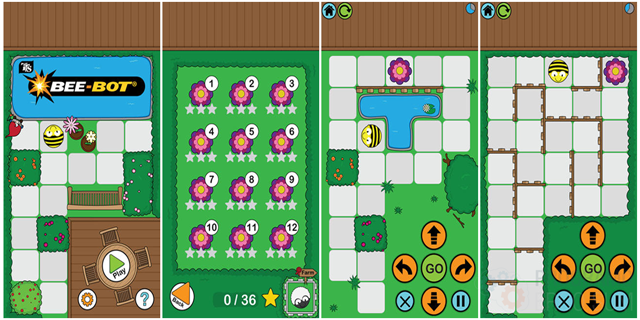
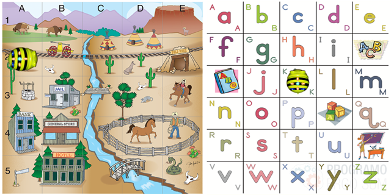
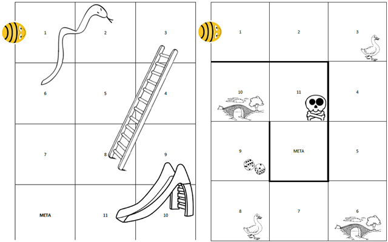
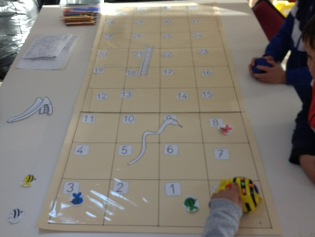

# Robótica educativa con Bee-Bot

En este curso te explicamos diferentes actividades de robótica educativa para introducir la Bee-Bot en el aula desde educación infantil. Aprenderás a construir un tablero casero para que tus alumnos se sientan creadores de sus propios escenarios, te mostraremos los resultados obtenidos en niños con necesidades educativas especiales (NEE) para que puedas poner en práctica nuestra experiencia y te contaremos nuestra experiencia en utilizar la Bee-Bot en el aula de infantil y primaria.

 

## ¿Qué es Bee-Bot?

Bee-Bot es un pequeño robot educativo con forma de abeja diseñado para desarrollar las capacidades elementales de la programación y sus aplicaciones de la robótica educativa: ubicación espacial, motricidad, lógica, estrategia, etc.

Las Bee-Bot se programan una y otra vez para conseguir una secuencia de instrucciones a través de una botonera que tiene en la parte superior de la carcasa. Se aceptan hasta un máximo de 40 instrucciones (adelante, atrás, girar a la izquierda y girar a la derecha).

También podemos encontrar el robot Blue-Bot, similar a Bee-Bot salvo con la diferencia de que Blue-Bot incluye Bluetooth y se puede programar desde dispositivos móviles o PC a través de las apps disponibles para Android y iPad. Además es transparente lo que permite ver el interior de la abeja.

Pro-Bot es un robot programable con apariencia de coche de carreras. Una de las diferencias con respecto a los anteriores es que si le añadimos un rotulador en la parte superior podemos dibujar el rastro.

### Beneficios de la Bee-Bot

Bee-Bot es una herramienta muy útil para niños a partir de 3 años ya que les ayuda a estimular su conocimiento en programación básica. Entre los beneficios más importantes encontramos:

- Lateralidad: Los alumnos tienen mucho mejor adquirida la distinción entre derecha e izquierda, tanto propia como en espejo. De esta forma mejora su escritura y su posicionamiento en el entorno.
- Razonamiento lógico: Gracias al desarrollo de secuencias lógicas nuestros alumnos presentan una mejora en cuanto a razonamiento.
- Cooperativo: Podemos lograr que los niños adquieran desde etapas tempranas la aceptación de diferentes roles en una tarea y aprendan a respetar las opiniones ajenas.
- Espacial: Puesto que todo el trabajo con los robots se basa en secuencias desarrolladas en cuadriculas, el desarrollo de la percepción espacial y su relación con los espacios cercanos de nuestros alumnos se ve mejorado.

 

## Primeros pasos

  <iframe src="//www.youtube.com/embed/08a3zlR9PcY" allowfullscreen></iframe>

Una vez adquirido el kit básico de Bee-Bot nos encontraremos con los siguientes componentes:

- 1x Bee-Bot recargable
- 1x cable USB A-B
- 1x guía de usuario en inglés

### Tablero

Crear un tablero es sencillo, simplemente debemos tener en cuenta las medidas de la cuadrícula de 15 cm de lado y utilizando unos simples palitos de los helados creamos el circuito una y otra vez. En nuestro caso hemos utilizado una combinación de folios Din-A4 unidos con celo. A continuación, teniendo en cuenta las medidas y utilizando una regla, hemos realizado la cuadrícula.

También puedes ayudarte fichas o pegatinas para ayudar a tus alumnos más pequeños como te enseñamos en el video de esta lección.

### ¿Cómo empiezo?

Cada vez que pulsemos un botón, los ojos de la Bee-Bot parpadearán y escucharemos un leve sonido que confirma la instrucción. Bee-Bot siempre avanza o retrocede 15 cm y gira sobre sí misma 90º.

La secuencia la realiza paso a paso, marcando cada acción con luz y sonido, animándonos a acompañarla y contar con ella. Bee-Bot puede realizar hasta 40 movimientos. Una vez programada la secuenciación simplemente hay que pulsar en la tecla GO para que la Bee-Bot ejecute las instrucciones. La Bee-Bot parpadeará una vez y emitirá un leve sonido al termino de cada instrucción parpadeará 3 veces al finalizar la secuencia completa. El botón de la X borra la memoria para empezar una nueva secuencia o en caso contrario repetirá la antigua secuencia y a continuación las nuevas instrucciones.

 

## Bee-Bot inclusiva

En el siguiente vídeo contamos con Carmen, Terapeuta de Astrade (Asociación para la Atención de personas con trastornos generalizados del desarrollo de la Región de Murcia) y nos enseña varios ejemplos para introducir la robótica en niños con autismo practicando la visión espacial.

  <iframe src="//www.youtube.com/embed/_cG4dv-GPiI" allowfullscreen></iframe>

> Uno de los beneficios de este pequeño robot es que ayuda a los niños a aprender jugando.

En los diferentes talleres que realizamos con niños con Necesidades Educativas Especiales les proponemos una serie de retos de diferentes niveles. Empezamos creando sencillas secuencias que tienen que resolver ayudándonos de unas pequeñas pegatinas como se puede observar en el vídeo.

 

## Bee-Bot en Infantil y Primaria

  <iframe src="//www.youtube.com/embed/ZywtymARqlM" allowfullscreen></iframe>

Con Bee-Bot podemos enseñar a los niños a secuenciar un programa de movimiento. Ellos deben pensar los movimientos y luego introducirlos para que la Bee-Bot los ejecute. Para ello podemos ayudarnos de la cuadrícula anteriormente creada y utilizar los palos de los helados, como explicamos en el vídeo, para que sean los propios alumnos los creadores del circuito a resolver.

Aunque la Bee-Bot parece un robot destinado principalmente a alumnos de infantil se puede utilizar en otras etapas de primaria y secundaria creando retos avanzados.

Entre los diferentes talleres que realizamos destacamos el CEIP San Isidro (Murcia), donde pudimos poner en prática retos complejos para desarrollar el pensamiento algorítmico.

 

## Bee-Bot para tablets

  <iframe src="//www.youtube.com/embed/imWVcaCpVUo" allowfullscreen></iframe>

En esta lección te enseñamos una aplicación para tablets o smartphones. La nueva aplicación Bee-Bot hace uso de la funcionalidad del teclado de Bee-Bot y permite a los niños mejorar sus habilidades en el lenguaje direccional dentro de un jardín atractivo.

> Puedes conectar tu dispositivo al proyector para utilizarlo como herramienta en el aula.

La aplicación es adecuada para su uso en iPhone®, iPad®, iPod touch® y Android.

- <a target="_blank" href="https://apps.apple.com/es/app/bee-bot/id500131639">Bee-Bot App para iOS</a>
- <a target="_blank" href="https://play.google.com/store/apps/details?id=air.BlueBot&hl=es">Bee-Bot App para Android</a>

 

## Bee-Bot para PC's

En esta lección te enseñamos una aplicación vía web para utilizar en el aula con tus alumnos. Se compone de varias plantillas online para desarrollar sin necesidad de utilizar el robot de forma física.

- <a target="_blank" href="https://www.terrapinlogo.com//emu/beebot.html">Bee-Bot Emulador</a>

 

## Tableros

Una vez adquiridos los conocimientos básicos sobre el manejo de la Bee-Bot se puede adaptar a cualquier juego de mesa, como son el caso de El Juego de la Escalera y El Juego de la Oca, entre otros.

El funcionamiento del juego es exactamente igual que si del juego original se tratase, con la diferencia que en este caso lo que hay que mover es la Bee-Bot que hace de ficha. Para ello, cada jugador tiene una ficha de un color diferente. Con ayuda de un dado, desplazamos la Bee-Bot hacia la casilla que haya salido al tirar el dado.

Según la dificultad que queramos darle al juego, en algunos casos se puede poner la norma de si un jugador programa mal la abeja y no llega a la casilla que tenía que llegar, esta deba regresar a la casilla donde estaba antes de tirar el dado y perder el turno.

