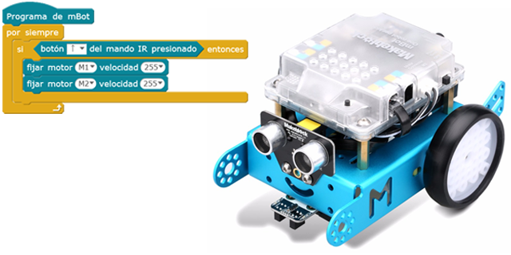
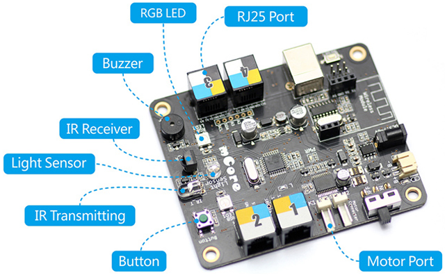
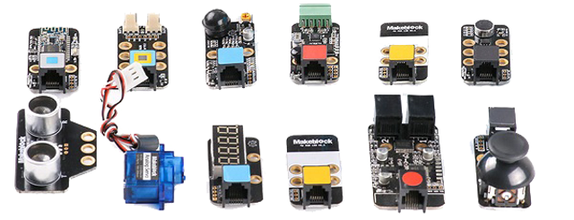
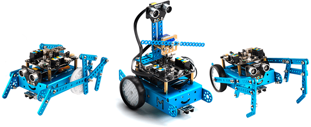
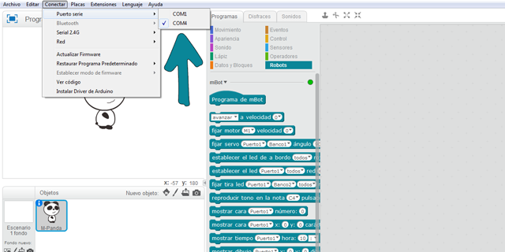
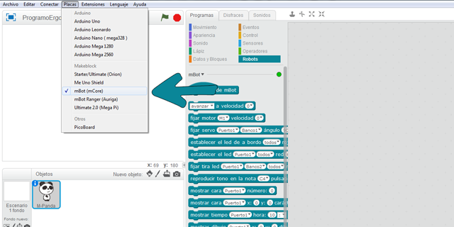
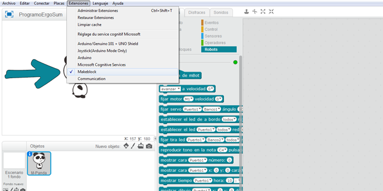
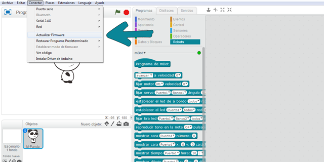
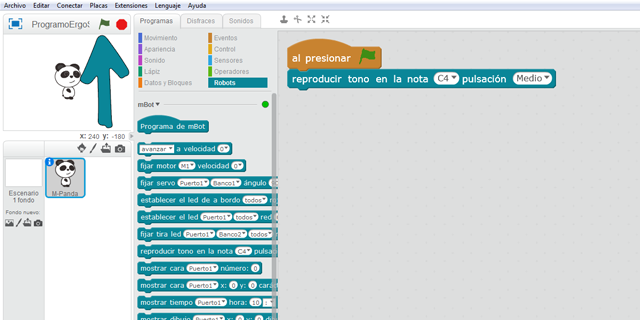
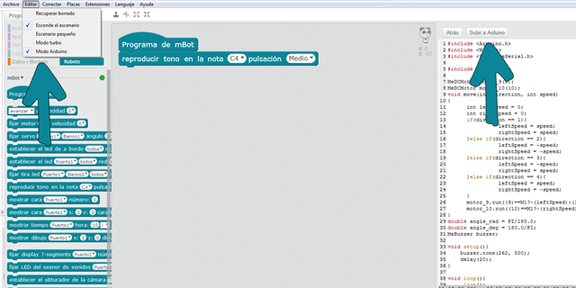

# Robótica educativa con mBot

mBot es un robot educativo ideal para iniciarse en la programación y robótica desde educación primaria. Está basado en Arduino Uno considerándose sencillo de utilizar ya que no necesita cableado ni soldaduras gracias a sus conectores RJ25 (típicas conexiones de teléfono).

En cuando a su programación y control, se puede programar utilizando lenguajes de programación por bloques y otras opciones como las siguientes:

- Utilizando mBlock. mBlock es el software de programación propio de Makeblock, basado en Scratch 2.0, que nos permite programar el robot sin necesidad de aprender un lenguaje complejo de programación.
- Utilizando Arduino. Esta opción es para usuarios de nivel intermedio. En este caso se utiliza un lenguaje de programación de Arduino y necesitamos instalar las librerías de Makeblock en el software de Arduino.
- Utilizando la app de mBot. ​Otra opción es usar la app mBot disponible para iOS y Android. La podemos utilizar sin necesidad de instalarle un código previo al robot.

### Especificaciones técnicas

- Placa: mCore (basada en Arduino)
- Micro controlador: Atmega328
- Peso: 400gr
- Alimentación: 4 pilas AA o batería de litio de 3,7V
- Accesorios: Sensor de luz, botón, infrarrojos, ultrasónico, seguidor de línea, zumbador, Led RGB, transmisor.
- Conexiones: 2 motores y 4 sensores
- Comunicación: Bluetooth, Serie inalámbrica 2.4G
- Dimensiones: 17 x 13 x 9 cm (montado)

### Hardware de mBot

El robot mBot utiliza la placa mCore la cual tiene un micro controlador ATmega238 con 4 puertos con conexiones RJ25 para conectar sensores. También integra un interruptor de encendido, un botón, dos LEDs RGB, un buzzer, un sensor de luminosidad y un sensor de infrarrojos.

Los módulos o sensores que pretendemos conectar a la placa vienen clasificados por color. Ese color debe corresponder con el color del puerto al cual pretendemos conectarlo. Es decir, en la imagen anterior vemos que el puerto 2 dispone de tres colores (amarillo, azul y blanco), lo que indica que en él podremos conectar cualquier módulo cuyo RJ25 disponga de alguno de esos colores.

Los colores que podemos encontrarnos en los puertos de las diferentes placas de Makeblock son: Rojo (motores), Amarillo (interface digital), Azul (interface digital dual), Gris (Puerto serie, bluetooth), Negro (interface analógica y dual) y Blanco (Puerto I2C). Este sistema de identificación por colores hace que conectar los accesorios de electrónica con la placa sea algo muy intuitivo y fácil.

 

## Construcción del Robot

  <iframe src="//www.youtube.com/embed/dsOqO8fmqpk" allowfullscreen></iframe>

En el video de esta lección se muestra como montar el robot de mBot paso a paso siguiendo el manual del fabricante. El manual es muy sencillo y didáctico y viene expresado con un lenguaje para que los alumnos de último ciclo de educación primaria o secundaria sean capaces de montarlo sin ningún problema.

> Cuando adquieres el robot de mBot por primera vez suele venir preparado para que sea montado en el aula por los alumnos.

Por otro lado, recordar que dependiendo de las extensiones o robots de mBot adquiridos, el montaje será diferente ya que puede incluir nuevas funcionalidades, sensores, etc. Desde la página web del fabricante podrás encontrar todos los modelos de robots educativos disponibles, así como las fichas técnicas, ayudas en el montaje y ejemplos de programación.

 

## ¡Hola Mundo!

Una vez hemos instalado mBlock, debemos conectar nuestro robot mBot utilizando el cable USB y encender el interruptor que viene en la carcasa. A continuación, deberemos seguir los siguientes pasos para configurarlo y conectarlo a mBlock.

- Conectar el puerto USB
- Elegir placa
- Elegir extensión
- Actualizar firmware
- Programar y depurar el código
- Subir el programa a Arduino

**Conectar el puerto USB**

En primer lugar debemos elegir el puerto correcto al cual hemos conectado nuestro robot mBot. En caso de dudas puedes acceder a las herramientas administrativas de tu equipo (Windows, Linux o MAC) y comprobar el puerto utilizado.

**Elegir la placa y extensiones del robot utilizado**

mBlock puede ser utilizado con diferentes robots educativos o placas como Arduino. En este caso deberemos seleccionar la placa del robot mBot y la extensión de MakeBlock. A continuación observaremos como aparecen los bloques de programación para este robot en el apartado de robots en la pestaña de programas.

**Actualizar firmware**

Según se va programando el código a ejecutar en el robot, podemos ir probándolo sin necesidad de desconectarlo del puerto USB. En este caso, deberemos cargar el firmware en el robot para que el código y variables utilizadas en el programa puedan ser mostradas desde el robot hacia la pantalla de mBlock.

**Hola Mundo**

Puedes probar a programar el siguiente código y pulsar la bandera verde. Si todo ha salido correcto deberás escuchar un sonido en el robot mBot. De esta forma ya habremos configurado y conectado correctamente nuestro robot mBot con el software mBlock.

**Subir el código programado al robot**

Una vez hemos programado nuestro robot y queremos que funcione de forma autónoma sin necesidad de estar conectado a nuestro PC mediante el cable USB, deberemos cargar el código en nuestro robot. Para ello deberemos acceder al apartado de Arduino y subir el código al robot. El proceso suele tardar unos segundos.

