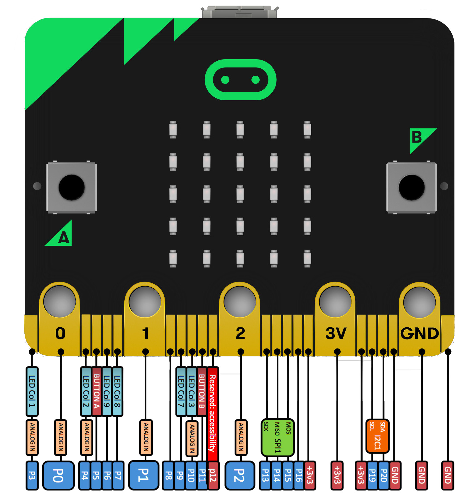

## Introducción

En este tutorial vamos a explicar cómo utilizar los pines IO de micro:bit para interactuar con ellos y construir diferentes programas utilizando el lenguaje de programación MicroPython.

### Antes de empezar

Vas a necesitar los siguientes componentes:

- Raspberry Pi con Raspbian
- Micro:Bit


<br />


## Pines en Micro:bit

Micro:bit tiene 25 conexiones externas llamadas *pines*. Dispone de cinco pines de conexión conectados con los agujeros en la placa marcados con las serigrafías *0, 1, 2, 3V y GND*, y 20 pequeños pines que se pueden utilizar al conectar micro:bit a un conector de borde.

> Puedes acceder a la referencia de los <a target="_blank" href="https://microbit-micropython.readthedocs.io/en/latest/pin.html">pines</a> desde la documentación oficial de Micro:bit.



Los pines 0, 1 y 2 son flexibles y se puede utilizar como pines de propósito general de entrada y salida (GPIO). Tiene la habilidad de leer voltajes analógicos usando un convertidor de analógico a digital (ADC) con lo cual se puede utilizar para el efecto de las placas makey-makey. Las clavijas 3V y GND se utilizan para la alimentación.

El resto de pines pequeños tienen algunas diferencias entre ellos. Algunos son compartidos con otros componentes en la placa, como el pin 3 es compartido con algunos de los LEDs de la matriz de LEDs.

> Para la utilización de los pines pequeños se recomienda utilizar un conector de borde comprado por separado normalmente.


<br />


## Función is_touched()

La primera función que vamos a ver es `is_touched()` encargada de comprobar si estamos tocando un determinado pin. De tal manera que el código encargado de comprobar si estamos tocando el pin 0 será `pin0.is_touched()`.

En el siguiente ejemplo al tocar con una mano el pin GND y con la otra el pin 0 deberá mostrarse una cara feliz en la matriz de LEDs.

```python
from microbit import *

while True:
   if pin0.is_touched():
      display.show(Image.HAPPY)
   else:
      display.show(Image.SAD)
```


<br />


## Función read_digital()

De forma similar a la anterior, con la función `read_digital()` podemos leer un valor digital en un determinado pin. 

```python
from microbit import *

while True:
   if pin0.read_digital():
      display.show(Image.HAPPY)
   else:
      display.show(Image.SAD)
```


<br />


## Función write_digital()

Con la función `write_digital()` podemos escribir un valor digital en un determinado pin. Por ejemplo, vamos a programar un LED intermitente utilizando el pin 0. 

```python
from microbit import *

while True:
   pin0.write_digital(1)
   sleep(1000)
   pin0.write_digital(0)
   sleep(1000)
```


<br />


## Función read_analog()

De forma similar a la anterior, con la función `read_analog()` podemos leer un valor analógico en un determinado pin. 

```python
from microbit import *

while True:
   if pin0.read_analog() > 100:
      display.show(Image.HAPPY)
   else:
      display.show(Image.SAD)
```


<br />


## Función write_analog()

Con la función `write_analog()` podemos escribir un valor analógico en un determinado pin. Por ejemplo, vamos a programar un LED para que se encienda poco a poco. 

```python
from microbit import *

while True:
   for i in range(0, 256, 1):
      pin0.write_analog(i)
      sleep(50)
```


<br />


## Ejercicios propuestos

1.- Crea un sencillo semáforo.

2.- Utiliza los pulsadores de la placa para encender diferentes LEDs conectados al GPIO.

3.- Utilizando un sensor LDR enciende o apaga la matriz de LEDs dependiendo de la intensidad de luz en el ambiente.

4.- Mueve un servomotor utilizando los pines los botones de la microbit.
