# Introducción

Echidna Shield es una placa para arduino dirigida a facilitar el aprendizaje de la robótica en los últimos cursos de educación primaria y secundaria, como indican en la propia web del proyecto. Surge ante la necesidad de dotar a los centros educativos con herramientas que les permitan conectar el mundo físico con el digital a través de herramientas libres. Es un proyecto OpenSource creado por Jorge Lobo, Xabier Rosas y José Pujol, profesores y entusiastas de la robótica educativa.

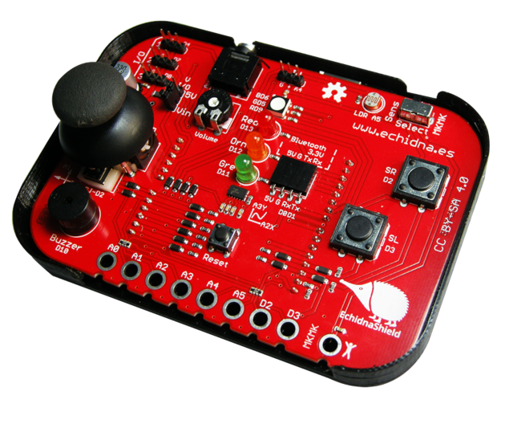

El escudo está pensado para ser utilizado con lenguajes visuales de programación por bloques, como S4A, mBlock, Snap4Arduino, etc. Al tener sensores y actuadores integrados, elimina  la necesidad de cablear, minimizando los errores de electrónica, lo que conlleva un incremento en el tiempo dedicado a programación y al conocimiento de los componentes. Puede actuar en dos modos, un modo de sensores, donde podrás utilizar los sensores de la placa, y un modo Makey-Makey.

En la placa Echidna Shield podemos encontrar los siguientes sensores y actuadores:

- 3 LEDs (rojo, naranja y verde) 
- 1 LED RGB
- 1 sensor de luz (LDR)
- 1 acelerómetro de 2 ejes
- 1 joystick analógico de 2 ejes
- 2 pulsadores
- 1 zumbador piezoeléctrico
- 1 conexión para sensores analógicos
- 3 conexiones digitales de entrada/salida con modulación por ancho de pulsos (PWM)
- 8 entradas y la tierra para crear circuitos tipo Makey Makey
- 1 salida de sonido a través de jack de audio de 3,5 mm

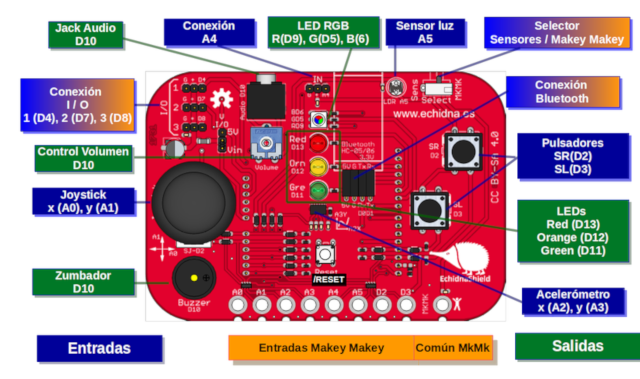

Desde la propia web del proyecto encontrarás una guía abierta, que se irá modificando a la par que se vaya creando materiales de las diferentes actividades y aportaciones de la comunidad.

  <iframe src="//www.youtube.com/embed/IuekBu6J0Co" allowfullscreen></iframe>

 

## Primeros pasos

Como se explica en la lección anterior Echidna Shield es un escudo para Arduino. Esto quiere decir que para utilizar esta placa necesitamos una placa Arduino UNO o compatible.

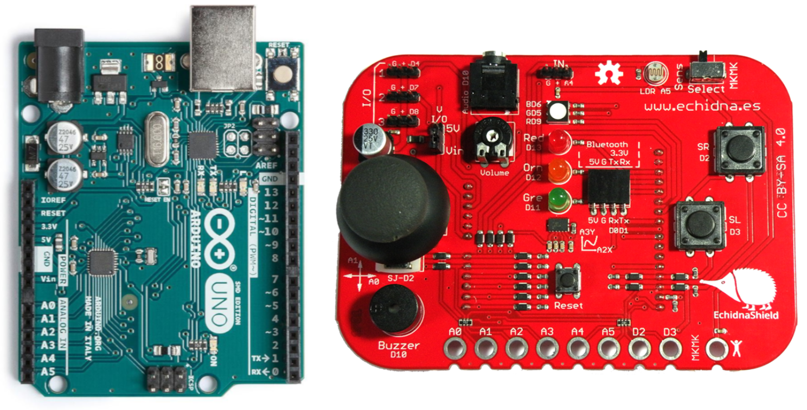

Antes de programar con ellas deberemos conectarlas. Hay que prestar atención a la forma de conectarlas, ya que pueden dañarse si intentan conectarse de una forma errónea. Fíjate que solamente se puede conectar en una dirección, como aparece en la anterior imagen. De tal forma que los pines de la Echidna Shield deben quedar en la parte interior de la tarjeta de Arduino UNO, es decir, en el pin digital número 0 que aparece serigrafiado en la parte interior.

  <iframe src="//www.youtube.com/embed/d2bde03Q_1U" allowfullscreen></iframe>

Una vez hemos conectado ambas placas podemos empezar a programarlas. En las siguientes lecciones se explica cómo programarlas utilizando varias plataformas de programación por bloques como mBlock o Snap4Arduino.

 

## Configuración mBlock 3.0

mBlock es un entorno gráfico de programación basado en Scratch 2.0 y desarrollado por la empresa MakeBlock. El primer paso será instalar el software desde la propia página web del proyecto. Está disponible para Windows, Linux o Mac, siendo la instalación similar.

  <iframe src="//www.youtube.com/embed/c5CGQOZTsis" allowfullscreen></iframe>

El primer paso que debemos realizar será añadir la extensión de Arduino, ya que como hemos dicho, Echidna Shield es un escudo que se conecta con Arduino, por eso la configuración sobre mBlock será igual que si quisiéramos utilizar la placa de Arduino solamente sin escudo.

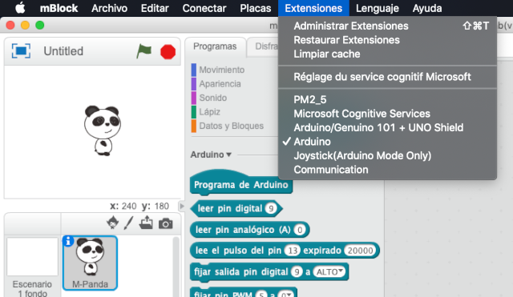

Además, en placas debemos seleccionar la placa que vamos a utilizar, Arduino UNO en nuestro caso. Tanto el paso anterior como el actual, quedarán guardados en el siguiente reinicio de mBlock salvo que se vuelva a modificar.

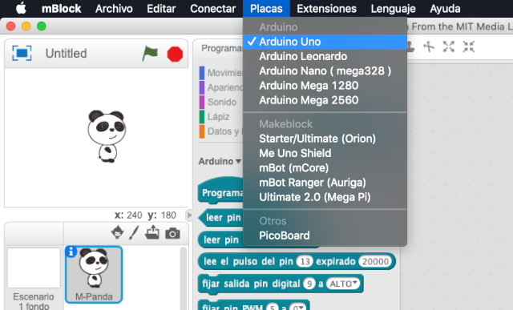

Lo sigiuente será seleccionar el puerto que vamos a utilizar. Normalmente suele ser el último que aparece. En el caso de sistemas operativos como Windows, aparecerá COM seguido de un número. Puedes acceder a propiedades de sistema para ver el puerto al cual está conectado Arduino.

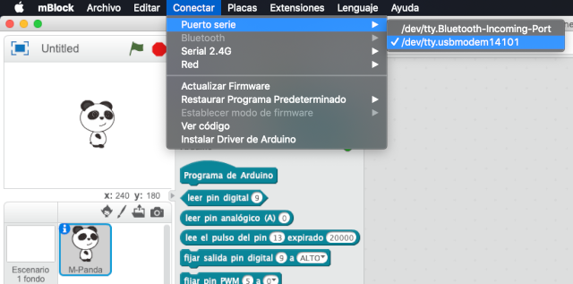

El último paso antes de empezar a programar será cargar el firmware en la placa de Arduino. Este proceso dura unos segundos y deberá realizarse siempre que se desconecte la placa de Arduino del PC. Este pequeño firmware hace que se pueda sincronizar la información en el editor de programación mBlock con la tarjeta de Arduino.

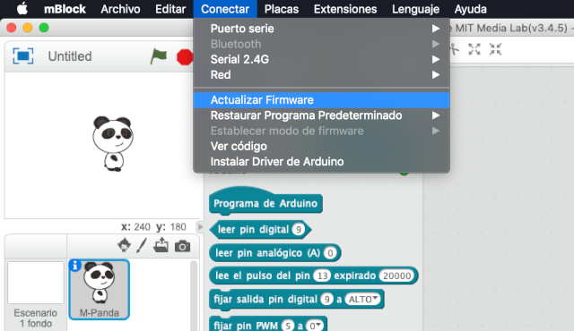

Por último, vamos a crear un programa muy sencillo que encenderá el LED RGB en color rojo y lo apagará de forma intermitente.

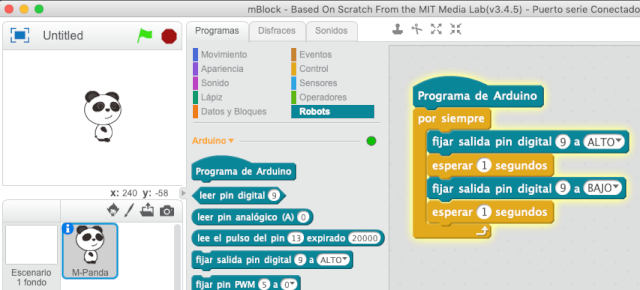

Por último, vamos a suponer que queremos cargar el código anterior en la placa de Arduino para que funcione aún así cuando nuestra placa de Arduino esté desconectada de nuestro programa mBlock. En este caso, lo subiremos a la placa haciendo clic sobre el botón de subir a la placa.

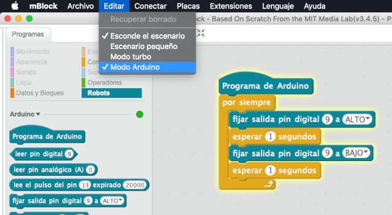

 

## Configuración mBlock 5.0

mBlock es un entorno gráfico de programación basado en Scratch 3.0 y desarrollado por la empresa MakeBlock. El primer paso será instalar el software desde la propia página web del proyecto. Está disponible para Windows, Linux o Mac, siendo la instalación similar.

  <iframe src="//www.youtube.com/embed/2lqjPiC4MMk" allowfullscreen></iframe>

El primer paso que debemos realizar será añadir el dispositivo a utilizar. Podemos observarnos en la parte de los disfraces sobre la pestaña Dispositivos. Añadimos el dispositivo Arduino como explicamos en la lección anterior.

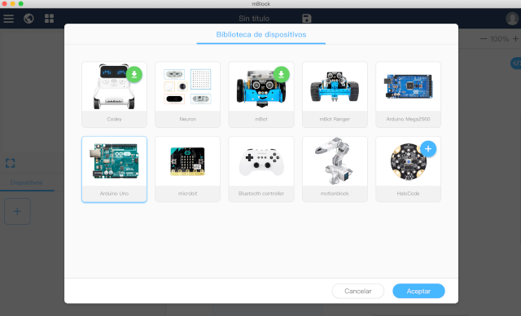

El siguiente paso será conectar el puerto. Dependiendo de el sistema operativo utilizado nos aparecerá una nomenclatura de puertos.

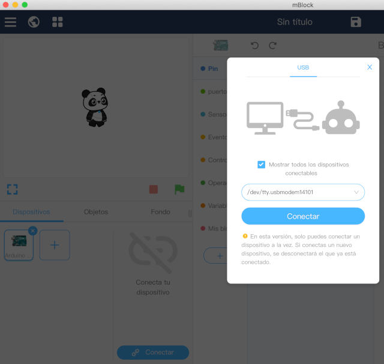

Pur último, cuando tengamos un código de ejemplo cargado, deberemos subirlo a Arduino para que podamos probarlo y trabajar con el de forma autónoma sin necesidad de estar conectado al PC.

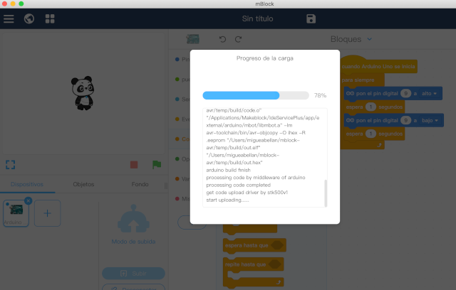

 

## Configuración Snap for Arduino

Snap4Arduino es una combinación de Snap! y de Arduino. El primer paso será instalar el software desde la propia página web del proyecto. Está disponible para Windows, Linux o Mac, siendo la instalación similar.

  <iframe src="//www.youtube.com/embed/uAK5tvSOaRY" allowfullscreen></iframe>

Lo primero que debemos hacer es cargar el StandardFirmata en nuestra placa de Arduino. Esto lo realizaremos mediante el Software de Arduino IDE. Para ello, una vez descargado desde la web de Arduino, abrimos el archivo que se encuentra en los ejemplos de la aplicación.

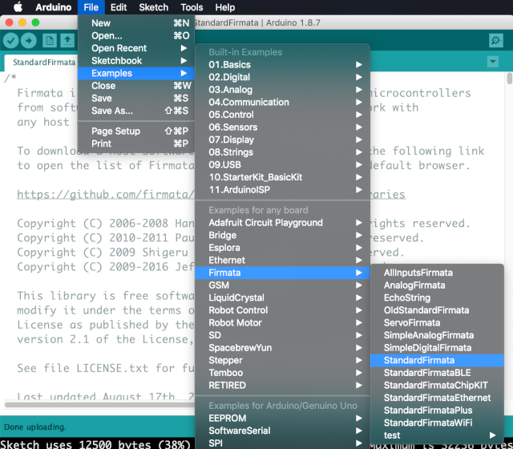

Una vez abierto lo subiremos a la placa haciendo clic en el icono de subir. Este proceso suele tardar apenas unos segundos.

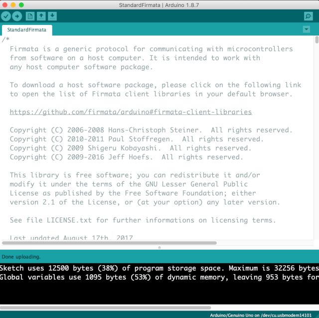

A continuación, con el programa de Snap4Arduino, en el apartado de Arduino conectaremos al puerto que tengamos seleccionado nuestra placa de Arduino, esto es el USB. Recuerda que en Sistemas Operativos como Windows aparecerá el nombre de puerto como COM y seguido de un número.

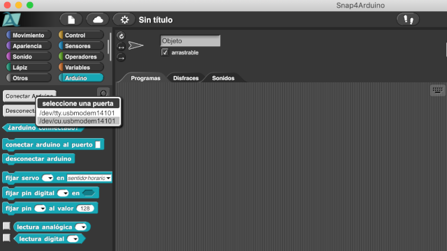

Por último, podemos probar el ejemplo de prueba para encender un led de forma intermitente y veremos que funciona perfectamente.

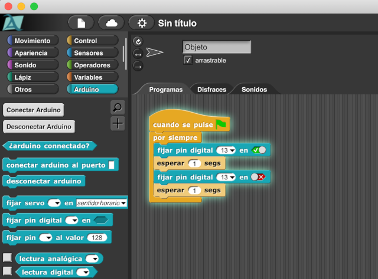
