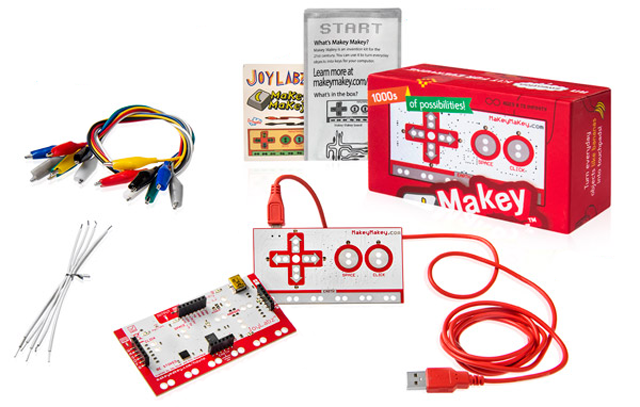
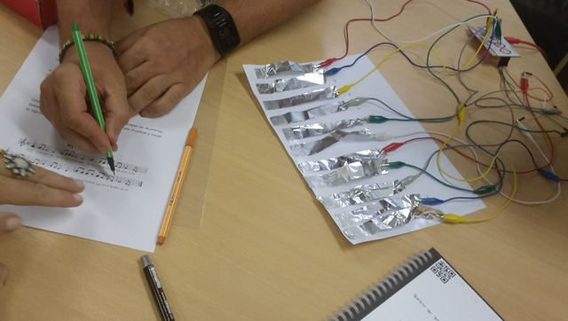
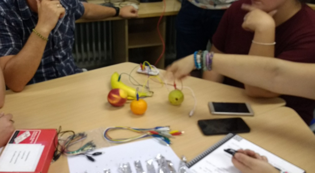
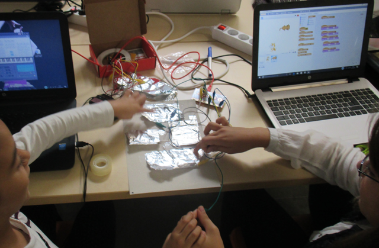
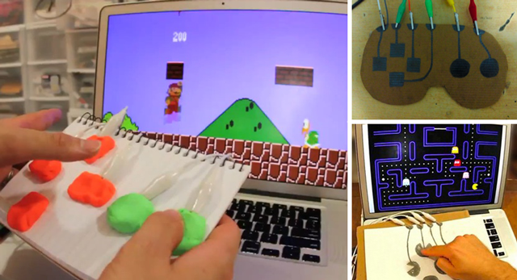
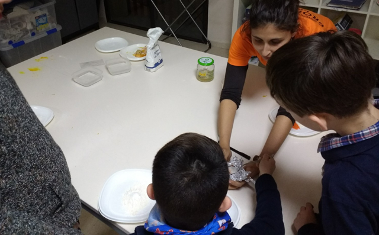
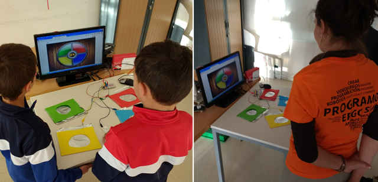

# Robótica educativa con Makey-Makey

Makey-Makey es una placa similar al mando de una videoconsola que simula ser un teclado o ratón, lo que permite enviar órdenes al ordenador al que se encuentre conectado. En vez de pulsar los botones lo que hacemos es cerrar el circuito mediante contactos o pinzas de cocodrilo y de esta forma se simula haber pulsado un botón. De esta forma, nos permite convertir cualquier objeto de la vida diaria en un teclado, un mando o un ratón.

La idea de Makey-Makey es sencilla y simple. Consiste en una placa de electrónica basada en Arduino con un cable USB que se conecta al ordenador como un periférico más, de manera que da la oportunidad a sus usuarios de buscar y encontrar nuevas maneras de interactuar con sus ordenadores, potenciando la creatividad, la imaginación y el diseño.

### MaKey MaKey - An Invention Kit for Everyone

Haz un piano con plátanos, juega al Mario, deja que tu gato se haga una foto. Este es un kit de invención simple para principiantes y expertos. En el video podemos ver a Jay y a Eric haciendo algunas muy divertidas demostraciones del uso de este kit, el cual obviamente está limitado por la imaginación del usuario.

  <iframe src="//www.youtube.com/embed/rfQqh7iCcOU" allowfullscreen></iframe>

 

## Notas musicales

Un ejercicio muy común cuando se utiliza la Makey-Makey en el aula consiste en crear un piano para componer diferentes canciones con los alumnos. Para ello se pueden utilizar diferentes recortes con papel de aluminio para componer las notas musicales. Cada recorte de aluminio se conectará a las diferentes teclas de la placa Makey-Makey (mediante pinzas de cocodrilo y latiguillos en la parte trasera de la placa).

En cuanto al software del piano tenemos varias opciones; podemos utilizar aplicaciones disponibles en modo online, o programarlas nosotros mismos utilizando el lenguaje de programación por bloques de Scratch.

Otra opción en la que nos encontramos es la de realizar el piano con diferentes objetos conductores de electricidad, como el caso de la fruta o verdura. De esta forma podemos darnos cuenta que existen diferentes objetos conductores y se puede explicar la conductividad en el aula. Por ejemplo, ¿sabías que la piel del Kiwi es menos conductor que la piel del plátano?

También puedes encontrar muchos vídeos en YouTube que muestran el gran ingenio de personas de todo el mundo. Este es uno de los mejores vídeos musicales que hemos visto.

  <iframe src="//www.youtube.com/embed/fR9pcI-Te5s" allowfullscreen></iframe>

 

## Mando de videojuego

Otra de las opciones para utilizar la placa de Makey-Makey, es mediante la construcción de un mando para jugar a diferentes videojuegos ya que utilizaremos las flechas del teclado y otros botones más que pueden ser personalizados en algunos de los videojuegos online.

También está la opción de que los alumnos programen sus propios videojuegos utilizando el lenguaje de programación por bloques de Scratch y se conviertan en creadores y programadores.

Otras elaboraciones más sofisticadas consisten en utilizar plastilina conductora, lápiz de grafito u otras herramientas y utensilios conductores que encontremos en casa o en el aula, para poder jugar a videojuegos online o programados por nosotros mismos en Scratch u otros lenguajes de programación.

 

## Plastilina conductora casera

Uno de los usos que se le puede dar a las placas Makey-Makey es mediante proyectos de manualidades. Por ejemplo, sabemos que la placa funciona cerrando los circuitos y en anteriores lecciones del curso vimos cómo utilizar el papel de aluminio u otros componentes conductores.

Otra de las opciones consiste en elaborar plastilina conductora (o adquirirla en la tienda) para conectarla a nuestra placa Makey-Makey. Si optas por la primera opción, los niños se convertirán en creadores de sus propios productos de una forma muy divertida.

En el siguiente vídeo de YouTube puedes ver un ejemplo de cómo elaborar plastilina casera tipo Play Doh SIN cocinar. También puedes utilizar otras técnicas o métodos siempre y cuando la plastilina sea conductora.

  <iframe src="//www.youtube.com/embed/9PUXt-1OSSw" allowfullscreen></iframe>

 

## Juego de Simón

El juego de simón consiste en reproducir una secuencia de colores en el mismo orden que se generan. De esta forma, utilizando junto a la placa Makey-Makey, nuestros alumnos pueden ver el juego más divertido.

En algunos talleres hemos reproducido este juego en modo colaborativo, de tal forma que unidos de las manos cada uno se encargaba de una secuencia o color para que les resulte más sencillo el juego.

