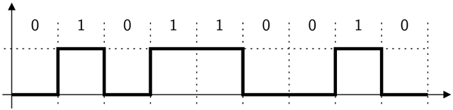
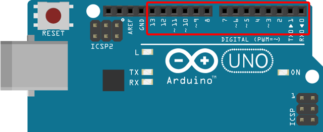
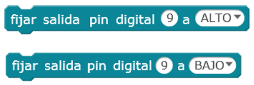
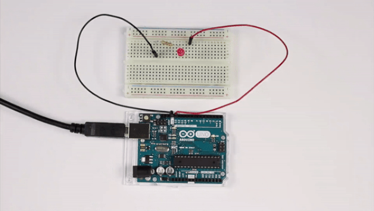
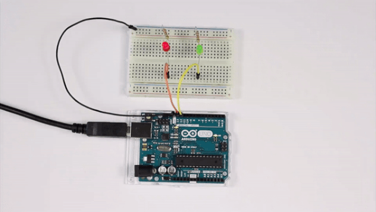
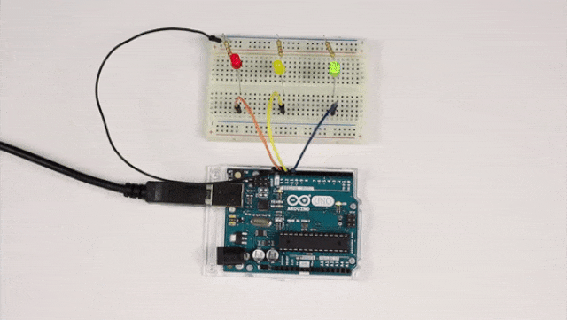
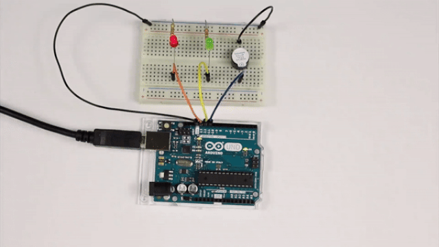

# Salidas digitales con Arduino

En este curso aprenderás a programar diferentes prácticas utilizando las salidas digitales de la placa de arduino. Para cada una se explica la parte de electrónica que deberás conocer antes de programarlas. Observarás además que puedes programarlas utilizando los lenguajes de programación por bloques o textual de Arduino.

- Práctica 1: Luz intermitente
- Práctica 2: Luz alterna
- Práctica 3: Semáforo simple
- Práctica 4: Semáforo de peatones

### ¿Qué materiales voy a necesitar?

Antes de continuar con las lecciones del curso asegúrate que dispones de todos los componentes que se van a necesitar. Los componentes utilizados en este tutorial son:

- Arduino UNO
- Protoboard
- Latiguillos
- LEDs
- Resistencias
- Zumbador


<br />


## Salidas digitales

Una señal digital es aquella que sólo puede tomar ciertos valores (alto o bajo). Su forma característica es conocida como señal de onda cuadrada y las representaciones se realizan en el dominio del tiempo. La función principal de las salidas digitales es entregar una señal de control que le dará funcionalidad a un circuito electrónico que será el encargado de cumplir con las funciones que el usuario requiera.

> Los sistemas electrónicos manejan este tipo de señales binarias.



### Salidas digitales en Arduino

En arduino disponemos de 14 pines digitales serigrafiados con los números del 0 al 13. Estos pines son utilizados en modo digital para entradas y salidas, incluso algunos de ellos, serigrafiados con el símbolo de alterna (~), pueden ser también utilizados como pines de salida analógica en modo PWM.

> La salida digital toma los valores 0V (bajo) ó 5V (alto).



Los pines de salida han sido diseñados para entregar señales de voltaje, no para suplir corriente a un circuito. El máximo de corriente que puede entregar un pin de salida es de aproximadamente 40mA (suficiente para encender un LED). Las cargas que vamos a manejar no deben superar los 5V ni consumir más de 40mA.

### Bloques de programación

Para programar las siguientes prácticas utilizando el lenguaje de programación por bloques de mBlock, deberás conocer los siguientes bloques de programación, encargados de activar o desactivar el voltaje en los pines digitales de la placa de arduino.

El primer bloque activa el pin digital número 13 de la placa de arduino a un valor alto, con lo cual si conectamos un LED  correctamente se encenderá. Por otro lado, con el segundo bloque ocurre justamente lo contrario.

> Los pines para las salidas digitales corresponden a los pines desde el 0 hasta el 13 y toman los valores ALTO o BAJO.
Salidas digitales en mBlock



### Instrucciones de programación

Para programar las siguientes prácticas utilizando el lenguaje de programación textual de Arduino IDE, deberás conocer las siguientes instrucciones de programación.

**Función pinMode()**

La función pinMode(), utilizada en la función setup(), sirve para configurar el modo de trabajo de un pin pudiendo ser INPUT (entrada) u OUTPUT (salida).

```arduino
// Configura "pin" como salida
pinMode(pin, OUTPUT);

// Ejemplo: Activar el pin digital 13 como salida
pinMode(13, OUTPUT);
```
 
**Función digitalWrite()**

La función digitalWrite(), utilizada normalmente en la función loop(), sirve para escribir un valor (o poner en un estado) un pin digital. Los valores o estados posibles son HIGH (alto) o LOW (bajo).

```arduino
// Establece en "pin" como valor alto
digitalWrite(pin, HIGH);

// Ejemplo: Activar el pin digital 13 como valor alto
digitalWrite(13, HIGH);
```

**Función delay()**

La función delay() sirve para detener el flujo del programa durante una cantidad de tiempo. Dicha cantidad de tiempo está representada en milisegundos.

```arduino
// Espera una determinada cantidad de milisegundos
delay(milisegundos);

// Ejemplo: Esperar 1 segundo
delay(1000);
```

### Estructura de un programa en Arduino IDE

Todo programa para Arduino consta de 2 funciones; la función setup() y la función loop(). La función setup() es la primera función que se ejecuta en nuestro programa, ejecutándose sólo una vez, y se utiliza para configurar la comunicación con nuestro equipo, inicializar los pines de nuestra tarjeta de Arduino e inicialización de las variables.

```arduino
// La función setup() es la primera función en ejecutarse, una sola vez
void setup(){
  Instrucción 1
  Instrucción 2
  ...
  Instrucción N
}
```

La función loop() se ejecuta repetidamente después de la función setup(). Dentro de la misma vamos a introducir el programa que queremos ejecutar dentro de la placa de Arduino.

```arduino
// La función loop() se ejecuta repetidamente en modo bucle infinito
void loop(){
  Instrucción 1
  Instrucción 2
  ...
  Instrucción N
}
```

### Sintaxis de programación en Arduino IDE

Es importante tener claras las siguientes reglas del lenguaje de programación:

- Toda línea termina en punto y coma ";" excepto las estructuras de control que se acompañan con llaves "{}".
- Las instrucciones y variables son sensibles a mayúsculas y minúsculas, es decir, debemos respetar el nombre exacto.
- Las instrucciones que comienzan por el símbolo de doble barra "//" se tomará como comentario para el programa. También se dispone de comentarios de múltiples líneas /* */.


<br />


## Práctica 1: Luz intermitente

El objetivo de esta práctica es programar un LED que parpadeé de forma intermitente con una frecuencia de 1 segundo, es decir, se va a programar un código encargado de encender y apagar un LED (haciendo uso de la salida digital).



### Materiales

- 1 Arduino UNO
- 1 Protoboard
- 2 Latiguillos
- 1 LED
- 1 Resistencias de 220Ω (rojo-rojo-marrón)

### Esquema eléctrico

Se conecta el LED al pin digital 13 de la placa de arduino (utilizando su debida resistencia). La patilla larga del LED debe ser conectada al voltaje positivo (ánodo) y la corta al voltaje negativo (cátodo) pasando por la resistencia.

```
V = 5V - 2.1V = 2.9V
I = 20mA

V = I x R ; R = V / I

R = 2.9V / 0.02A = 145Ω -> 220Ω (por aproximación)
```


### Programación en mBlock

Al ejecutar el código se deberá establecer en el pin digital 13 un valor alto, esperar 1 segundo, establecerse un valor bajo y volver a esperar. Este procedimiento se deberá repetir indefinidamente.


### Programación en Arduino IDE

En primer lugar, se configura el pin digital 13 en modo salida (OUTPUT). Esta configuración se establece en la función setup(), ya que solamente se ejecuta una vez.

Por otro lado, al ejecutar el código se deberá establecer en el pin digital 13 un valor alto (HIGH), esperar 1 segundo (1000 milisegundos), establecerse un valor bajo (LOW) y volver a esperar. Este procedimiento se realiza en la función loop() ya que se repite indefinidamente.

```arduino
void setup() {
  pinMode(13, OUTPUT);
}

void loop() {
  digitalWrite(13, HIGH);
  delay(1000);
  digitalWrite(13, LOW);
  delay(1000);
}
```


<br />


## Práctica 2: Luz alterna

El objetivo de esta práctica es programar dos luces que parpadean de forma alterna con una frecuencia de 1 segundo, es decir, se va a programar un código encargado de encender y apagar dos LEDs (haciendo uso de las salidas digitales).



### Materiales

- 1 Arduino UNO
- 1 Protoboard
- 4 Latiguillos
- 2 LEDs
- 2 Resistencias de 220Ω (rojo-rojo-marrón)

### Esquema eléctrico

Se conecta el LED de color rojo al pin digital 13 y el LED de color verde al pin digital 12 de la placa de arduino (utilizando su debida resistencia). La patilla larga del LED debe ser conectada al voltaje positivo (ánodo) y la corta al voltaje negativo (cátodo) pasando por la resistencia.

```
V = 5V - 2.1V = 2.9V
I = 20mA

V = I x R ; R = V / I

R = 2.9V / 0.02A = 145Ω -> 220Ω (por aproximación)
```


### Programación en mBlock

Al ejecutar el código se deberá establecer en el pin digital 13 un valor alto y en el pin digital 12 un valor bajo, esperar 1 segundo, establecerse los valores de forma alterna y volver a esperar. Este procedimiento se deberá repetir indefinidamente.


### Programación en Arduino IDE

En primer lugar, se configuran los pines digitales 12 y 13 en modo salida (OUTPUT). Esta configuración se establece en la función setup(), ya que solamente se ejecuta una vez.

Por otro lado, al ejecutar el código se deberá establecer en el pin digital 13 un valor alto (HIGH) y en el pin digital 12 un valor bajo (LOW), esperar 1 segundo (1000 milisegundos), establecerse los valores de forma alterna y volver a esperar. Este procedimiento se realiza en la función loop() ya que se repite indefinidamente.

```arduino
void setup() {
  pinMode(13, OUTPUT);
  pinMode(12, OUTPUT);
}

void loop() {
  digitalWrite(13, HIGH);
  digitalWrite(12, LOW);
  delay(1000);
  digitalWrite(13, LOW);
  digitalWrite(12, HIGH);
  delay(1000);
}
```


<br />


## Práctica 3: Semáforo simple

El objetivo de esta práctica es construir un semáforo simple, es decir, se va a programar un código encargado de simular un semáforo como el que se puede encontrar en cualquier ciudad.



### Materiales

- 1 Arduino UNO
- 1 Protoboard
- 4 Latiguillos
- 3 LEDs
- 3 Resistencias de 220Ω (rojo-rojo-marrón)

### Esquema eléctrico

Se conectan los LEDs rojo, amarillo y verde a los pines digitales 13, 12 y 11 de la placa de arduino (utilizando su debida resistencia). La patilla larga del LED debe ser conectada al voltaje positivo (ánodo) y la corta al voltaje negativo (cátodo) pasando por la resistencia.

```
V = 5V - 2.1V = 2.9V
I = 20mA

V = I x R ; R = V / I

R = 2.9V / 0.02A = 145Ω -> 220Ω (por aproximación)
```


### Programación en mBlock

Al ejecutar el código se deberán establecer los pines digitales a un valor bajo para inicializar así los LEDs. A continuación se procede a activar y desactivar los diferentes pines simulando el funcionamiento del semáforo.


### Programación en Arduino IDE

En primer lugar, se configuran los pines digitales 11, 12 y 13 en modo salida (OUTPUT). Esta configuración se establece en la función setup(), ya que solamente se ejecuta una vez. Además, se ha creado la inicialización de los pines a un valor bajo (LOW).

Al ejecutar el código se deberán establecer los pines digitales a un valor bajo para inicializar así los LEDs. A continuación se procede a activar y desactivar los diferentes pines simulando el funcionamiento del semáforo.

```arduino
void setup() {
  pinMode(13, OUTPUT);
  pinMode(12, OUTPUT);
  pinMode(11, OUTPUT);
  digitalWrite(13, LOW);
  digitalWrite(12, LOW);
  digitalWrite(11, LOW);
}

void loop() {
  digitalWrite(13, LOW);
  digitalWrite(11, HIGH);
  delay(5000);
  digitalWrite(11, LOW);
  digitalWrite(12, HIGH);
  delay(1000);
  digitalWrite(12, LOW);
  digitalWrite(13, HIGH);
  delay(5000);
}
```


<br />


## Práctica 4: Semáforo de peatones

El objetivo de esta práctica es construir un semáforo para peatones utilizando dos LEDs y un zumbador, es decir, se va a programar un código encargado de encender una luz roja y una luz verde al mismo tiempo que se emite un zumbido para avisar al peatón que puede cruzar por el paso de peatones.



### Materiales

- 1 Arduino UNO
- 1 Protoboard
- 5 Latiguillos
- 2 LEDs
- 2 Resistencias de 220Ω (rojo-rojo-marrón)
- 1 Zumbador

### Esquema eléctrico

Se conecta el LED rojo al pin digital 13 y el LED de color verde al pin digital 12 de la placa de arduino (utilizando su debida resistencia). La patilla larga del LED debe ser conectada al voltaje positivo (ánodo) y la corta al voltaje negativo (cátodo) pasando por la resistencia. El zumbador se conecta debidamente polarizado al pin digital 11.

```
V = 5V - 2.1V = 2.9V
I = 20mA

V = I x R ; R = V / I

R = 2.9V / 0.02A = 145Ω -> 220Ω (por aproximación)
```


### Programación en mBlock

Al ejecutar el código se deberán establecer los pines digitales a valores bajos, lo que se conoce como inicialización. A continuación, en el bucle principal del programa se programa la activación del pin 13 en valor a alto de manera que espere 5 segundos. Una vez transcurrido el tiempo de espera se desactiva el pin 13 y se llama a un evento encargado de hacer la programación del paso de peatones. En este evento puedes observar que se reproducirá el sonido de encendido y apagado 10 veces al estar conectado al pin digital 11.


### Programación en Arduino IDE

En primer lugar, se configuran los pines digitales 11, 12 y 13 en modo salida (OUTPUT). Esta configuración se establece en la función setup(), ya que solamente se ejecuta una vez. Además, se ha creado la inicialización de los pines a un valor bajo (LOW).

Por otro lado, en la función principal loop() se programa la activación del pin 13 en valor a alto de manera que espere 5 segundos (5000 milisegundos). Una vez transcurrido el tiempo de espera se desactiva el pin 13 y se recorre un bucle encargado de hacer la programación del paso de peatones. En el interior del bucle puedes observar que se reproducirá el sonido de encendido y apagado 10 veces al estar conectado al pin digital 11.

```arduino
void setup() {
  pinMode(13, OUTPUT);
  pinMode(12, OUTPUT);
  pinMode(11, OUTPUT);
  digitalWrite(13, LOW);
  digitalWrite(12, LOW);
  digitalWrite(11, LOW);
}

void loop() {
  digitalWrite(13, HIGH);
  delay(5000);
  digitalWrite(13, LOW);
  
  digitalWrite(12, HIGH);
  for(int i=0; i<10; i++){
    digitalWrite(11, HIGH);
    delay(200);
    digitalWrite(11, LOW);
    delay(500);
  }
  digitalWrite(12, LOW);
}
```
