# Curso de iniciación a la programación con Scratch 3.0

En este curso online de iniciación a la programación aprenderás a utilizar la herramienta de Scratch 3.0 para programar diferentes tipos de videojuegos y animaciones mediante el lenguaje de programación por bloques de Scratch. 

  <iframe src="//www.youtube.com/embed/6ofHiea__hU" allowfullscreen></iframe>

## Haciendo un poco de historia...

Haciendo un poco de historia, recordarás la primera versión de Scratch 1.4 creada sobre el año 2009. Actualmente todavía existen usuarios que siguen utilizando dicha versión en sistemas operativos Linux.

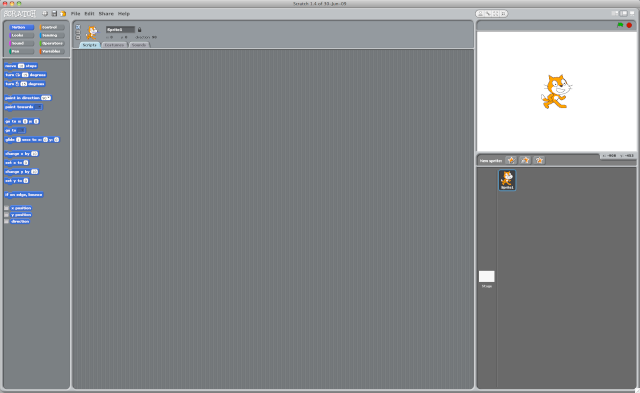

Años más tarde, en mayo de 2013, se lanzó la segunda versión de Scratch 2.0, la cual ha estado con nosotros tanto tiempo. Esta versión como la anterior utilizaban Flash como tecnología. Flash fue un software creado originalmente diseñado para crear animaciones que se pueden usar en páginas web. Sin embargo, este software no es soportado por los nuevos dispositivos móviles. Por esa misma razón, el equipo del MIT decidió cambiar de tecnología en la siguiente versión de Scratch para utilizar una tecnología más moderna, HTML5 en este caso.

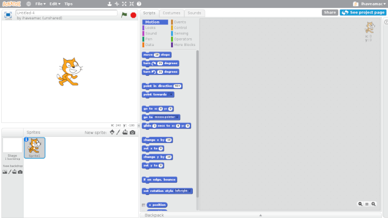

Desde el pasado 2 de enero de 2019 puedes programar tus videojuegos con la nueva versión de Scratch. Pero antes de que sigas leyendo, no te preocupes si estabas utilizando la versión anterior de Scratch 2.0 ya que son compatibles al 100%. Es decir, puedes seguir utilizando tus proyectos anteriores con la nueva versión. La principal diferencia que encontrarás es el nuevo diseño de la plataforma... pero en cuanto a programación, no notarás apenas diferencia.

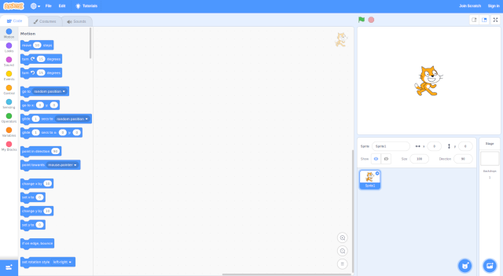

### Scratch 3.0 ¡Ya está aquí!

La principal novedad de Scratch 3.0 es que ahora no requiere flash para ser ejecutado por lo que cualquier dispositivo y navegador podrá servirnos para aprender a programar y crear los proyectos.

No te preocupes si tienes proyectos en versiones anteriores ya que podrás seguir utilizándolos sin problema alguno. La nueva versión de Scratch 3.0 guarda los proyectos en un nuevo formato de archivo, .sb3. Podemos compartir los proyectos realizados con versiones anteriores de Scratch. No obstante, no podemos realizar la acción inversa, es decir, abrir un proyecto de scratch 3.0 con la anterior versión de Scratch 2.0.

 

## Nuevo diseño del editor

El primer cambio que encontramos al acceder a la nueva versión de Scratch 3.0 es la disposición de los móodulos sobre el editor. Si anteriormente teníamos el escenario en la parte izquierda, en la nueva versión el escenario está situado en la derecha. Este cambio viene para quedarse, ya que en la primera versión de Scratch 1.4 estaba situada en la misma posición.

De esta forma se hace más intuitiva la visualización porque con un barrido de la mirada estamos visualizando los bloques y el escenario.

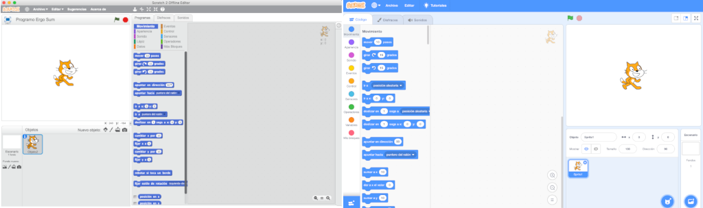

Otro cambio notable a simple vista es la categorización de los bloques. En las versiones anteriores para buscar un bloque que no sabíamos donde estaba, teníamos que pasar por todas las categorías. En esta nueva versión aparecen todas en el listado y desplazando el cursos del ratón hacía abajo podemos ver todos los bloques. En caso de saber el tipo de bloque, podemos hacer clic en la categoría y veremos como se desplaza para llegar a dicho bloque.

Este cambio ha sido un gran acierto ya que desde dispositivos móviles podemos desplazarnos por los bloques de una forma mucho más sencilla.

> A rasgos generales podríamos decir que los mayores cambios son a nivel de estética sobre la versión anterior de Scratch 2.0 y la actual versión de Scratch 3.0. Aunque en las siguientes lecciones entramos en detalle sobre cada uno de los módulos indicando las novedades :).

### Bloques de programación

En cuanto a la cantidad de bloques de programación, además de agrandarlos para que sean más manejables desde dispositivos móviles, se han algunos nuevos, así como traducidos otros, pero sin eliminar ninguno de los bloques existentes en la versión anterior de Scratch 2.0. Otra de las mejoras es la posibilidad de hacer múltiples Ctrl+Z, es decir, revertir las últimas acciones con los bloques.

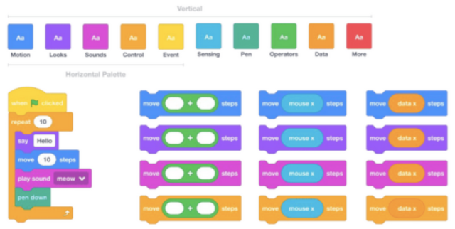

 

## Nuevo editor de dibujo

El editor de dibujo ha sido diseñado por completo para ofrecer nuevas funciones. Algunas de las más necesitadas en versiones anteriores era la función de seleccionar y ajustar color, la cual se ha incluido, así como controles para ordenar las capas hacia adelante o hacia atrás, etc.

Por defecto, encontraremos todos los disfraces en modo vectorial. Esto quiere decir que en caso de agrandar un disfraz, este no perderá calidad como pasaba con los anteriores mapa de bits. No obstante, si en tus proyectos ya tenías disfraces como imágenes en mapa de bits, podrás seguir utilizando las herramientas que utilizabas en la versión anterior de Scratch 2.0.

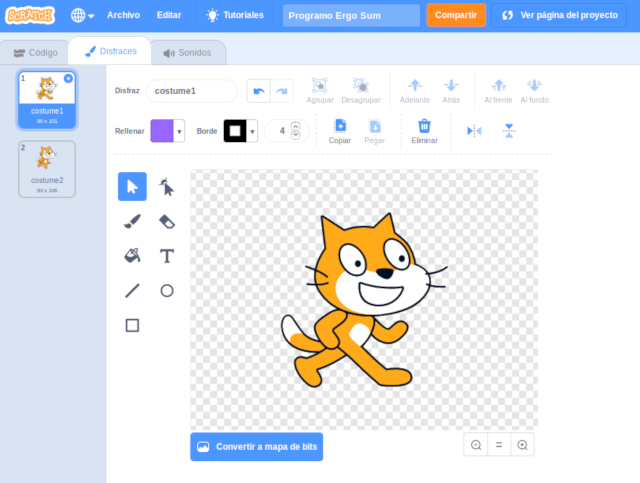

La principal ventaja de utilizar un disfraz en modo vectorial es que podemos modificar los objetos y fondos incluidos en Scratch como puedes ver en la siguiente imagen.

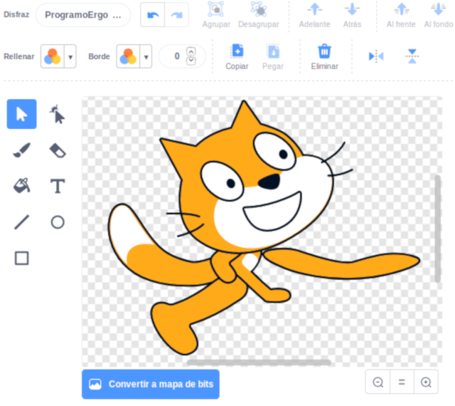

 

### Nuevo editor de sonido

Desde ahora podrás manipular las grabaciones de una forma más sencilla e intuitiva. Podrás añadir efectos para acelerar o relentizar tus grabaciones, como reproducir un pequeño retardo o eco, etc. Además, en cuanto a los bloques de sonido, podemos cambiar el sonido de forma dinámica así como detenerlos todos de golpe.

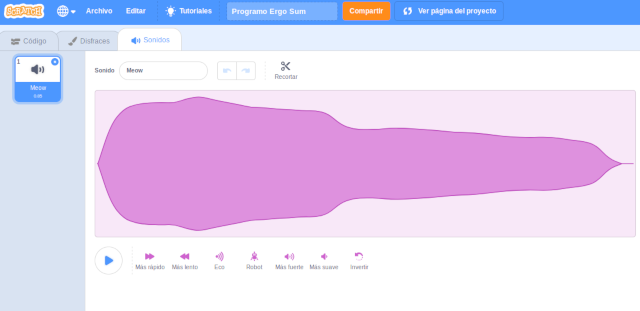

Por último, otra novedad interesante es la reproducción automática de los sonidos al pasar el cursos sobre las grabaciones. 

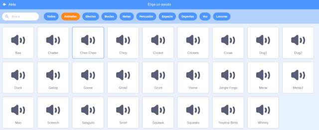

 

### Nuevo apartado para las extensiones

Si recordamos la versión anterior de Scratch 2.0, aparecían 3 categorías que hacían referencia a los bloques de lápiz, música o sensor de vídeo. Sin embargo, a simple vista, no encontramos dichas categorías en la nueva versión de Scratch 3.0.

Para activar estas categorías debemos incluir las extensiones en la parte inferior izquierda de la pantalla. Una vez hacemos clic, veremos que aparecen las extensiones, además de otras muchas más.

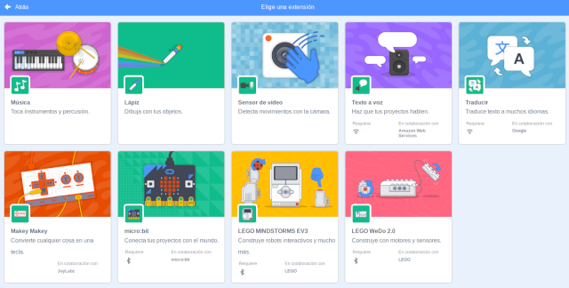

> Recuerda que si estás realizando los tutoriales de realidad aumentada con scratch en esta misma plataforma, viendo los vídeos de la anterior versión, deberás habilitar la extensión de vídeo sobre esta versión de Scratch 3.0 antes de continuar con los tutoriales.

 

### Activar WebGL para Scratch 3.0 en Firefox

Si eres usuario de Linux, probablemente te haya aparecido un error al acceder a Scratch 3.0 (Your Browser Does Not Support WebGL), que indica que tu navegador debe soportar WebGL para poder acceder.

> WebGL es una librería gráfica basada en JavaScript para reproducir gráficos 3D en navegadores web sin plugins.

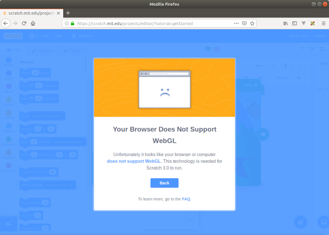

Para activar WebGL en nuestro navegador Firefox, debemos realizar 3 sencillos pasos. En primer lugar, con el navegador abierto, escribimos "about:config" en la barra de dirección. Nos pedirá permiso para continuar.

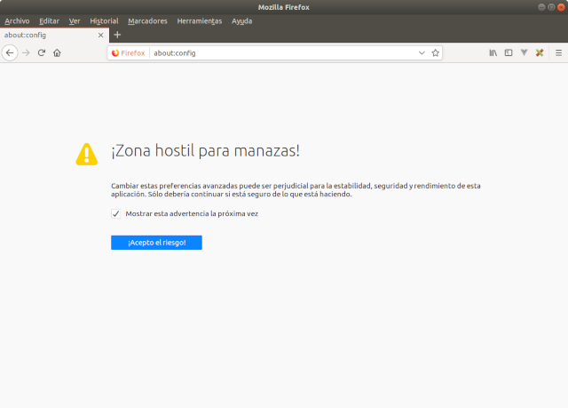

Una vez dentro del panel de configuración de Firefox, buscamos una línea con la palabra "webgl.disabled". Podemos utilizar el buscador que aparece para que sea más rápido.

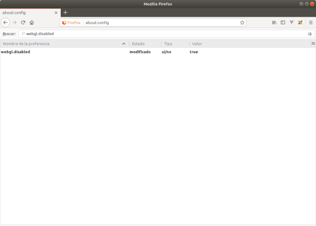

Si nos fijamos, veremos que aparece que está deshabilitado ya que contiene un valor a verdadero o true. Haciendo doble clic sobre el elemento, veremos que se desabilita mediante el valor false.

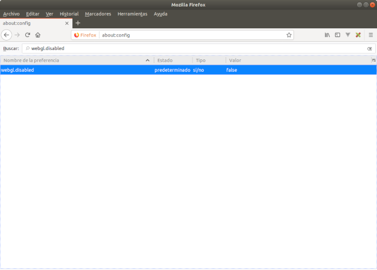

Una vez deshabilitado, podemos acceder a Scratch sin problema.

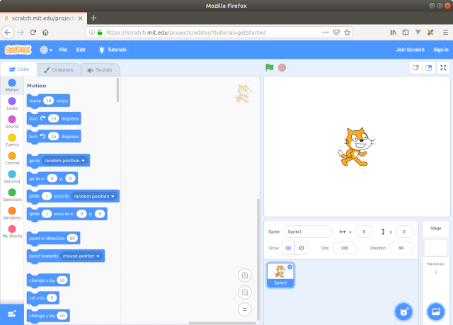
