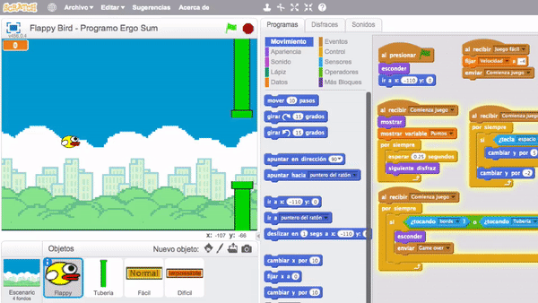

## Introducción

En este **tutorial con Scratch 2.0** te explicamos cómo **programar el videojuego de Flappy Bird**. Flappy Bird es un juego para móviles de 2013 desarrollado en Hanói por el desarrollador Dong Nguyen. El juego fue eliminado de App Store y Google Play por su creador un año más tarde. El videojuego consiste en hacer volar a un pájaro haciendo click sobre él de manera que pase entre sendas tuberías. En caso de tocarlas terminará la partida.

### Reinventa, programa y comparte

Antes de continuar con las lecciones de este curso de programación con Scratch te recomendamos seguir los siguientes pasos para reinventar y obtener todas las imágenes utilizadas en el videojuego gratis.

- Regístrate o accede a la web de <a target="_blank" href="https://scratch.mit.edu">Scratch</a>.
- Reinventa el proyecto <a target="_blank" href="https://scratch.mit.edu/projects/147152781/editor">Flappy Bird (base)</a> para obtener todas las imágenes.
- Programa el videojuego siguiendo los videotutoriales de las lecciones de este curso.
- Comparte el proyecto y si está entre los mejores aparecerá en la sección Mejores proyectos.

 

## Flappy Bird

  <iframe src="//www.youtube.com/embed/LSMPzJ8x_GY" allowfullscreen></iframe>

### Programación del escenario

En este primer video se crean los diferentes fondos que aparecerán a lo largo del videojuego. Recuerda añadirles nombres intuitivos ya que más adelante necesitaremos saber qué fondo elegir desde los bloques de programación.

En cuanto a la programación en el escenario, se crean los eventos de "Comienza juego", "Game Over" y "Winner", los cuales cambiarán al fondo correspondiente en cada caso.

> Al programar con Scratch, una buena práctica de programación consiste en agrupar las funcionalidades básicas en el escenario.

### Objeto principal del videojuego

En la segunda parte de este video se crea el objeto Flappy con los diferentes disfraces a utilizar y se programan los movimientos. Para ello utilizamos la función "Comienza juego" para cambiar el disfraz cada cierto tiempo y para desplazarlo sobre su vertical al presionar una tecla.

> La técnica de utilizar dos funciones paralelas recibe el nombre de programación paralela o paralelismo.

 

## Conceptos avanzados

  <iframe src="//www.youtube.com/embed/cWvQ0d10wdE" allowfullscreen></iframe>

### Tuberías del videojuego

Recordarás que en el videojuego de Flappy Bird aparecen 2 tuberías opuestas y Flappy debe pasar entre ellas. Podrías pensar que se utilizan dos objetos representando a la tubería superior e inferior, sin embargo, en el vídeo explicamos los beneficios de utilizar clones con Scratch.

De esta forma programamos mediante clones la tubería superior e inferior como una sola. Para ello creamos el objeto tubería y le añadimos sendos disfraces centrados en el punto de origen.

> Los clones son copias exactas del objeto en tiempo de ejecución.

### Programación de Clones con Scratch

Al utilizar clones con Scratch evitamos tener que duplicar código. Es decir, en este caso cuando aparece una tubería sobre la parte superior duplicamos el objeto cambiando el disfraz y de esta forma aparecerán dos objetos clonados que representan al mismo.

Para reutilizar código, se ha creado una función llamada "Crear tubería" la cual recibe un valor por parámetro. Este valor es la distancia sobre el eje vertical de forma aleatoria sobre el hemisferio superior de la pantalla de Scratch. Observa que tras clonar el objeto tomamos la distancia del hemisferio inferior. De esta forma conseguimos que la distancia entre tuberías clonadas sea siempre de 120 pasos.

> Restando por un valor a la posición en el eje vertical conseguimos que la distancia entre tuberías siempre sea la misma.

 

## Mejoras del juego

  <iframe src="//www.youtube.com/embed/PHadoJxg3Uo" allowfullscreen></iframe>

### Mejoras propuestas

Una de las mejoras que se pueden crear en el videojuego consiste en crear diferentes niveles. Para ello creamos 2 botones en el escenario para ajustar la velocidad con la que se moverán las tuberías. De esta forma debemos crear una variable para almacenar la velocidad seleccionada y a continuación comenzar la partida.

Las velocidades deben ser múltiplos de la posición sobre el eje vertical de Flappy.

> ¡Recuerda! En la lección anterior se establecía en la condición del objeto Flappy la posición -100 en el eje vertical. por lo tanto, en caso de jugar con las velocidades recuerda que estas deben ser múltiplos de 100, es decir, si utilizamos una velocidad de -3, nunca nos contaría un punto.

 

## Dudas en YouTube

En esta lección vamos a responder una duda muy común que suele aparecer en este videojuego cuando se comprueban coordenadas durante el transcurso del videojuego. Esta duda la plantea Ja El a través de un comentario en nuestro canal de YouTube.

**Problema**

Cuando se comprueba si un objeto pasa por un determinado punto o coordenada (en este caso la tubería) tenemos que tener en cuenta que en caso de aumentar la velocidad dejará de pasar por el punto de referencia. De ahí a que si se modifica la velocidad de las tuberías en el videojuego, deja de funcionar el contador de puntos.

**Solución**

Para solucionarlo basta con añadir un número múltiplo de la velocidad.

 

## Retos propuestos

Si ya has completado todas las lecciones del tutorial te proponemos resolver los siguientes retos de programación con Scratch.

### Reto 1: Aumentar la subida de Flappy según el nivel

En este reto te proponemos que modifiques la programación del videojuego para que el movimiento en la subida de Flappy aumente o disminuye dependiendo del nivel elegido en la partida. Para ello debemos modificar la programación tanto en la condición como en los eventos del nivel de partida.

 

## Retos resueltos

ToDo

## Mejores proyectos

ToDo

## Materiales

ToDo
