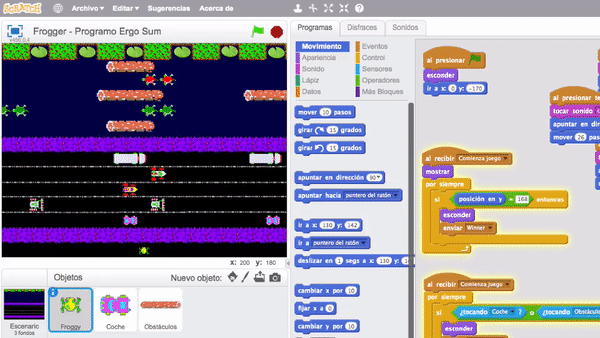

# Videojuego de Frogger programado con Scratch 2.0

En este curso de Scratch te explicamos cómo programar el videojuego de Frogger. El objetivo del juego es guiar a la rana hasta su hogar. Para hacerlo, la rana debe evitar coches mientras cruza una carretera congestionada y luego cruzar un río lleno de riesgos.

### Reinventa, programa y comparte

Antes de continuar con las lecciones de este curso de programación con Scratch te recomendamos seguir los siguientes pasos para reinventar y obtener todas las imágenes utilizadas en el videojuego gratis.

- Regístrate o accede a la web de <a target="_blank" href="https://scratch.mit.edu">Scratch</a>.
- Reinventa el proyecto <a target="_blank" href="https://scratch.mit.edu/projects/186864134/editor">Frogger (base)</a> para obtener todas las imágenes.
- Programa el videojuego siguiendo los videotutoriales de las lecciones de este curso.
- Comparte el proyecto y si está entre los mejores aparecerá en la sección Mejores proyectos.

 

## Escenario

  <iframe src="//www.youtube.com/embed/KLhpbuDlxaA" allowfullscreen></iframe>

### Programación del escenario

En este primer video se crean los diferentes fondos que aparecerán a lo largo del videojuego. Recuerda añadirles nombres intuitivos ya que más adelante necesitaremos saber qué fondo elegir desde los bloques de programación.

En cuanto a la programación en el escenario, se crean los eventos de "Comienza juego", "Game Over" y "Winner", los cuales cambiarán al fondo correspondiente en cada caso.

> En el escenario se ha utilizado una cuadrícula de 26 píxeles para representar las líneas de los carriles de los vehículos.

### Personaje principal del videojuego

A continuación se crea el objeto principal del videojuego con sus respectivos disfraces y se le asignan los valores iniciales como coordenadas, tamaños, etc.

En cuanto a la programación hemos optado por crear los movimientos a través de eventos. Como se comenta en el vídeo se ha creado una cuadrícula para dibujar las líneas de los vehículos y troncos. Dicha cuadrícula tiene una separación de 26 píxeles que coincide con la cantidad de pasos que realiza el objeto principal.

> Recuerda utilizar cuadrículas para los diseños de tus videojuegos.

 

## Conceptos avanzados

  <iframe src="//www.youtube.com/embed/2v0x0XZRAXk" allowfullscreen></iframe>

### Disfraces de los coches

En esta lección se crean los diferentes disfraces que aparecerán en el objeto de vehículos. Cada disfraz representará en tiempo de ejecución a un vehículo clonado. Esto es una buena práctica de programación ya que reutilizamos programación en vez de crear numerosos objetos repetitivos.

> Cada imagen del disfraz está optimizada siguiendo la cuadrícula del escenario.

### Programación de los coches

Para programar la funcionalidad de los coches se crea una función "Mover coche" la cual recibe varios parámetros correspondientes al disfraz, coordenadas y dirección.

En el vídeo se explica la técnica de paralelismo. Como se puede ver en la siguiente imagen, al presionar la bandera verde se invoca a la función "Mover coche" 5 veces. De esta forma los coches aparecerán al mismo tiempo y cada uno en su determinada posición.

 

## Mejoras

  <iframe src="//www.youtube.com/embed/2SpP7cbqJSk" allowfullscreen></iframe>

### Disfraces de los troncos

En esta lección se crean los diferentes disfraces que aparecerán en el objeto de los troncos. Recuerda optimizar el tamaño justo de los troncos como se comenta en el video, ya que si los disfraces exceden el tamaño de la cuatrícula se crearán efectos no deseados en el videojuego.

> Cada imagen del disfraz está optimizada siguiendo la cuadrícula del escenario.

### Programación de los troncos

Para programar los troncos simplemente copiamos las funciones realizadas en el objeto de coche y cambiamos las coordenadas de aparición. Asegúrate primero que funciona correctamente la programación antes de copiar las funciones para no arrastrar posibles errores.

 

## Dudas en YouTube

  <iframe src="//www.youtube.com/embed/TblHQJulAsU" allowfullscreen></iframe>

En esta lección vamos a responder a una duda sobre el desarrollo del videojuego. Esta duda la plantea Mario a través de un comentario en nuestro canal de YouTube.

**Problema**

Tal y como está programado el videojuego, detectamos si hemos ganado la partida cuando nuestro personaje llega a la parte superior del escenario, sin embargo, la rena debe pararse sobre la hoja de lirio.

**Solución**

Para solucionarlo basta con tectar si estamos sobre el color de la hoja de lirio como se explica en el video.

 

## Dudas en Twitter

  <iframe src="//www.youtube.com/embed/Wpa7mtXLJBU" allowfullscreen></iframe>

En esta lección vamos a responder a una duda sobre el desarrollo del videojuego. Esta duda la plantea Juan a través de un comentario en nuestro Twitter.

 

## Retos propuestos

Si ya has completado todas las lecciones del tutorial te proponemos resolver los siguientes retos de programación con Scratch.

### Reto1: Consigue puntos al tocar la hoja de lirio

En este reto te proponemos implementar una nueva funcionalidad al videojuego para acumular puntos cada vez que se toca la hoja de lirio. Para ello deberás modificar la condición seleccionada (además de crear la variable correspondiente).

