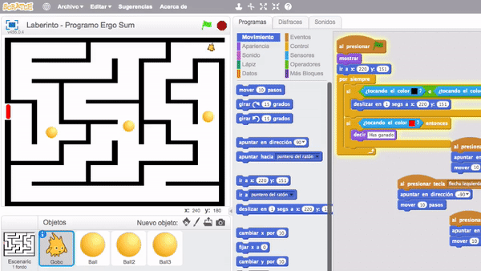
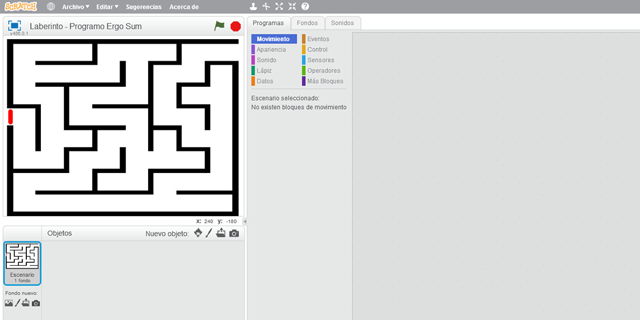
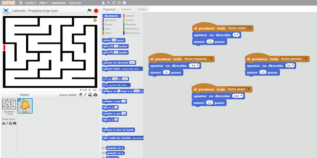
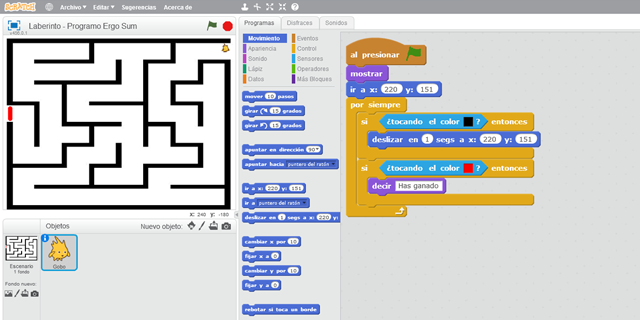
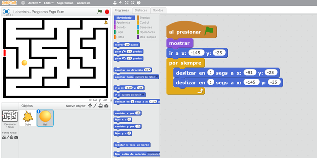
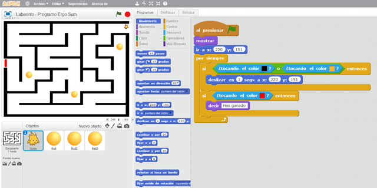
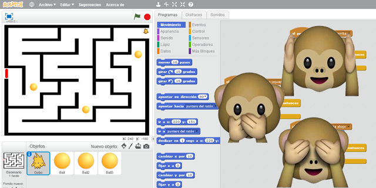
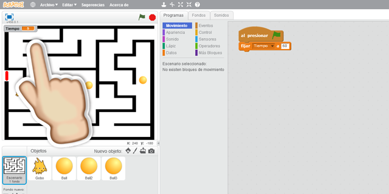
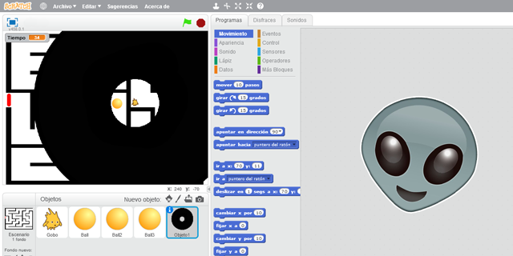

## Introducción

En este curso de Scratch aprenderás a programar el sencillo videojuego del laberinto. El videojuego consiste en mover a nuestro personaje por un laberinto con obstáculos, los cuales se moverán siguiendo un patrón. El objetivo consiste en esquivarlos y llegar a la salida marcada en color rojo. Si en algún momento tocamos un obstáculo volveremos al principio del videojuego. 

### Reinventa, programa y comparte

Antes de continuar con las lecciones de este curso de programación con Scratch te recomendamos seguir los siguientes pasos para reinventar y obtener todas las imágenes utilizadas en el videojuego gratis.

- Regístrate o accede a la web de <a target="_blank" href="https://scratch.mit.edu">Scratch</a>.
- Reinventa el proyecto <a target="_blank" href="https://scratch.mit.edu/projects/118054460/editor">Laberinto (base)</a> para obtener todas las imágenes.
- Programa el videojuego siguiendo los videotutoriales de las lecciones de este curso.
- Comparte el proyecto y si está entre los mejores aparecerá en la sección Mejores proyectos.

 

## Personaje

  <iframe src="//www.youtube.com/embed/Xp1iSsKxop4" allowfullscreen></iframe>

<iframe src="//www.youtube.com/embed/Xp1iSsKxop4" allowfullscreen></iframe>

### Escenario del laberinto

En primer lugar añadimos el laberinto en el escenario con su respectiva marca de salida. Dicha marca la vamos a realizar con el editor de dibujo de Scratch. Recuerda que debes elegir un color único ya que lo utilizaremos como sensor para detectar que hemos llegado a la meta.

### Personaje principal del juego

En este videojuego vamos a utilizar a Gobo como personaje principal aunque puedes elegir de la galería de Scratch el personaje que más te guste o incluso importar uno propio desde tu ordenador.

Una vez importado el personaje principal, debemos ajustarle el tamaño para que pueda desplazarse entre las paredes del laberinto.

Sobre el personaje programamos los movimientos básicos para que se desplace por el escenario con ayuda de las flechas del teclado (arriba, abajo, izquierda y derecha).

 

## Sensores

  <iframe src="//www.youtube.com/embed/GwMnc4xls-E" allowfullscreen></iframe>

### Detectando las paredes

El juego del laberinto consiste en recorrer un camino desde un punto origen hasta un punto de llegada. En ningún momento se podrá atravesar ninguna pared.

La programación de este apartado consiste en detectar si estamos tocando una pared, o lo que es lo mismo, si estamos tocando el color de la pared del laberinto, en cuyo caso volveremos al punto de partida inicial estableciendo unas coordenadas.

Una alternativa a esta programación podría ser evitar que se atraviese la pared sin retroceder a la casilla de origen. Esta mejora se propone como reto en la lección número 6.

 

## Obstáculos

  <iframe src="//www.youtube.com/embed/WqFuPVvBN7k" allowfullscreen></iframe>

### Añadiendo obstáculos al videojuego

Para hacer más complicado nuestro laberinto, vamos a añadirle una serie de obstáculos que tendremos que esquivar si no queremos terminar la partida o volver al principio.

Para añadir los obstáculos, en primer lugar creamos un nuevo objeto o sprite y programamos su movimiento. Este movimiento será lineal y se desplazará desde una posición a otra durante un tiempo determinado. Duplicamos tantos objetos como obstáculos queramos.

> Esta práctica de programación duplicando objetos no es recomendada aunque debido a que este tutorial es de nivel iniciación optamos por explicar esta técnica de duplicar objetos.

 

## Detectar objeto

  <iframe src="//www.youtube.com/embed/cUYxQtrU-L4" allowfullscreen></iframe>

### Detectando los objetos en movimiento

A la hora de programar tenemos que buscar la forma más corta o eficiente. En este caso agrupamos en la misma condición si estamos tocando una de las 3 bolas.

De forma muy parecida como se realizó en el primer apartado, en este caso detectamos si estamos tocando una de las 3 bolas para volver al principio, o en caso de tocar la salida mostrar un mensaje.

 

## Retos de Scratch

Si ya has completado todas las lecciones del tutorial te proponemos resolver los siguientes retos de programación con Scratch.

### Reto 1: Evita atravesar las paredes

Te habrás dado cuenta que siempre que tocas una pared vuelves al principio. En este reto te propongo que modifiques el funcionamiento del videojuego para que tu personaje no pueda atravesar las paredes del laberinto. ¿Te atreves? Solamente deberás modificar la programación del personaje.

### Reto 2: Añade un temporizador

Verás que es fácil llegar hasta la salida porque tienes todo el tiempo del mundo. En este reto te propongo que añadas un temporizador de 60 segundos para recorrer el laberinto y llegar a la salida. Si consumes el tiempo habrás perdido. ¿Cuál es tu record?

### Reto 3: Oscurece la visión del personaje

Si ves el camino te resulta muy sencillo llegar hasta la salida. Sin embargo, podemos hacer que nuestro personaje no vea lo que tiene a su alrededor, y complicando así la partida... ¿Te atreves a resolverlo?

 

## Retos resueltos

ToDo

## Mejores proyectos

ToDo

## Materiales

ToDo
