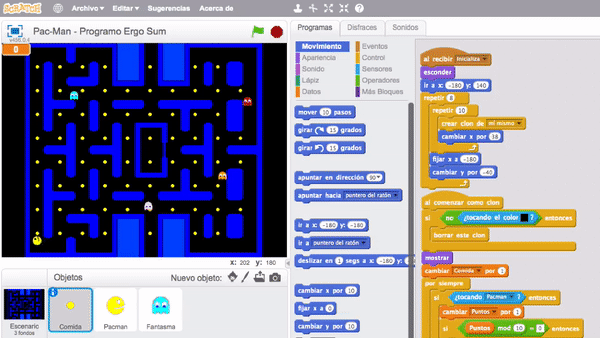
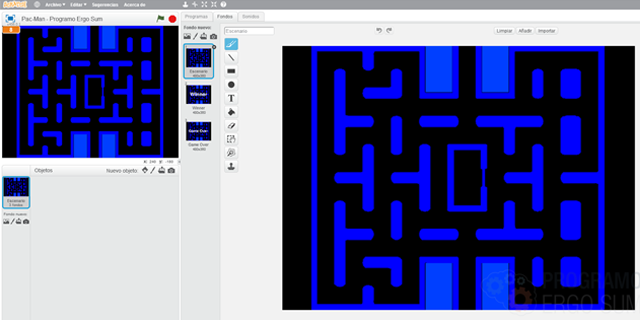
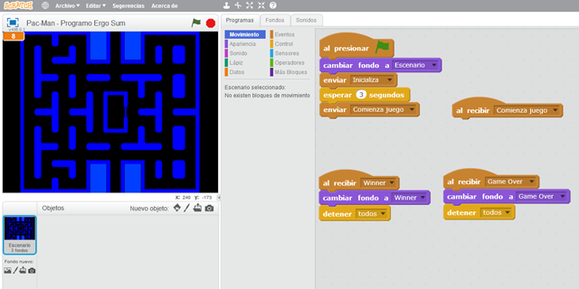
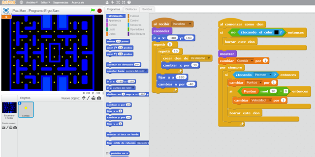
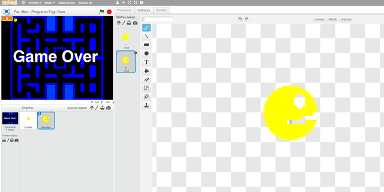
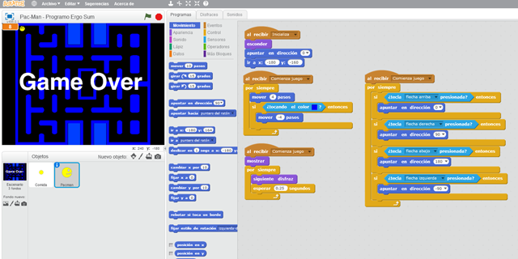
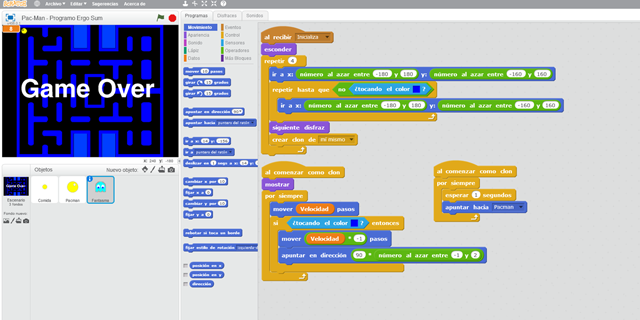

## Introducción

En este **tutorial con Scratch 2.0** te explicamos cómo **programar el videojuego de Pac-Man**. El videojuego consiste en mover al personaje principal Pac-Man para coger la comida esquivando a los fantasmas. Los fantasmas se mueven de forma aleatoria ya que están programados mediante un algoritmo que busca a Pac-Man. El juego termina cuando obtenemos toda la comida.

### Reinventa, programa y comparte

Antes de continuar con las lecciones de este curso de programación con Scratch te recomendamos seguir los siguientes pasos para reinventar y obtener todas las imágenes utilizadas en el videojuego gratis.

- Regístrate o accede a la web de <a target="_blank" href="https://scratch.mit.edu">Scratch</a>.
- Reinventa el proyecto <a target="_blank" href="https://scratch.mit.edu/projects/186866500/editor">Pac Man (base)</a> para obtener todas las imágenes.
- Programa el videojuego siguiendo los videotutoriales de las lecciones de este curso.
- Comparte el proyecto y si está entre los mejores aparecerá en la sección Mejores proyectos.

 

## Escenario del juego

  <iframe src="//www.youtube.com/embed/8ytj53-UccY" allowfullscreen></iframe>

### Escenario

A la hora de programar videojuegos es muy importante utilizar una buena base de diseño. Normalmente se suelen utilizar plantillas o cuadrículas ya que los personajes se mueven una determinada cantidad de píxeles o pasos.

Para este videojuego se ha creado una cuadrícula como se explica en el video para que el personaje principal y los fantasmas puedan desplazarse libremente siguiendo el recorrido y sin atravesar las paredes del videojuego.

### Programación del videojuego

En cuanto a la programación en el escenario, se crean los eventos de "Comienza juego", "Game Over" y "Winner", los cuales cambiarán al fondo correspondiente en cada caso.

Como se comenta en el video, el flujo de entrada principal del videojuego es el escenario, ya que en el mismo activaremos cuando aparecen los fantasmas, la comida, etc.

 

## Comida

  <iframe src="//www.youtube.com/embed/FFmYfH_Lx5M" allowfullscreen></iframe>

### Bucle anidado para la comida

El primer paso será crear el objeto comida mediante la herramienta de dibujo de Scratch. A continuación utilizamos el evento de "Inicializar" como se explica en el video para crear la matriz de comida.

Se puede observar que utilizamos bucles anidados (un bucle dentro de otro) y por cada iteración del bucle interno se crea un clon de comida. Recuerda que como siempre en todos los tutoriales utilizamos buenas prácticas de programación.

 

## Pac-man

  <iframe src="//www.youtube.com/embed/SPVBB_AlRQw" allowfullscreen></iframe>

### Personaje principal

El primer paso será añadir el objeto con sus respectivos disfraces para realizar el efecto de abrir y cerrar la boca e inicializar sus atributos por defecto como coordenadas, tamaño, etc.

En este caso nos ayudamos del editor de dibujo de Scratch para crear a Pac-Man pero puedes utilizar otros diseños.

### Programación de Pac-Man

En la segunda parte del video se explica la programación principal del personaje. Como hemos hecho en otros tutoriales de programación, optamos por utilizar condiciones en los movimientos en vez de eventos. Además, recuerda que no queremos que el personaje atraviese las paredes, con lo cual procedemos a detectar las paredes y retroceder si eso ocurre.

 

## Fantasmas

  <iframe src="//www.youtube.com/embed/Hou9sCeH1MA" allowfullscreen></iframe>

### Algoritmo del fantasma

La funcionalidad de los fantasmas es un algoritmo pseudo-aleatorio, lo que significa que realmente no es aleatorio ya que cada cierto tiempo apuntamos en dirección del objeto principal Pac-Man. El objetivo es que los fantasmas sigan al personaje para que sea más complicado ganar la partida.

 

## Retos propuestos

Si ya has completado todas las lecciones del tutorial te proponemos resolver los siguientes retos de programación con Scratch.

### Reto 1: Crea diferentes tipos de comida

Cuando empieza la partida, verás que aparece la comida. En este reto tendrás que modificar ciertas partes de la programación y del diseño para crear diferentes tipos de comida, es decir, puedes crear comida con forma de fruta, galletas, etc.

 

## Retos resueltos

ToDo

## Mejores proyectos

ToDo

## Materiales

ToDo
