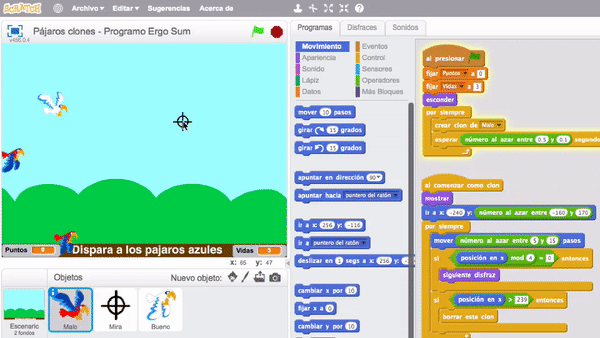
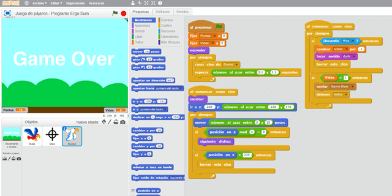
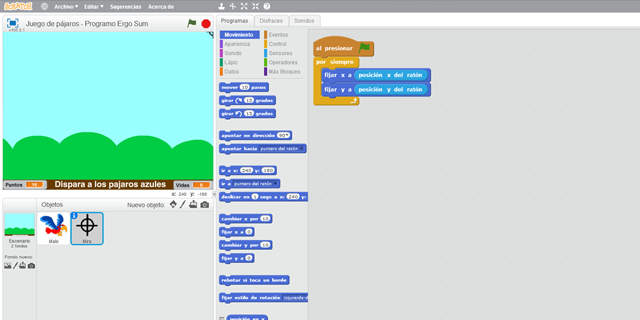
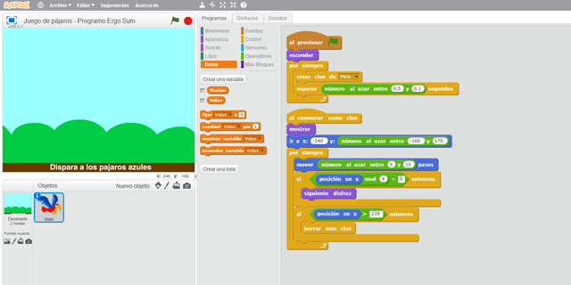
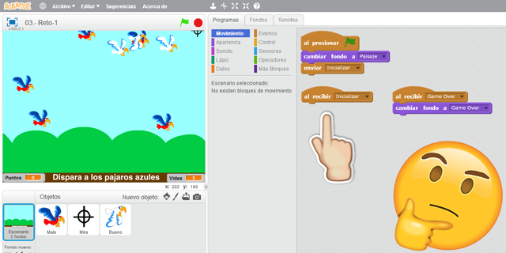

## Introducción

En este **tutorial con Scratch 2.0** te explicamos cómo **programar un videojuego utilizando los clones**. En el videojuego tendrás que capturar a los patos malos y dejar libres a los patos buenos. Si capturas un pato bueno perderás 1 vida y al perder las 3 vidas terminará la partida. Captura la mayor cantidad de pájaros malos.

### Reinventa, programa y comparte

Antes de continuar con las lecciones de este curso de programación con Scratch te recomendamos seguir los siguientes pasos para reinventar y obtener todas las imágenes utilizadas en el videojuego gratis.

- Regístrate o accede a la web de <a target="_blank" href="https://scratch.mit.edu">Scratch</a>.
- Reinventa el proyecto <a target="_blank" href="https://scratch.mit.edu/projects/118054483/editor">Pájaros (base)</a> para obtener todas las imágenes.
- Programa el videojuego siguiendo los videotutoriales de las lecciones de este curso.
- Comparte el proyecto y si está entre los mejores aparecerá en la sección Mejores proyectos.

 

## Pájaro bueno

  <iframe src="//www.youtube.com/embed/E74_nUAaZbY" allowfullscreen></iframe>

### Programación de clones

En primer lugar programamos el escenario con el fondo por defecto, y el fondo en caso de perder la partida. Recordar que al crear diferentes funciones para ambos casos, estaremos controlando el flujo principal del juego desde la programación del escenario.

A continuación añadimos el sprite para el primer objeto, en este caso el pájaro malo, y programamos el bucle para crear clones.

Por último, programamos las posiciones aleatorias del objeto para que aparezca sobre distintas posiciones al crearse como nuevo clon.

> Los clones son objetos idénticos e independientes que comparten propiedades. En tutoriales más avanzados se explicarán dichas propiedades y conceptos más avanzados de Programación Orientada a Objetos.

 

## Punto de mira

  <iframe src="//www.youtube.com/embed/N2k0wWMiDv4" allowfullscreen></iframe>

### Dibujando el punto de mira

Tenemos varias formas de crear el punto de mira, importando un sprite, o dibujándolo nosotros. En este caso optamos por dibujarlo para explicar cómo realizarlo.

A continuación programamos la función del punto de mira utilizando el ratón de nuestro ordenador.

> También puedes programar el punto de mira utilizando las flechas del teclado.

 

## Pájaro malo

  <iframe src="//www.youtube.com/embed/Heo9pkR9iqc" allowfullscreen></iframe>

### Duplicando objetos

Por último duplicamos el objeto creado anteriormente modificando las variables que no compartan. Una vez modificamos las variables necesarias habremos terminado el juego.

> Recordar que antes de duplicar, debemos asegurarnos que el objeto a duplicar funciona correctamente para no acarrear errores.

 

## Retos propuestos

Si ya has completado todas las lecciones del tutorial te proponemos resolver los siguientes retos de programación con Scratch.

### Reto 1: Consigue 10 puntos y gana la partida

Seguro que te gustaría que llegue un momento en el cual la partida termina. En este reto te propongo que modifiques la programación para finalizar la partida cuando consigamos 10 puntos, o lo que es lo mismo, capturar a 10 pájaros malos.

 

## Retos resueltos

ToDo

## Mejores proyectos

ToDo

## Materiales

ToDo
